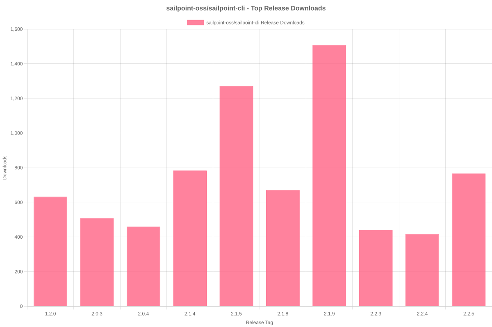

# SailPoint SDK Usage Statistics

<!-- METRICS_START -->
# Usage Statistics
    
Last updated: 8/25/2025, 12:05:12 AM

Below are stats from artifacts tracked across NPM, GitHub, PyPI and PowerShell.
    
### NPM (JavaScript/TypeScript): 

| Package | Downloads | Monthly Downloads | Weekly Downloads | Daily Downloads |
| --- | --- | --- | --- | --- |
| sailpoint-api-client | 17,053 | 1,151 | 250 | 21 |
| **Total** | **17,053** | **1,151** | **250** | **21** | | | | |

### GitHub: 

| Repository | Stars | Forks | Watchers | Open Issues | Closed Issues | Total Issues | Release Downloads | Releases | Latest Release | Language |
| --- | --- | --- | --- | --- | --- | --- | --- | --- | --- | --- |
| sailpoint-oss/sailpoint-cli | 36 | 24 | 9 | 5 | 35 | 40 | 10,167 | 31 | 2.2.5 | Go |
| **Total** | **36** | **24** | **9** | **5** | **35** | **40** | **10,167** | **31** | | |

#### Repository Details:

**sailpoint-oss/sailpoint-cli**:
- Last Activity: 2 days ago
- Repository Age: 1,130 days
- Release Count: 31
- Total Release Downloads: 10,167
- Latest Release: 2.2.5
- Latest Release Downloads: 896
- Views: 398
- Unique Visitors: 159
- Clones: 67

### PyPI (Python): 

| Package | Total Downloads | Monthly Downloads | Weekly Downloads | Daily Downloads | Version |
| --- | --- | --- | --- | --- | --- |
| sailpoint | 16,086 | 6,678 | 0 | 0 | 1.3.8 |
| **Total** | **16,086** | **6,678** | **0** | **0** | | |

#### Package Details:

**sailpoint**:
- Version: 1.3.8
- Released: 2025-07-29
- Popular system: Linux
- Popular installer: pip
- Releases: 29
- OS Usage Breakdown 
  - other: 1543
  - Darwin: 44
  - Windows: 71
  - Linux: 7004
- Python Version Breakdown 
  - python2: 1
  - python3: 7094

### PowerShell: 

| Module | Total Downloads | Latest Version | Version Downloads | Versions | Last Updated |
| --- | --- | --- | --- | --- | --- |
| PSSailPoint | 20,509 | 1.6.6 | 146 | 32 | 8/22/2025 |
| PSSailpoint.V3 | 11,763 | 1.6.6 | 153 | 19 | 8/22/2025 |
| PSSailpoint.Beta | 12,086 | 1.6.6 | 147 | 19 | 8/22/2025 |
| PSSailpoint.V2024 | 11,754 | 1.6.6 | 144 | 19 | 8/22/2025 |
| PSSailpoint.V2025 | 1,049 | 1.6.6 | 140 | 8 | 8/22/2025 |
| **Total** | **57,161** | | | **97** | |

#### PowerShell Module Details:

**PSSailPoint**:
- Total Downloads: 20,509
- Latest Version: 1.6.6
- Latest Version Downloads: 146
- Version Count: 32
- Last Updated: 8/22/2025
- Package Size: 13618 KB

**PSSailpoint.V3**:
- Total Downloads: 11,763
- Latest Version: 1.6.6
- Latest Version Downloads: 153
- Version Count: 19
- Last Updated: 8/22/2025
- Package Size: 1023 KB

**PSSailpoint.Beta**:
- Total Downloads: 12,086
- Latest Version: 1.6.6
- Latest Version Downloads: 147
- Version Count: 19
- Last Updated: 8/22/2025
- Package Size: 1526 KB

**PSSailpoint.V2024**:
- Total Downloads: 11,754
- Latest Version: 1.6.6
- Latest Version Downloads: 144
- Version Count: 19
- Last Updated: 8/22/2025
- Package Size: 1881 KB

**PSSailpoint.V2025**:
- Total Downloads: 1,049
- Latest Version: 1.6.6
- Latest Version Downloads: 140
- Version Count: 8
- Last Updated: 8/22/2025
- Package Size: 1923 KB

<!-- METRICS_END -->
