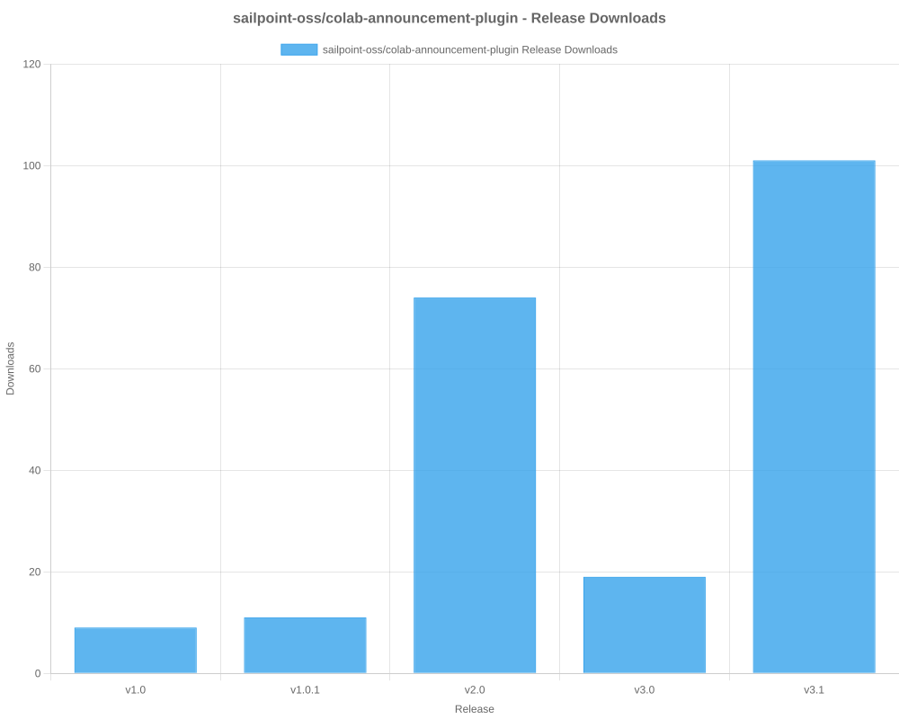
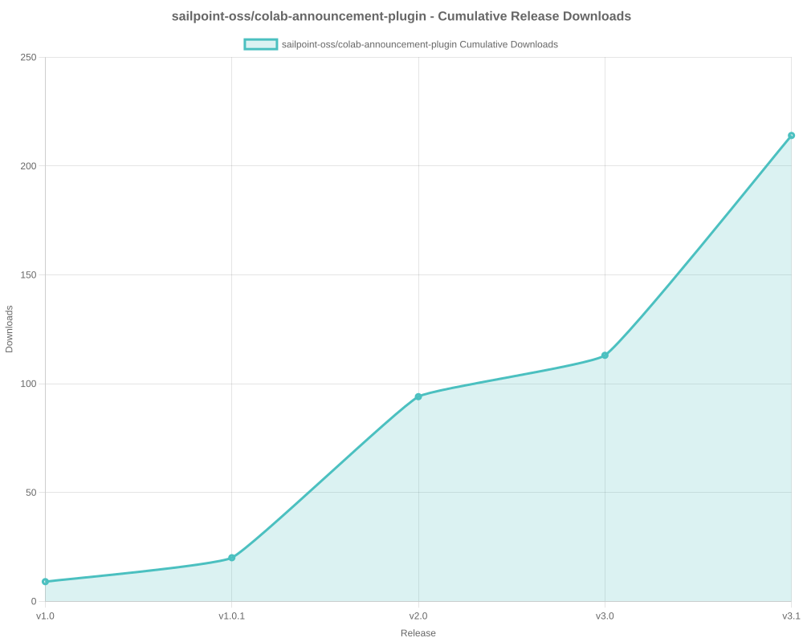

# SailPoint SDK Usage Statistics

<!-- METRICS_START -->
# Usage Statistics
    
Last updated: 11/24/2025, 12:35:08 AM

Below are stats from artifacts tracked across  and GitHub.
    
### GitHub: 

| Repository | Stars | Forks | Watchers | Open Issues | Closed Issues | Total Issues | Release Downloads | Releases | Latest Release | Language |
| --- | --- | --- | --- | --- | --- | --- | --- | --- | --- | --- |
| sailpoint-oss/colab-saas-conn-sailpoint-identity-fusion | 6 | 6 | 4 | 3 | 1 | 4 | 66 | 8 | v1.3.0 | TypeScript |
| sailpoint-oss/colab-saas-conn-attribute-generator | 0 | 0 | 0 | 0 | 0 | 0 | 0 | 0 | N/A | TypeScript |
| sailpoint-oss/colab-saas-conn-proxy-entitlements | 0 | 0 | 0 | 0 | 0 | 0 | 0 | 0 | N/A | TypeScript |
| sailpoint-oss/colab-siem-plugin | 3 | 2 | 0 | 0 | 0 | 0 | 0 | 0 | N/A | CSS |
| sailpoint-oss/colab-isc-extended-workflow-helper | 0 | 2 | 0 | 0 | 0 | 0 | 0 | 0 | N/A | Java |
| sailpoint-oss/colab-saas-conn-prisma-sase | 0 | 2 | 0 | 0 | 0 | 0 | 0 | 0 | N/A | TypeScript |
| sailpoint-oss/colab-saas-conn-pan-customer-service-portal | 0 | 1 | 0 | 0 | 0 | 0 | 0 | 0 | N/A | TypeScript |
| sailpoint-oss/colab-iiq-roles-with-deleted-entitlements | 0 | 1 | 0 | 0 | 0 | 0 | 0 | 0 | N/A | N/A |
| sailpoint-oss/colab-stunt-script | 4 | 0 | 2 | 0 | 0 | 0 | 0 | 0 | N/A | Shell |
| sailpoint-oss/colab-saas-conn-outlook-out-of-office | 1 | 1 | 1 | 0 | 0 | 0 | 0 | 0 | N/A | TypeScript |
| sailpoint-oss/colab-saas-conn-access-management | 0 | 0 | 0 | 0 | 0 | 0 | 0 | 0 | N/A | TypeScript |
| sailpoint-oss/colab-saas-customizer-entra-id-plus | 0 | 0 | 1 | 0 | 0 | 0 | 0 | 0 | N/A | TypeScript |
| sailpoint-oss/colab-saas-conn-search-loopback | 0 | 1 | 0 | 0 | 0 | 0 | 0 | 0 | N/A | TypeScript |
| sailpoint-oss/colab-sailpoint-zapier-integration | 1 | 1 | 0 | 0 | 0 | 0 | 0 | 0 | N/A | JavaScript |
| sailpoint-oss/colab-events-dashboard-plugin | 0 | 1 | 0 | 0 | 0 | 0 | 7 | 1 | v1.0 | Java |
| sailpoint-oss/colab-motd-plugin | 4 | 0 | 0 | 0 | 0 | 0 | 0 | 0 | N/A | JavaScript |
| sailpoint-oss/colab-saas-conn-genetec-clearid | 2 | 1 | 0 | 1 | 0 | 1 | 0 | 0 | N/A | TypeScript |
| sailpoint-oss/colab-iiq-resilient-actions | 0 | 1 | 0 | 0 | 0 | 0 | 0 | 0 | N/A | N/A |
| sailpoint-oss/colab-isc-PsAttributeSyncValidator | 0 | 1 | 0 | 0 | 0 | 0 | 0 | 0 | N/A | N/A |
| sailpoint-oss/colab-saas-conn-identitynow-orphan-accounts | 2 | 6 | 0 | 0 | 0 | 0 | 0 | 0 | N/A | TypeScript |
| sailpoint-oss/colab-saas-conn-peloton-platform | 0 | 1 | 0 | 0 | 0 | 0 | 0 | 0 | N/A | TypeScript |
| sailpoint-oss/colab-non-employee-risk-management-splunk-addon | 1 | 1 | 0 | 0 | 0 | 0 | 0 | 1 | v1.0.0 | Python |
| sailpoint-oss/colab-iiqda-plugin-intellij | 0 | 3 | 0 | 0 | 0 | 0 | 0 | 0 | N/A | Java |
| sailpoint-oss/colab-saas-conn-identitynow-management | 6 | 8 | 1 | 0 | 0 | 0 | 0 | 0 | N/A | TypeScript |
| sailpoint-oss/colab-saas-conn-cyber-ark-rbac | 0 | 3 | 0 | 0 | 0 | 0 | 0 | 0 | N/A | TypeScript |
| sailpoint-oss/colab-saas-conn-peloton-landview | 0 | 0 | 0 | 0 | 0 | 0 | 0 | 0 | N/A | TypeScript |
| sailpoint-oss/colab-workflows | 13 | 16 | 4 | 0 | 0 | 0 | 0 | 0 | N/A | N/A |
| sailpoint-oss/colab-show-workgroup-member-plugin | 0 | 2 | 0 | 0 | 0 | 0 | 0 | 0 | N/A | Java |
| sailpoint-oss/colab-iiq-custom-loading-spinner | 0 | 1 | 0 | 0 | 0 | 0 | 4 | 1 | v1.0 | JavaScript |
| sailpoint-oss/colab-isc-auto-loader | 0 | 2 | 0 | 0 | 0 | 0 | 0 | 0 | N/A | N/A |
| sailpoint-oss/colab-saas-conn-beyondtrust-privilege-management-cloud | 0 | 1 | 0 | 0 | 0 | 0 | 0 | 0 | N/A | TypeScript |
| sailpoint-oss/colab-provisioning-simulator-plugin | 2 | 1 | 0 | 8 | 3 | 11 | 11 | 3 | 1.2 | Java |
| sailpoint-oss/colab-saas-conn-thomsonreuters-document-intelligence | 1 | 1 | 0 | 0 | 0 | 0 | 0 | 0 | N/A | TypeScript |
| sailpoint-oss/colab-isc-powershell-task-manager | 1 | 1 | 0 | 0 | 0 | 0 | 0 | 0 | N/A | PowerShell |
| sailpoint-oss/colab-saas-conn-delimited-file | 1 | 2 | 0 | 0 | 0 | 0 | 0 | 0 | N/A | TypeScript |
| sailpoint-oss/colab-file-upload-utility-automation-scripts | 1 | 2 | 1 | 0 | 0 | 0 | 0 | 0 | N/A | PowerShell |
| sailpoint-oss/colab-sailpoint-configuration-manager | 2 | 3 | 1 | 0 | 0 | 0 | 0 | 0 | N/A | PowerShell |
| sailpoint-oss/colab-org-chart-plugin | 0 | 1 | 0 | 0 | 0 | 0 | 38 | 1 | 1.2.0 | TypeScript |
| sailpoint-oss/colab-transforms | 2 | 9 | 0 | 0 | 0 | 0 | 0 | 0 | N/A | N/A |
| sailpoint-oss/colab-file-upload-utility | 5 | 8 | 1 | 3 | 2 | 5 | 1,708 | 2 | file-upload-utility-4.1.0 | Java |
| sailpoint-oss/colab-isc-credential-cycling | 0 | 1 | 0 | 0 | 0 | 0 | 0 | 0 | N/A | C# |
| sailpoint-oss/colab-log-level-modifier-plugin | 1 | 2 | 0 | 0 | 0 | 0 | 0 | 0 | N/A | HTML |
| sailpoint-oss/colab-valdate-population-plugin | 0 | 0 | 0 | 0 | 0 | 0 | 0 | 0 | N/A | N/A |
| sailpoint-oss/colab-identity-photos-plugin | 0 | 0 | 0 | 0 | 0 | 0 | 0 | 0 | N/A | N/A |
| sailpoint-oss/colab-community-rest-api-plugin | 2 | 4 | 0 | 0 | 0 | 0 | 0 | 0 | N/A | Java |
| sailpoint-oss/colab-saas-conn-beyondtrust-pmcloud-computers | 1 | 2 | 0 | 0 | 0 | 0 | 0 | 2 | v1.01 | TypeScript |
| sailpoint-oss/colab-connector-configurations | 0 | 1 | 0 | 0 | 0 | 0 | 0 | 0 | N/A | N/A |
| sailpoint-oss/colab-iiq-hbm-extension-template | 2 | 2 | 0 | 0 | 0 | 0 | 0 | 0 | N/A | Java |
| sailpoint-oss/colab-iiqda | 5 | 9 | 2 | 4 | 1 | 5 | 0 | 0 | N/A | Java |
| sailpoint-oss/colab-announcement-plugin | 2 | 0 | 0 | 0 | 0 | 0 | 220 | 5 | v3.1 | CSS |
| sailpoint-oss/colab-identity-details-tweaks-plugin | 3 | 2 | 0 | 0 | 0 | 0 | 7 | 2 | v2.0 | JavaScript |
| sailpoint-oss/colab-repo-template | 0 | 4 | 2 | 0 | 0 | 0 | 0 | 0 | N/A | N/A |
| sailpoint-oss/colab-identitynow-azure-sentinel | 0 | 2 | 0 | 0 | 0 | 0 | 0 | 0 | N/A | Python |
| sailpoint-oss/colab-sailpoint-rule-restriction-vs-code-plugin | 0 | 2 | 0 | 0 | 0 | 0 | 0 | 0 | N/A | TypeScript |
| sailpoint-oss/colab-saas-conn-beyondtrust-representatives | 1 | 1 | 0 | 0 | 0 | 0 | 0 | 0 | N/A | TypeScript |
| sailpoint-oss/colab-reports | 1 | 1 | 0 | 0 | 0 | 0 | 0 | 0 | N/A | Java |
| sailpoint-oss/colab-rules | 3 | 7 | 0 | 0 | 0 | 0 | 0 | 0 | N/A | N/A |
| sailpoint-oss/colab-proofpoint-plugin | 1 | 1 | 0 | 0 | 0 | 0 | 0 | 0 | N/A | Java |
| sailpoint-oss/colab-saas-conn-rambase-cloud-erp | 0 | 1 | 0 | 0 | 0 | 0 | 0 | 0 | N/A | TypeScript |
| sailpoint-oss/colab-saas-conn-beyondtrust-epm | 0 | 1 | 0 | 0 | 0 | 0 | 0 | 0 | N/A | N/A |
| sailpoint-oss/colab-saas-conn-beyondtrust-pra | 0 | 1 | 0 | 0 | 0 | 0 | 0 | 0 | N/A | N/A |
| sailpoint-oss/colab-saas-conn-proofpoint | 0 | 2 | 0 | 0 | 0 | 0 | 0 | 0 | N/A | N/A |
| **Total** | **80** | **139** | **20** | **19** | **7** | **26** | **2,061** | **26** | | |

#### Repository Details:

**sailpoint-oss/colab-saas-conn-sailpoint-identity-fusion**:
- Last Activity: 2 days ago
- Repository Age: 600 days
- Release Count: 8
- Total Release Downloads: 66
- Latest Release: v1.3.0
- Latest Release Downloads: 1
- Views: 404
- Unique Visitors: 80
- Clones: 67
- Top Assets (by downloads):
  - identity_zip: 66
- Format Breakdown:
  - zip: 66

**sailpoint-oss/colab-saas-conn-attribute-generator**:
- Last Activity: 3 days ago
- Repository Age: 151 days
- Release Count: 0
- Total Release Downloads: 0
- Latest Release: N/A
- Latest Release Downloads: 0
- Views: 21
- Unique Visitors: 4
- Clones: 15

**sailpoint-oss/colab-saas-conn-proxy-entitlements**:
- Last Activity: 3 days ago
- Repository Age: 151 days
- Release Count: 0
- Total Release Downloads: 0
- Latest Release: N/A
- Latest Release Downloads: 0
- Views: 21
- Unique Visitors: 6
- Clones: 15

**sailpoint-oss/colab-siem-plugin**:
- Last Activity: 16 days ago
- Repository Age: 788 days
- Release Count: 0
- Total Release Downloads: 0
- Latest Release: N/A
- Latest Release Downloads: 0
- Views: 76
- Unique Visitors: 20
- Clones: 6

**sailpoint-oss/colab-isc-extended-workflow-helper**:
- Last Activity: 59 days ago
- Repository Age: 66 days
- Release Count: 0
- Total Release Downloads: 0
- Latest Release: N/A
- Latest Release Downloads: 0
- Views: 7
- Unique Visitors: 3
- Clones: 4

**sailpoint-oss/colab-saas-conn-prisma-sase**:
- Last Activity: 73 days ago
- Repository Age: 485 days
- Release Count: 0
- Total Release Downloads: 0
- Latest Release: N/A
- Latest Release Downloads: 0
- Views: 3
- Unique Visitors: 3
- Clones: 6

**sailpoint-oss/colab-saas-conn-pan-customer-service-portal**:
- Last Activity: 74 days ago
- Repository Age: 485 days
- Release Count: 0
- Total Release Downloads: 0
- Latest Release: N/A
- Latest Release Downloads: 0
- Views: 6
- Unique Visitors: 4
- Clones: 8

**sailpoint-oss/colab-iiq-roles-with-deleted-entitlements**:
- Last Activity: 79 days ago
- Repository Age: 79 days
- Release Count: 0
- Total Release Downloads: 0
- Latest Release: N/A
- Latest Release Downloads: 0
- Views: 4
- Unique Visitors: 3
- Clones: 3

**sailpoint-oss/colab-stunt-script**:
- Last Activity: 96 days ago
- Repository Age: 788 days
- Release Count: 0
- Total Release Downloads: 0
- Latest Release: N/A
- Latest Release Downloads: 0
- Views: 35
- Unique Visitors: 21
- Clones: 55

**sailpoint-oss/colab-saas-conn-outlook-out-of-office**:
- Last Activity: 97 days ago
- Repository Age: 739 days
- Release Count: 0
- Total Release Downloads: 0
- Latest Release: N/A
- Latest Release Downloads: 0
- Views: 3
- Unique Visitors: 2
- Clones: 3

**sailpoint-oss/colab-saas-conn-access-management**:
- Last Activity: 103 days ago
- Repository Age: 151 days
- Release Count: 0
- Total Release Downloads: 0
- Latest Release: N/A
- Latest Release Downloads: 0
- Views: 33
- Unique Visitors: 10
- Clones: 9

**sailpoint-oss/colab-saas-customizer-entra-id-plus**:
- Last Activity: 103 days ago
- Repository Age: 151 days
- Release Count: 0
- Total Release Downloads: 0
- Latest Release: N/A
- Latest Release Downloads: 0
- Views: 36
- Unique Visitors: 9
- Clones: 10

**sailpoint-oss/colab-saas-conn-search-loopback**:
- Last Activity: 104 days ago
- Repository Age: 304 days
- Release Count: 0
- Total Release Downloads: 0
- Latest Release: N/A
- Latest Release Downloads: 0
- Views: 7
- Unique Visitors: 4
- Clones: 6

**sailpoint-oss/colab-sailpoint-zapier-integration**:
- Last Activity: 124 days ago
- Repository Age: 789 days
- Release Count: 0
- Total Release Downloads: 0
- Latest Release: N/A
- Latest Release Downloads: 0
- Views: 6
- Unique Visitors: 3
- Clones: 6

**sailpoint-oss/colab-events-dashboard-plugin**:
- Last Activity: 128 days ago
- Repository Age: 151 days
- Release Count: 1
- Total Release Downloads: 7
- Latest Release: v1.0
- Latest Release Downloads: 7
- Views: 26
- Unique Visitors: 5
- Clones: 2
- Top Assets (by downloads):
  - eventsdashboardplugin_zip: 7
- Format Breakdown:
  - zip: 7

**sailpoint-oss/colab-motd-plugin**:
- Last Activity: 134 days ago
- Repository Age: 577 days
- Release Count: 0
- Total Release Downloads: 0
- Latest Release: N/A
- Latest Release Downloads: 0
- Views: 17
- Unique Visitors: 4
- Clones: 4

**sailpoint-oss/colab-saas-conn-genetec-clearid**:
- Last Activity: 159 days ago
- Repository Age: 788 days
- Release Count: 0
- Total Release Downloads: 0
- Latest Release: N/A
- Latest Release Downloads: 0
- Views: 25
- Unique Visitors: 9
- Clones: 3

**sailpoint-oss/colab-iiq-resilient-actions**:
- Last Activity: 164 days ago
- Repository Age: 164 days
- Release Count: 0
- Total Release Downloads: 0
- Latest Release: N/A
- Latest Release Downloads: 0
- Views: 1
- Unique Visitors: 1
- Clones: 5

**sailpoint-oss/colab-isc-PsAttributeSyncValidator**:
- Last Activity: 174 days ago
- Repository Age: 174 days
- Release Count: 0
- Total Release Downloads: 0
- Latest Release: N/A
- Latest Release Downloads: 0
- Views: 0
- Unique Visitors: 0
- Clones: 4

**sailpoint-oss/colab-saas-conn-identitynow-orphan-accounts**:
- Last Activity: 177 days ago
- Repository Age: 788 days
- Release Count: 0
- Total Release Downloads: 0
- Latest Release: N/A
- Latest Release Downloads: 0
- Views: 8
- Unique Visitors: 4
- Clones: 4

**sailpoint-oss/colab-saas-conn-peloton-platform**:
- Last Activity: 208 days ago
- Repository Age: 208 days
- Release Count: 0
- Total Release Downloads: 0
- Latest Release: N/A
- Latest Release Downloads: 0
- Views: 1
- Unique Visitors: 1
- Clones: 5

**sailpoint-oss/colab-non-employee-risk-management-splunk-addon**:
- Last Activity: 230 days ago
- Repository Age: 366 days
- Release Count: 1
- Total Release Downloads: 0
- Latest Release: v1.0.0
- Latest Release Downloads: 0
- Views: 3
- Unique Visitors: 3
- Clones: 4

**sailpoint-oss/colab-iiqda-plugin-intellij**:
- Last Activity: 234 days ago
- Repository Age: 522 days
- Release Count: 0
- Total Release Downloads: 0
- Latest Release: N/A
- Latest Release Downloads: 0
- Views: 24
- Unique Visitors: 9
- Clones: 2

**sailpoint-oss/colab-saas-conn-identitynow-management**:
- Last Activity: 261 days ago
- Repository Age: 789 days
- Release Count: 0
- Total Release Downloads: 0
- Latest Release: N/A
- Latest Release Downloads: 0
- Views: 48
- Unique Visitors: 16
- Clones: 3

**sailpoint-oss/colab-saas-conn-cyber-ark-rbac**:
- Last Activity: 269 days ago
- Repository Age: 272 days
- Release Count: 0
- Total Release Downloads: 0
- Latest Release: N/A
- Latest Release Downloads: 0
- Views: 10
- Unique Visitors: 9
- Clones: 7

**sailpoint-oss/colab-saas-conn-peloton-landview**:
- Last Activity: 272 days ago
- Repository Age: 611 days
- Release Count: 0
- Total Release Downloads: 0
- Latest Release: N/A
- Latest Release Downloads: 0
- Views: 3
- Unique Visitors: 2
- Clones: 7

**sailpoint-oss/colab-workflows**:
- Last Activity: 277 days ago
- Repository Age: 790 days
- Release Count: 0
- Total Release Downloads: 0
- Latest Release: N/A
- Latest Release Downloads: 0
- Views: 305
- Unique Visitors: 68
- Clones: 6

**sailpoint-oss/colab-show-workgroup-member-plugin**:
- Last Activity: 285 days ago
- Repository Age: 300 days
- Release Count: 0
- Total Release Downloads: 0
- Latest Release: N/A
- Latest Release Downloads: 0
- Views: 24
- Unique Visitors: 7
- Clones: 4

**sailpoint-oss/colab-iiq-custom-loading-spinner**:
- Last Activity: 314 days ago
- Repository Age: 320 days
- Release Count: 1
- Total Release Downloads: 4
- Latest Release: v1.0
- Latest Release Downloads: 4
- Views: 17
- Unique Visitors: 5
- Clones: 6
- Top Assets (by downloads):
  - custom_zip: 4
- Format Breakdown:
  - zip: 4

**sailpoint-oss/colab-isc-auto-loader**:
- Last Activity: 348 days ago
- Repository Age: 348 days
- Release Count: 0
- Total Release Downloads: 0
- Latest Release: N/A
- Latest Release Downloads: 0
- Views: 1
- Unique Visitors: 1
- Clones: 5

**sailpoint-oss/colab-saas-conn-beyondtrust-privilege-management-cloud**:
- Last Activity: 353 days ago
- Repository Age: 663 days
- Release Count: 0
- Total Release Downloads: 0
- Latest Release: N/A
- Latest Release Downloads: 0
- Views: 2
- Unique Visitors: 2
- Clones: 7

**sailpoint-oss/colab-provisioning-simulator-plugin**:
- Last Activity: 355 days ago
- Repository Age: 564 days
- Release Count: 3
- Total Release Downloads: 11
- Latest Release: 1.2
- Latest Release Downloads: 9
- Views: 2
- Unique Visitors: 2
- Clones: 7
- Top Assets (by downloads):
  - colab: 6
  - colab_zip: 4
  - provisioningsimulator: 1
- Format Breakdown:
  - zip: 4

**sailpoint-oss/colab-saas-conn-thomsonreuters-document-intelligence**:
- Last Activity: 356 days ago
- Repository Age: 363 days
- Release Count: 0
- Total Release Downloads: 0
- Latest Release: N/A
- Latest Release Downloads: 0
- Views: 1
- Unique Visitors: 1
- Clones: 3

**sailpoint-oss/colab-isc-powershell-task-manager**:
- Last Activity: 387 days ago
- Repository Age: 409 days
- Release Count: 0
- Total Release Downloads: 0
- Latest Release: N/A
- Latest Release Downloads: 0
- Views: 3
- Unique Visitors: 1
- Clones: 5

**sailpoint-oss/colab-saas-conn-delimited-file**:
- Last Activity: 400 days ago
- Repository Age: 485 days
- Release Count: 0
- Total Release Downloads: 0
- Latest Release: N/A
- Latest Release Downloads: 0
- Views: 0
- Unique Visitors: 0
- Clones: 3

**sailpoint-oss/colab-file-upload-utility-automation-scripts**:
- Last Activity: 418 days ago
- Repository Age: 430 days
- Release Count: 0
- Total Release Downloads: 0
- Latest Release: N/A
- Latest Release Downloads: 0
- Views: 43
- Unique Visitors: 8
- Clones: 3

**sailpoint-oss/colab-sailpoint-configuration-manager**:
- Last Activity: 421 days ago
- Repository Age: 634 days
- Release Count: 0
- Total Release Downloads: 0
- Latest Release: N/A
- Latest Release Downloads: 0
- Views: 3
- Unique Visitors: 3
- Clones: 2

**sailpoint-oss/colab-org-chart-plugin**:
- Last Activity: 423 days ago
- Repository Age: 522 days
- Release Count: 1
- Total Release Downloads: 38
- Latest Release: 1.2.0
- Latest Release Downloads: 38
- Views: 95
- Unique Visitors: 5
- Clones: 5
- Top Assets (by downloads):
  - orgchartplugin_zip: 38
- Format Breakdown:
  - zip: 38

**sailpoint-oss/colab-transforms**:
- Last Activity: 424 days ago
- Repository Age: 790 days
- Release Count: 0
- Total Release Downloads: 0
- Latest Release: N/A
- Latest Release Downloads: 0
- Views: 42
- Unique Visitors: 18
- Clones: 4

**sailpoint-oss/colab-file-upload-utility**:
- Last Activity: 438 days ago
- Repository Age: 789 days
- Release Count: 2
- Total Release Downloads: 1,708
- Latest Release: file-upload-utility-4.1.0
- Latest Release Downloads: 938
- Views: 161
- Unique Visitors: 70
- Clones: 9
- Top Assets (by downloads):
  - sailpoint: 1,708

**sailpoint-oss/colab-isc-credential-cycling**:
- Last Activity: 452 days ago
- Repository Age: 478 days
- Release Count: 0
- Total Release Downloads: 0
- Latest Release: N/A
- Latest Release Downloads: 0
- Views: 6
- Unique Visitors: 2
- Clones: 3

**sailpoint-oss/colab-log-level-modifier-plugin**:
- Last Activity: 461 days ago
- Repository Age: 465 days
- Release Count: 0
- Total Release Downloads: 0
- Latest Release: N/A
- Latest Release Downloads: 0
- Views: 25
- Unique Visitors: 3
- Clones: 4

**sailpoint-oss/colab-valdate-population-plugin**:
- Last Activity: 475 days ago
- Repository Age: 475 days
- Release Count: 0
- Total Release Downloads: 0
- Latest Release: N/A
- Latest Release Downloads: 0
- Views: 1
- Unique Visitors: 1
- Clones: 8

**sailpoint-oss/colab-identity-photos-plugin**:
- Last Activity: 475 days ago
- Repository Age: 475 days
- Release Count: 0
- Total Release Downloads: 0
- Latest Release: N/A
- Latest Release Downloads: 0
- Views: 1
- Unique Visitors: 1
- Clones: 5

**sailpoint-oss/colab-community-rest-api-plugin**:
- Last Activity: 516 days ago
- Repository Age: 522 days
- Release Count: 0
- Total Release Downloads: 0
- Latest Release: N/A
- Latest Release Downloads: 0
- Views: 46
- Unique Visitors: 6
- Clones: 2

**sailpoint-oss/colab-saas-conn-beyondtrust-pmcloud-computers**:
- Last Activity: 521 days ago
- Repository Age: 663 days
- Release Count: 2
- Total Release Downloads: 0
- Latest Release: v1.01
- Latest Release Downloads: 0
- Views: 1
- Unique Visitors: 1
- Clones: 3

**sailpoint-oss/colab-connector-configurations**:
- Last Activity: 522 days ago
- Repository Age: 522 days
- Release Count: 0
- Total Release Downloads: 0
- Latest Release: N/A
- Latest Release Downloads: 0
- Views: 0
- Unique Visitors: 0
- Clones: 3

**sailpoint-oss/colab-iiq-hbm-extension-template**:
- Last Activity: 550 days ago
- Repository Age: 578 days
- Release Count: 0
- Total Release Downloads: 0
- Latest Release: N/A
- Latest Release Downloads: 0
- Views: 27
- Unique Visitors: 3
- Clones: 3

**sailpoint-oss/colab-iiqda**:
- Last Activity: 555 days ago
- Repository Age: 790 days
- Release Count: 0
- Total Release Downloads: 0
- Latest Release: N/A
- Latest Release Downloads: 0
- Views: 92
- Unique Visitors: 26
- Clones: 5

**sailpoint-oss/colab-announcement-plugin**:
- Last Activity: 555 days ago
- Repository Age: 683 days
- Release Count: 5
- Total Release Downloads: 220
- Latest Release: v3.1
- Latest Release Downloads: 103
- Views: 32
- Unique Visitors: 6
- Clones: 2
- Top Assets (by downloads):
  - announcement_zip: 220
- Format Breakdown:
  - zip: 220

**sailpoint-oss/colab-identity-details-tweaks-plugin**:
- Last Activity: 600 days ago
- Repository Age: 647 days
- Release Count: 2
- Total Release Downloads: 7
- Latest Release: v2.0
- Latest Release Downloads: 0
- Views: 8
- Unique Visitors: 1
- Clones: 3
- Top Assets (by downloads):
  - identitydetailstweaks_zip: 7
- Format Breakdown:
  - zip: 7

**sailpoint-oss/colab-repo-template**:
- Last Activity: 629 days ago
- Repository Age: 1,216 days
- Release Count: 0
- Total Release Downloads: 0
- Latest Release: N/A
- Latest Release Downloads: 0
- Views: 14
- Unique Visitors: 7
- Clones: 12

**sailpoint-oss/colab-identitynow-azure-sentinel**:
- Last Activity: 641 days ago
- Repository Age: 782 days
- Release Count: 0
- Total Release Downloads: 0
- Latest Release: N/A
- Latest Release Downloads: 0
- Views: 44
- Unique Visitors: 4
- Clones: 7

**sailpoint-oss/colab-sailpoint-rule-restriction-vs-code-plugin**:
- Last Activity: 647 days ago
- Repository Age: 661 days
- Release Count: 0
- Total Release Downloads: 0
- Latest Release: N/A
- Latest Release Downloads: 0
- Views: 6
- Unique Visitors: 2
- Clones: 5

**sailpoint-oss/colab-saas-conn-beyondtrust-representatives**:
- Last Activity: 661 days ago
- Repository Age: 663 days
- Release Count: 0
- Total Release Downloads: 0
- Latest Release: N/A
- Latest Release Downloads: 0
- Views: 5
- Unique Visitors: 3
- Clones: 3

**sailpoint-oss/colab-reports**:
- Last Activity: 747 days ago
- Repository Age: 748 days
- Release Count: 0
- Total Release Downloads: 0
- Latest Release: N/A
- Latest Release Downloads: 0
- Views: 42
- Unique Visitors: 6
- Clones: 2

**sailpoint-oss/colab-rules**:
- Last Activity: 748 days ago
- Repository Age: 790 days
- Release Count: 0
- Total Release Downloads: 0
- Latest Release: N/A
- Latest Release Downloads: 0
- Views: 17
- Unique Visitors: 9
- Clones: 2

**sailpoint-oss/colab-proofpoint-plugin**:
- Last Activity: 775 days ago
- Repository Age: 788 days
- Release Count: 0
- Total Release Downloads: 0
- Latest Release: N/A
- Latest Release Downloads: 0
- Views: 0
- Unique Visitors: 0
- Clones: 2

**sailpoint-oss/colab-saas-conn-rambase-cloud-erp**:
- Last Activity: 780 days ago
- Repository Age: 789 days
- Release Count: 0
- Total Release Downloads: 0
- Latest Release: N/A
- Latest Release Downloads: 0
- Views: 1
- Unique Visitors: 1
- Clones: 6

**sailpoint-oss/colab-saas-conn-beyondtrust-epm**:
- Last Activity: 782 days ago
- Repository Age: 789 days
- Release Count: 0
- Total Release Downloads: 0
- Latest Release: N/A
- Latest Release Downloads: 0
- Views: 1
- Unique Visitors: 1
- Clones: 5

**sailpoint-oss/colab-saas-conn-beyondtrust-pra**:
- Last Activity: 782 days ago
- Repository Age: 789 days
- Release Count: 0
- Total Release Downloads: 0
- Latest Release: N/A
- Latest Release Downloads: 0
- Views: 1
- Unique Visitors: 1
- Clones: 7

**sailpoint-oss/colab-saas-conn-proofpoint**:
- Last Activity: 782 days ago
- Repository Age: 788 days
- Release Count: 0
- Total Release Downloads: 0
- Latest Release: N/A
- Latest Release Downloads: 0
- Views: 1
- Unique Visitors: 1
- Clones: 8

<!-- METRICS_END -->
