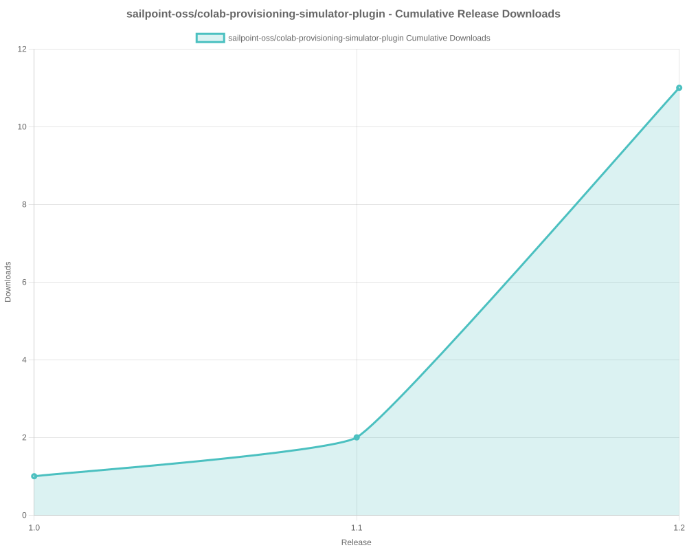
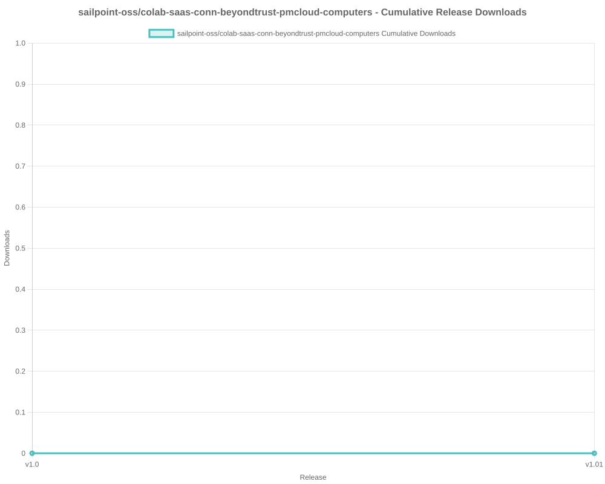

# SailPoint SDK Usage Statistics

<!-- METRICS_START -->
# Usage Statistics
    
Last updated: 12/15/2025, 12:36:32 AM

Below are stats from artifacts tracked across  and GitHub.
    
### GitHub: 

| Repository | Stars | Forks | Watchers | Open Issues | Closed Issues | Total Issues | Release Downloads | Releases | Latest Release | Language |
| --- | --- | --- | --- | --- | --- | --- | --- | --- | --- | --- |
| sailpoint-oss/colab-saas-conn-genetec-clearid | 2 | 1 | 0 | 1 | 0 | 1 | 1 | 2 | v1.2.1 | TypeScript |
| sailpoint-oss/colab-saas-conn-sailpoint-identity-fusion | 6 | 6 | 5 | 4 | 1 | 5 | 80 | 10 | v1.3.2 | TypeScript |
| sailpoint-oss/colab-saas-conn-attribute-generator | 0 | 1 | 0 | 0 | 0 | 0 | 0 | 0 | N/A | TypeScript |
| sailpoint-oss/colab-saas-conn-proxy-entitlements | 0 | 0 | 0 | 0 | 0 | 0 | 0 | 0 | N/A | TypeScript |
| sailpoint-oss/colab-siem-plugin | 3 | 3 | 0 | 0 | 0 | 0 | 0 | 0 | N/A | CSS |
| sailpoint-oss/colab-isc-extended-workflow-helper | 0 | 2 | 0 | 0 | 0 | 0 | 0 | 0 | N/A | Java |
| sailpoint-oss/colab-saas-conn-prisma-sase | 0 | 2 | 0 | 0 | 0 | 0 | 0 | 0 | N/A | TypeScript |
| sailpoint-oss/colab-saas-conn-pan-customer-service-portal | 0 | 1 | 0 | 0 | 0 | 0 | 0 | 0 | N/A | TypeScript |
| sailpoint-oss/colab-iiq-roles-with-deleted-entitlements | 0 | 1 | 0 | 0 | 0 | 0 | 0 | 0 | N/A | N/A |
| sailpoint-oss/colab-stunt-script | 4 | 0 | 2 | 0 | 0 | 0 | 0 | 0 | N/A | Shell |
| sailpoint-oss/colab-saas-conn-outlook-out-of-office | 1 | 1 | 1 | 0 | 0 | 0 | 0 | 0 | N/A | TypeScript |
| sailpoint-oss/colab-saas-conn-access-management | 0 | 0 | 0 | 0 | 0 | 0 | 0 | 0 | N/A | TypeScript |
| sailpoint-oss/colab-saas-customizer-entra-id-plus | 0 | 1 | 1 | 0 | 0 | 0 | 0 | 0 | N/A | TypeScript |
| sailpoint-oss/colab-saas-conn-search-loopback | 0 | 1 | 0 | 0 | 0 | 0 | 0 | 0 | N/A | TypeScript |
| sailpoint-oss/colab-sailpoint-zapier-integration | 1 | 1 | 0 | 0 | 0 | 0 | 0 | 0 | N/A | JavaScript |
| sailpoint-oss/colab-events-dashboard-plugin | 0 | 1 | 0 | 0 | 0 | 0 | 7 | 1 | v1.0 | Java |
| sailpoint-oss/colab-motd-plugin | 4 | 0 | 0 | 0 | 0 | 0 | 0 | 0 | N/A | JavaScript |
| sailpoint-oss/colab-iiq-resilient-actions | 0 | 1 | 0 | 0 | 0 | 0 | 0 | 0 | N/A | N/A |
| sailpoint-oss/colab-isc-PsAttributeSyncValidator | 0 | 1 | 0 | 0 | 0 | 0 | 0 | 0 | N/A | N/A |
| sailpoint-oss/colab-saas-conn-identitynow-orphan-accounts | 2 | 6 | 0 | 0 | 0 | 0 | 0 | 0 | N/A | TypeScript |
| sailpoint-oss/colab-saas-conn-peloton-platform | 0 | 1 | 0 | 0 | 0 | 0 | 0 | 0 | N/A | TypeScript |
| sailpoint-oss/colab-non-employee-risk-management-splunk-addon | 1 | 1 | 0 | 1 | 0 | 1 | 0 | 1 | v1.0.0 | Python |
| sailpoint-oss/colab-iiqda-plugin-intellij | 0 | 3 | 0 | 0 | 0 | 0 | 0 | 0 | N/A | Java |
| sailpoint-oss/colab-saas-conn-identitynow-management | 6 | 8 | 1 | 0 | 0 | 0 | 0 | 0 | N/A | TypeScript |
| sailpoint-oss/colab-saas-conn-cyber-ark-rbac | 0 | 3 | 0 | 0 | 0 | 0 | 0 | 0 | N/A | TypeScript |
| sailpoint-oss/colab-saas-conn-peloton-landview | 0 | 0 | 0 | 0 | 0 | 0 | 0 | 0 | N/A | TypeScript |
| sailpoint-oss/colab-workflows | 13 | 16 | 4 | 0 | 0 | 0 | 0 | 0 | N/A | N/A |
| sailpoint-oss/colab-show-workgroup-member-plugin | 0 | 2 | 0 | 0 | 0 | 0 | 0 | 0 | N/A | Java |
| sailpoint-oss/colab-iiq-custom-loading-spinner | 0 | 1 | 0 | 0 | 0 | 0 | 4 | 1 | v1.0 | JavaScript |
| sailpoint-oss/colab-isc-auto-loader | 0 | 3 | 0 | 0 | 0 | 0 | 0 | 0 | N/A | N/A |
| sailpoint-oss/colab-saas-conn-beyondtrust-privilege-management-cloud | 0 | 1 | 0 | 0 | 0 | 0 | 0 | 0 | N/A | TypeScript |
| sailpoint-oss/colab-provisioning-simulator-plugin | 2 | 1 | 0 | 8 | 3 | 11 | 11 | 3 | 1.2 | Java |
| sailpoint-oss/colab-saas-conn-thomsonreuters-document-intelligence | 1 | 1 | 0 | 0 | 0 | 0 | 0 | 0 | N/A | TypeScript |
| sailpoint-oss/colab-isc-powershell-task-manager | 1 | 1 | 0 | 0 | 0 | 0 | 0 | 0 | N/A | PowerShell |
| sailpoint-oss/colab-saas-conn-delimited-file | 1 | 2 | 0 | 0 | 0 | 0 | 0 | 0 | N/A | TypeScript |
| sailpoint-oss/colab-file-upload-utility-automation-scripts | 1 | 3 | 1 | 0 | 0 | 0 | 0 | 0 | N/A | PowerShell |
| sailpoint-oss/colab-sailpoint-configuration-manager | 2 | 3 | 1 | 0 | 0 | 0 | 0 | 0 | N/A | PowerShell |
| sailpoint-oss/colab-org-chart-plugin | 0 | 1 | 0 | 0 | 0 | 0 | 38 | 1 | 1.2.0 | TypeScript |
| sailpoint-oss/colab-transforms | 2 | 9 | 0 | 0 | 0 | 0 | 0 | 0 | N/A | N/A |
| sailpoint-oss/colab-file-upload-utility | 5 | 8 | 1 | 3 | 2 | 5 | 1,767 | 2 | file-upload-utility-4.1.0 | Java |
| sailpoint-oss/colab-isc-credential-cycling | 0 | 1 | 0 | 0 | 0 | 0 | 0 | 0 | N/A | C# |
| sailpoint-oss/colab-log-level-modifier-plugin | 1 | 2 | 0 | 0 | 0 | 0 | 0 | 0 | N/A | HTML |
| sailpoint-oss/colab-valdate-population-plugin | 0 | 0 | 0 | 0 | 0 | 0 | 0 | 0 | N/A | N/A |
| sailpoint-oss/colab-identity-photos-plugin | 0 | 0 | 0 | 0 | 0 | 0 | 0 | 0 | N/A | N/A |
| sailpoint-oss/colab-community-rest-api-plugin | 2 | 4 | 0 | 0 | 0 | 0 | 0 | 0 | N/A | Java |
| sailpoint-oss/colab-saas-conn-beyondtrust-pmcloud-computers | 1 | 2 | 0 | 0 | 0 | 0 | 0 | 2 | v1.01 | TypeScript |
| sailpoint-oss/colab-connector-configurations | 0 | 1 | 0 | 0 | 0 | 0 | 0 | 0 | N/A | N/A |
| sailpoint-oss/colab-iiq-hbm-extension-template | 2 | 2 | 0 | 0 | 0 | 0 | 0 | 0 | N/A | Java |
| sailpoint-oss/colab-iiqda | 5 | 9 | 2 | 4 | 1 | 5 | 0 | 0 | N/A | Java |
| sailpoint-oss/colab-announcement-plugin | 2 | 0 | 0 | 0 | 0 | 0 | 224 | 5 | v3.1 | CSS |
| sailpoint-oss/colab-identity-details-tweaks-plugin | 3 | 2 | 0 | 0 | 0 | 0 | 7 | 2 | v2.0 | JavaScript |
| sailpoint-oss/colab-repo-template | 0 | 4 | 2 | 0 | 0 | 0 | 0 | 0 | N/A | N/A |
| sailpoint-oss/colab-identitynow-azure-sentinel | 0 | 2 | 0 | 0 | 0 | 0 | 0 | 0 | N/A | Python |
| sailpoint-oss/colab-sailpoint-rule-restriction-vs-code-plugin | 0 | 2 | 0 | 0 | 0 | 0 | 0 | 0 | N/A | TypeScript |
| sailpoint-oss/colab-saas-conn-beyondtrust-representatives | 1 | 1 | 0 | 0 | 0 | 0 | 0 | 0 | N/A | TypeScript |
| sailpoint-oss/colab-reports | 1 | 1 | 0 | 0 | 0 | 0 | 0 | 0 | N/A | Java |
| sailpoint-oss/colab-rules | 3 | 7 | 0 | 0 | 0 | 0 | 0 | 0 | N/A | N/A |
| sailpoint-oss/colab-proofpoint-plugin | 1 | 1 | 0 | 0 | 0 | 0 | 0 | 0 | N/A | Java |
| sailpoint-oss/colab-saas-conn-rambase-cloud-erp | 0 | 1 | 0 | 0 | 0 | 0 | 0 | 0 | N/A | TypeScript |
| sailpoint-oss/colab-saas-conn-beyondtrust-epm | 0 | 1 | 0 | 0 | 0 | 0 | 0 | 0 | N/A | N/A |
| sailpoint-oss/colab-saas-conn-beyondtrust-pra | 0 | 1 | 0 | 0 | 0 | 0 | 0 | 0 | N/A | N/A |
| sailpoint-oss/colab-saas-conn-proofpoint | 0 | 2 | 0 | 0 | 0 | 0 | 0 | 0 | N/A | N/A |
| **Total** | **80** | **144** | **21** | **21** | **7** | **28** | **2,139** | **30** | | |

#### Repository Details:

**sailpoint-oss/colab-saas-conn-genetec-clearid**:
- Last Activity: 2 days ago
- Repository Age: 809 days
- Release Count: 2
- Total Release Downloads: 1
- Latest Release: v1.2.1
- Latest Release Downloads: 1
- Views: 46
- Unique Visitors: 5
- Clones: 43
- Top Assets (by downloads):
  - clearid_zip: 1
- Format Breakdown:
  - zip: 1

**sailpoint-oss/colab-saas-conn-sailpoint-identity-fusion**:
- Last Activity: 4 days ago
- Repository Age: 621 days
- Release Count: 10
- Total Release Downloads: 80
- Latest Release: v1.3.2
- Latest Release Downloads: 7
- Views: 444
- Unique Visitors: 55
- Clones: 144
- Top Assets (by downloads):
  - identity_zip: 80
- Format Breakdown:
  - zip: 80

**sailpoint-oss/colab-saas-conn-attribute-generator**:
- Last Activity: 12 days ago
- Repository Age: 172 days
- Release Count: 0
- Total Release Downloads: 0
- Latest Release: N/A
- Latest Release Downloads: 0
- Views: 34
- Unique Visitors: 8
- Clones: 12

**sailpoint-oss/colab-saas-conn-proxy-entitlements**:
- Last Activity: 12 days ago
- Repository Age: 172 days
- Release Count: 0
- Total Release Downloads: 0
- Latest Release: N/A
- Latest Release Downloads: 0
- Views: 2
- Unique Visitors: 2
- Clones: 11

**sailpoint-oss/colab-siem-plugin**:
- Last Activity: 37 days ago
- Repository Age: 809 days
- Release Count: 0
- Total Release Downloads: 0
- Latest Release: N/A
- Latest Release Downloads: 0
- Views: 89
- Unique Visitors: 25
- Clones: 5

**sailpoint-oss/colab-isc-extended-workflow-helper**:
- Last Activity: 80 days ago
- Repository Age: 87 days
- Release Count: 0
- Total Release Downloads: 0
- Latest Release: N/A
- Latest Release Downloads: 0
- Views: 14
- Unique Visitors: 4
- Clones: 3

**sailpoint-oss/colab-saas-conn-prisma-sase**:
- Last Activity: 94 days ago
- Repository Age: 506 days
- Release Count: 0
- Total Release Downloads: 0
- Latest Release: N/A
- Latest Release Downloads: 0
- Views: 0
- Unique Visitors: 0
- Clones: 7

**sailpoint-oss/colab-saas-conn-pan-customer-service-portal**:
- Last Activity: 95 days ago
- Repository Age: 506 days
- Release Count: 0
- Total Release Downloads: 0
- Latest Release: N/A
- Latest Release Downloads: 0
- Views: 1
- Unique Visitors: 1
- Clones: 6

**sailpoint-oss/colab-iiq-roles-with-deleted-entitlements**:
- Last Activity: 100 days ago
- Repository Age: 100 days
- Release Count: 0
- Total Release Downloads: 0
- Latest Release: N/A
- Latest Release Downloads: 0
- Views: 4
- Unique Visitors: 1
- Clones: 5

**sailpoint-oss/colab-stunt-script**:
- Last Activity: 117 days ago
- Repository Age: 809 days
- Release Count: 0
- Total Release Downloads: 0
- Latest Release: N/A
- Latest Release Downloads: 0
- Views: 34
- Unique Visitors: 19
- Clones: 10

**sailpoint-oss/colab-saas-conn-outlook-out-of-office**:
- Last Activity: 118 days ago
- Repository Age: 760 days
- Release Count: 0
- Total Release Downloads: 0
- Latest Release: N/A
- Latest Release Downloads: 0
- Views: 0
- Unique Visitors: 0
- Clones: 6

**sailpoint-oss/colab-saas-conn-access-management**:
- Last Activity: 124 days ago
- Repository Age: 172 days
- Release Count: 0
- Total Release Downloads: 0
- Latest Release: N/A
- Latest Release Downloads: 0
- Views: 15
- Unique Visitors: 5
- Clones: 4

**sailpoint-oss/colab-saas-customizer-entra-id-plus**:
- Last Activity: 124 days ago
- Repository Age: 172 days
- Release Count: 0
- Total Release Downloads: 0
- Latest Release: N/A
- Latest Release Downloads: 0
- Views: 11
- Unique Visitors: 8
- Clones: 6

**sailpoint-oss/colab-saas-conn-search-loopback**:
- Last Activity: 125 days ago
- Repository Age: 325 days
- Release Count: 0
- Total Release Downloads: 0
- Latest Release: N/A
- Latest Release Downloads: 0
- Views: 2
- Unique Visitors: 2
- Clones: 7

**sailpoint-oss/colab-sailpoint-zapier-integration**:
- Last Activity: 145 days ago
- Repository Age: 810 days
- Release Count: 0
- Total Release Downloads: 0
- Latest Release: N/A
- Latest Release Downloads: 0
- Views: 0
- Unique Visitors: 0
- Clones: 4

**sailpoint-oss/colab-events-dashboard-plugin**:
- Last Activity: 149 days ago
- Repository Age: 172 days
- Release Count: 1
- Total Release Downloads: 7
- Latest Release: v1.0
- Latest Release Downloads: 7
- Views: 5
- Unique Visitors: 3
- Clones: 2
- Top Assets (by downloads):
  - eventsdashboardplugin_zip: 7
- Format Breakdown:
  - zip: 7

**sailpoint-oss/colab-motd-plugin**:
- Last Activity: 155 days ago
- Repository Age: 598 days
- Release Count: 0
- Total Release Downloads: 0
- Latest Release: N/A
- Latest Release Downloads: 0
- Views: 4
- Unique Visitors: 3
- Clones: 4

**sailpoint-oss/colab-iiq-resilient-actions**:
- Last Activity: 185 days ago
- Repository Age: 185 days
- Release Count: 0
- Total Release Downloads: 0
- Latest Release: N/A
- Latest Release Downloads: 0
- Views: 2
- Unique Visitors: 2
- Clones: 3

**sailpoint-oss/colab-isc-PsAttributeSyncValidator**:
- Last Activity: 195 days ago
- Repository Age: 195 days
- Release Count: 0
- Total Release Downloads: 0
- Latest Release: N/A
- Latest Release Downloads: 0
- Views: 1
- Unique Visitors: 1
- Clones: 3

**sailpoint-oss/colab-saas-conn-identitynow-orphan-accounts**:
- Last Activity: 198 days ago
- Repository Age: 809 days
- Release Count: 0
- Total Release Downloads: 0
- Latest Release: N/A
- Latest Release Downloads: 0
- Views: 2
- Unique Visitors: 2
- Clones: 8

**sailpoint-oss/colab-saas-conn-peloton-platform**:
- Last Activity: 229 days ago
- Repository Age: 229 days
- Release Count: 0
- Total Release Downloads: 0
- Latest Release: N/A
- Latest Release Downloads: 0
- Views: 0
- Unique Visitors: 0
- Clones: 5

**sailpoint-oss/colab-non-employee-risk-management-splunk-addon**:
- Last Activity: 251 days ago
- Repository Age: 387 days
- Release Count: 1
- Total Release Downloads: 0
- Latest Release: v1.0.0
- Latest Release Downloads: 0
- Views: 22
- Unique Visitors: 5
- Clones: 5

**sailpoint-oss/colab-iiqda-plugin-intellij**:
- Last Activity: 255 days ago
- Repository Age: 543 days
- Release Count: 0
- Total Release Downloads: 0
- Latest Release: N/A
- Latest Release Downloads: 0
- Views: 36
- Unique Visitors: 12
- Clones: 5

**sailpoint-oss/colab-saas-conn-identitynow-management**:
- Last Activity: 282 days ago
- Repository Age: 810 days
- Release Count: 0
- Total Release Downloads: 0
- Latest Release: N/A
- Latest Release Downloads: 0
- Views: 14
- Unique Visitors: 9
- Clones: 6

**sailpoint-oss/colab-saas-conn-cyber-ark-rbac**:
- Last Activity: 290 days ago
- Repository Age: 293 days
- Release Count: 0
- Total Release Downloads: 0
- Latest Release: N/A
- Latest Release Downloads: 0
- Views: 18
- Unique Visitors: 5
- Clones: 3

**sailpoint-oss/colab-saas-conn-peloton-landview**:
- Last Activity: 293 days ago
- Repository Age: 632 days
- Release Count: 0
- Total Release Downloads: 0
- Latest Release: N/A
- Latest Release Downloads: 0
- Views: 0
- Unique Visitors: 0
- Clones: 3

**sailpoint-oss/colab-workflows**:
- Last Activity: 298 days ago
- Repository Age: 811 days
- Release Count: 0
- Total Release Downloads: 0
- Latest Release: N/A
- Latest Release Downloads: 0
- Views: 273
- Unique Visitors: 66
- Clones: 7

**sailpoint-oss/colab-show-workgroup-member-plugin**:
- Last Activity: 306 days ago
- Repository Age: 321 days
- Release Count: 0
- Total Release Downloads: 0
- Latest Release: N/A
- Latest Release Downloads: 0
- Views: 28
- Unique Visitors: 2
- Clones: 3

**sailpoint-oss/colab-iiq-custom-loading-spinner**:
- Last Activity: 335 days ago
- Repository Age: 341 days
- Release Count: 1
- Total Release Downloads: 4
- Latest Release: v1.0
- Latest Release Downloads: 4
- Views: 5
- Unique Visitors: 2
- Clones: 3
- Top Assets (by downloads):
  - custom_zip: 4
- Format Breakdown:
  - zip: 4

**sailpoint-oss/colab-isc-auto-loader**:
- Last Activity: 369 days ago
- Repository Age: 369 days
- Release Count: 0
- Total Release Downloads: 0
- Latest Release: N/A
- Latest Release Downloads: 0
- Views: 3
- Unique Visitors: 2
- Clones: 5

**sailpoint-oss/colab-saas-conn-beyondtrust-privilege-management-cloud**:
- Last Activity: 374 days ago
- Repository Age: 684 days
- Release Count: 0
- Total Release Downloads: 0
- Latest Release: N/A
- Latest Release Downloads: 0
- Views: 0
- Unique Visitors: 0
- Clones: 6

**sailpoint-oss/colab-provisioning-simulator-plugin**:
- Last Activity: 376 days ago
- Repository Age: 585 days
- Release Count: 3
- Total Release Downloads: 11
- Latest Release: 1.2
- Latest Release Downloads: 9
- Views: 18
- Unique Visitors: 4
- Clones: 3
- Top Assets (by downloads):
  - colab: 6
  - colab_zip: 4
  - provisioningsimulator: 1
- Format Breakdown:
  - zip: 4

**sailpoint-oss/colab-saas-conn-thomsonreuters-document-intelligence**:
- Last Activity: 377 days ago
- Repository Age: 384 days
- Release Count: 0
- Total Release Downloads: 0
- Latest Release: N/A
- Latest Release Downloads: 0
- Views: 5
- Unique Visitors: 2
- Clones: 5

**sailpoint-oss/colab-isc-powershell-task-manager**:
- Last Activity: 408 days ago
- Repository Age: 430 days
- Release Count: 0
- Total Release Downloads: 0
- Latest Release: N/A
- Latest Release Downloads: 0
- Views: 13
- Unique Visitors: 3
- Clones: 8

**sailpoint-oss/colab-saas-conn-delimited-file**:
- Last Activity: 421 days ago
- Repository Age: 506 days
- Release Count: 0
- Total Release Downloads: 0
- Latest Release: N/A
- Latest Release Downloads: 0
- Views: 5
- Unique Visitors: 2
- Clones: 4

**sailpoint-oss/colab-file-upload-utility-automation-scripts**:
- Last Activity: 439 days ago
- Repository Age: 451 days
- Release Count: 0
- Total Release Downloads: 0
- Latest Release: N/A
- Latest Release Downloads: 0
- Views: 66
- Unique Visitors: 14
- Clones: 9

**sailpoint-oss/colab-sailpoint-configuration-manager**:
- Last Activity: 442 days ago
- Repository Age: 655 days
- Release Count: 0
- Total Release Downloads: 0
- Latest Release: N/A
- Latest Release Downloads: 0
- Views: 10
- Unique Visitors: 3
- Clones: 7

**sailpoint-oss/colab-org-chart-plugin**:
- Last Activity: 444 days ago
- Repository Age: 543 days
- Release Count: 1
- Total Release Downloads: 38
- Latest Release: 1.2.0
- Latest Release Downloads: 38
- Views: 1
- Unique Visitors: 1
- Clones: 3
- Top Assets (by downloads):
  - orgchartplugin_zip: 38
- Format Breakdown:
  - zip: 38

**sailpoint-oss/colab-transforms**:
- Last Activity: 445 days ago
- Repository Age: 811 days
- Release Count: 0
- Total Release Downloads: 0
- Latest Release: N/A
- Latest Release Downloads: 0
- Views: 41
- Unique Visitors: 18
- Clones: 6

**sailpoint-oss/colab-file-upload-utility**:
- Last Activity: 459 days ago
- Repository Age: 810 days
- Release Count: 2
- Total Release Downloads: 1,767
- Latest Release: file-upload-utility-4.1.0
- Latest Release Downloads: 996
- Views: 160
- Unique Visitors: 72
- Clones: 7
- Top Assets (by downloads):
  - sailpoint: 1,767

**sailpoint-oss/colab-isc-credential-cycling**:
- Last Activity: 473 days ago
- Repository Age: 499 days
- Release Count: 0
- Total Release Downloads: 0
- Latest Release: N/A
- Latest Release Downloads: 0
- Views: 0
- Unique Visitors: 0
- Clones: 4

**sailpoint-oss/colab-log-level-modifier-plugin**:
- Last Activity: 482 days ago
- Repository Age: 486 days
- Release Count: 0
- Total Release Downloads: 0
- Latest Release: N/A
- Latest Release Downloads: 0
- Views: 5
- Unique Visitors: 3
- Clones: 5

**sailpoint-oss/colab-valdate-population-plugin**:
- Last Activity: 496 days ago
- Repository Age: 496 days
- Release Count: 0
- Total Release Downloads: 0
- Latest Release: N/A
- Latest Release Downloads: 0
- Views: 0
- Unique Visitors: 0
- Clones: 4

**sailpoint-oss/colab-identity-photos-plugin**:
- Last Activity: 496 days ago
- Repository Age: 496 days
- Release Count: 0
- Total Release Downloads: 0
- Latest Release: N/A
- Latest Release Downloads: 0
- Views: 0
- Unique Visitors: 0
- Clones: 3

**sailpoint-oss/colab-community-rest-api-plugin**:
- Last Activity: 537 days ago
- Repository Age: 543 days
- Release Count: 0
- Total Release Downloads: 0
- Latest Release: N/A
- Latest Release Downloads: 0
- Views: 41
- Unique Visitors: 8
- Clones: 6

**sailpoint-oss/colab-saas-conn-beyondtrust-pmcloud-computers**:
- Last Activity: 542 days ago
- Repository Age: 684 days
- Release Count: 2
- Total Release Downloads: 0
- Latest Release: v1.01
- Latest Release Downloads: 0
- Views: 0
- Unique Visitors: 0
- Clones: 5

**sailpoint-oss/colab-connector-configurations**:
- Last Activity: 543 days ago
- Repository Age: 543 days
- Release Count: 0
- Total Release Downloads: 0
- Latest Release: N/A
- Latest Release Downloads: 0
- Views: 0
- Unique Visitors: 0
- Clones: 6

**sailpoint-oss/colab-iiq-hbm-extension-template**:
- Last Activity: 571 days ago
- Repository Age: 599 days
- Release Count: 0
- Total Release Downloads: 0
- Latest Release: N/A
- Latest Release Downloads: 0
- Views: 9
- Unique Visitors: 3
- Clones: 5

**sailpoint-oss/colab-iiqda**:
- Last Activity: 576 days ago
- Repository Age: 811 days
- Release Count: 0
- Total Release Downloads: 0
- Latest Release: N/A
- Latest Release Downloads: 0
- Views: 19
- Unique Visitors: 17
- Clones: 7

**sailpoint-oss/colab-announcement-plugin**:
- Last Activity: 576 days ago
- Repository Age: 704 days
- Release Count: 5
- Total Release Downloads: 224
- Latest Release: v3.1
- Latest Release Downloads: 104
- Views: 20
- Unique Visitors: 7
- Clones: 5
- Top Assets (by downloads):
  - announcement_zip: 224
- Format Breakdown:
  - zip: 224

**sailpoint-oss/colab-identity-details-tweaks-plugin**:
- Last Activity: 621 days ago
- Repository Age: 668 days
- Release Count: 2
- Total Release Downloads: 7
- Latest Release: v2.0
- Latest Release Downloads: 0
- Views: 12
- Unique Visitors: 3
- Clones: 9
- Top Assets (by downloads):
  - identitydetailstweaks_zip: 7
- Format Breakdown:
  - zip: 7

**sailpoint-oss/colab-repo-template**:
- Last Activity: 650 days ago
- Repository Age: 1,237 days
- Release Count: 0
- Total Release Downloads: 0
- Latest Release: N/A
- Latest Release Downloads: 0
- Views: 4
- Unique Visitors: 4
- Clones: 10

**sailpoint-oss/colab-identitynow-azure-sentinel**:
- Last Activity: 662 days ago
- Repository Age: 803 days
- Release Count: 0
- Total Release Downloads: 0
- Latest Release: N/A
- Latest Release Downloads: 0
- Views: 14
- Unique Visitors: 2
- Clones: 7

**sailpoint-oss/colab-sailpoint-rule-restriction-vs-code-plugin**:
- Last Activity: 668 days ago
- Repository Age: 682 days
- Release Count: 0
- Total Release Downloads: 0
- Latest Release: N/A
- Latest Release Downloads: 0
- Views: 2
- Unique Visitors: 2
- Clones: 3

**sailpoint-oss/colab-saas-conn-beyondtrust-representatives**:
- Last Activity: 682 days ago
- Repository Age: 684 days
- Release Count: 0
- Total Release Downloads: 0
- Latest Release: N/A
- Latest Release Downloads: 0
- Views: 6
- Unique Visitors: 2
- Clones: 5

**sailpoint-oss/colab-reports**:
- Last Activity: 768 days ago
- Repository Age: 769 days
- Release Count: 0
- Total Release Downloads: 0
- Latest Release: N/A
- Latest Release Downloads: 0
- Views: 46
- Unique Visitors: 5
- Clones: 5

**sailpoint-oss/colab-rules**:
- Last Activity: 769 days ago
- Repository Age: 811 days
- Release Count: 0
- Total Release Downloads: 0
- Latest Release: N/A
- Latest Release Downloads: 0
- Views: 35
- Unique Visitors: 15
- Clones: 5

**sailpoint-oss/colab-proofpoint-plugin**:
- Last Activity: 796 days ago
- Repository Age: 809 days
- Release Count: 0
- Total Release Downloads: 0
- Latest Release: N/A
- Latest Release Downloads: 0
- Views: 0
- Unique Visitors: 0
- Clones: 6

**sailpoint-oss/colab-saas-conn-rambase-cloud-erp**:
- Last Activity: 801 days ago
- Repository Age: 810 days
- Release Count: 0
- Total Release Downloads: 0
- Latest Release: N/A
- Latest Release Downloads: 0
- Views: 1
- Unique Visitors: 1
- Clones: 3

**sailpoint-oss/colab-saas-conn-beyondtrust-epm**:
- Last Activity: 803 days ago
- Repository Age: 810 days
- Release Count: 0
- Total Release Downloads: 0
- Latest Release: N/A
- Latest Release Downloads: 0
- Views: 0
- Unique Visitors: 0
- Clones: 2

**sailpoint-oss/colab-saas-conn-beyondtrust-pra**:
- Last Activity: 803 days ago
- Repository Age: 810 days
- Release Count: 0
- Total Release Downloads: 0
- Latest Release: N/A
- Latest Release Downloads: 0
- Views: 0
- Unique Visitors: 0
- Clones: 4

**sailpoint-oss/colab-saas-conn-proofpoint**:
- Last Activity: 803 days ago
- Repository Age: 809 days
- Release Count: 0
- Total Release Downloads: 0
- Latest Release: N/A
- Latest Release Downloads: 0
- Views: 0
- Unique Visitors: 0
- Clones: 4

<!-- METRICS_END -->
