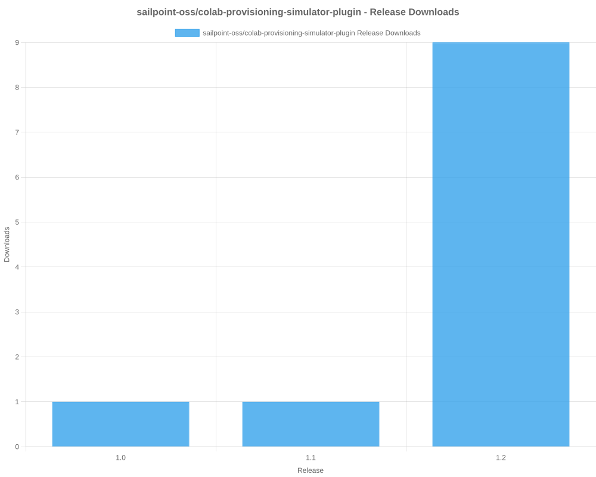

# SailPoint SDK Usage Statistics

<!-- METRICS_START -->
# Usage Statistics
    
Last updated: 10/27/2025, 12:36:35 AM

Below are stats from artifacts tracked across  and GitHub.
    
### GitHub: 

| Repository | Stars | Forks | Watchers | Open Issues | Closed Issues | Total Issues | Release Downloads | Releases | Latest Release | Language |
| --- | --- | --- | --- | --- | --- | --- | --- | --- | --- | --- |
| sailpoint-oss/colab-saas-conn-sailpoint-identity-fusion | 5 | 6 | 4 | 3 | 1 | 4 | 50 | 7 | v1.2.2 | TypeScript |
| sailpoint-oss/colab-isc-extended-workflow-helper | 0 | 2 | 0 | 0 | 0 | 0 | 0 | 0 | N/A | Java |
| sailpoint-oss/colab-saas-conn-prisma-sase | 0 | 2 | 0 | 0 | 0 | 0 | 0 | 0 | N/A | TypeScript |
| sailpoint-oss/colab-saas-conn-pan-customer-service-portal | 0 | 1 | 0 | 0 | 0 | 0 | 0 | 0 | N/A | TypeScript |
| sailpoint-oss/colab-iiq-roles-with-deleted-entitlements | 0 | 1 | 0 | 0 | 0 | 0 | 0 | 0 | N/A | N/A |
| sailpoint-oss/colab-stunt-script | 4 | 0 | 2 | 0 | 0 | 0 | 0 | 0 | N/A | Shell |
| sailpoint-oss/colab-saas-conn-outlook-out-of-office | 1 | 1 | 1 | 0 | 0 | 0 | 0 | 0 | N/A | TypeScript |
| sailpoint-oss/colab-saas-conn-search-loopback | 0 | 1 | 0 | 0 | 0 | 0 | 0 | 0 | N/A | TypeScript |
| sailpoint-oss/colab-sailpoint-zapier-integration | 1 | 1 | 0 | 0 | 0 | 0 | 0 | 0 | N/A | JavaScript |
| sailpoint-oss/colab-events-dashboard-plugin | 0 | 1 | 0 | 0 | 0 | 0 | 5 | 1 | v1.0 | Java |
| sailpoint-oss/colab-motd-plugin | 3 | 0 | 0 | 0 | 0 | 0 | 0 | 0 | N/A | JavaScript |
| sailpoint-oss/colab-saas-conn-genetec-clearid | 2 | 1 | 0 | 1 | 0 | 1 | 0 | 0 | N/A | TypeScript |
| sailpoint-oss/colab-iiq-resilient-actions | 0 | 1 | 0 | 0 | 0 | 0 | 0 | 0 | N/A | N/A |
| sailpoint-oss/colab-isc-PsAttributeSyncValidator | 0 | 1 | 0 | 0 | 0 | 0 | 0 | 0 | N/A | N/A |
| sailpoint-oss/colab-saas-conn-identitynow-orphan-accounts | 2 | 6 | 0 | 0 | 0 | 0 | 0 | 0 | N/A | TypeScript |
| sailpoint-oss/colab-saas-conn-peloton-platform | 0 | 1 | 0 | 0 | 0 | 0 | 0 | 0 | N/A | TypeScript |
| sailpoint-oss/colab-non-employee-risk-management-splunk-addon | 1 | 1 | 0 | 0 | 0 | 0 | 0 | 1 | v1.0.0 | Python |
| sailpoint-oss/colab-iiqda-plugin-intellij | 0 | 3 | 0 | 0 | 0 | 0 | 0 | 0 | N/A | Java |
| sailpoint-oss/colab-saas-conn-identitynow-management | 6 | 8 | 1 | 0 | 0 | 0 | 0 | 0 | N/A | TypeScript |
| sailpoint-oss/colab-saas-conn-cyber-ark-rbac | 0 | 3 | 0 | 0 | 0 | 0 | 0 | 0 | N/A | TypeScript |
| sailpoint-oss/colab-saas-conn-peloton-landview | 0 | 0 | 0 | 0 | 0 | 0 | 0 | 0 | N/A | TypeScript |
| sailpoint-oss/colab-workflows | 13 | 15 | 4 | 0 | 0 | 0 | 0 | 0 | N/A | N/A |
| sailpoint-oss/colab-show-workgroup-member-plugin | 0 | 2 | 0 | 0 | 0 | 0 | 0 | 0 | N/A | Java |
| sailpoint-oss/colab-iiq-custom-loading-spinner | 0 | 1 | 0 | 0 | 0 | 0 | 3 | 1 | v1.0 | JavaScript |
| sailpoint-oss/colab-isc-auto-loader | 0 | 2 | 0 | 0 | 0 | 0 | 0 | 0 | N/A | N/A |
| sailpoint-oss/colab-saas-conn-beyondtrust-privilege-management-cloud | 0 | 1 | 0 | 0 | 0 | 0 | 0 | 0 | N/A | TypeScript |
| sailpoint-oss/colab-provisioning-simulator-plugin | 1 | 1 | 0 | 8 | 3 | 11 | 11 | 3 | 1.2 | Java |
| sailpoint-oss/colab-saas-conn-thomsonreuters-document-intelligence | 1 | 1 | 0 | 0 | 0 | 0 | 0 | 0 | N/A | TypeScript |
| sailpoint-oss/colab-isc-powershell-task-manager | 1 | 1 | 0 | 0 | 0 | 0 | 0 | 0 | N/A | PowerShell |
| sailpoint-oss/colab-saas-conn-delimited-file | 1 | 2 | 0 | 0 | 0 | 0 | 0 | 0 | N/A | TypeScript |
| sailpoint-oss/colab-file-upload-utility-automation-scripts | 1 | 2 | 1 | 0 | 0 | 0 | 0 | 0 | N/A | PowerShell |
| sailpoint-oss/colab-sailpoint-configuration-manager | 2 | 3 | 1 | 0 | 0 | 0 | 0 | 0 | N/A | PowerShell |
| sailpoint-oss/colab-org-chart-plugin | 0 | 1 | 0 | 0 | 0 | 0 | 38 | 1 | 1.2.0 | TypeScript |
| sailpoint-oss/colab-transforms | 2 | 9 | 0 | 0 | 0 | 0 | 0 | 0 | N/A | N/A |
| sailpoint-oss/colab-file-upload-utility | 5 | 8 | 1 | 3 | 2 | 5 | 1,660 | 2 | file-upload-utility-4.1.0 | Java |
| sailpoint-oss/colab-isc-credential-cycling | 0 | 1 | 0 | 0 | 0 | 0 | 0 | 0 | N/A | C# |
| sailpoint-oss/colab-log-level-modifier-plugin | 1 | 2 | 0 | 0 | 0 | 0 | 0 | 0 | N/A | HTML |
| sailpoint-oss/colab-valdate-population-plugin | 0 | 0 | 0 | 0 | 0 | 0 | 0 | 0 | N/A | N/A |
| sailpoint-oss/colab-identity-photos-plugin | 0 | 0 | 0 | 0 | 0 | 0 | 0 | 0 | N/A | N/A |
| sailpoint-oss/colab-community-rest-api-plugin | 2 | 4 | 0 | 0 | 0 | 0 | 0 | 0 | N/A | Java |
| sailpoint-oss/colab-saas-conn-beyondtrust-pmcloud-computers | 1 | 2 | 0 | 0 | 0 | 0 | 0 | 2 | v1.01 | TypeScript |
| sailpoint-oss/colab-connector-configurations | 0 | 1 | 0 | 0 | 0 | 0 | 0 | 0 | N/A | N/A |
| sailpoint-oss/colab-iiq-hbm-extension-template | 2 | 2 | 0 | 0 | 0 | 0 | 0 | 0 | N/A | Java |
| sailpoint-oss/colab-iiqda | 5 | 9 | 2 | 4 | 1 | 5 | 0 | 0 | N/A | Java |
| sailpoint-oss/colab-announcement-plugin | 2 | 0 | 0 | 0 | 0 | 0 | 214 | 5 | v3.1 | CSS |
| sailpoint-oss/colab-identity-details-tweaks-plugin | 3 | 2 | 0 | 0 | 0 | 0 | 7 | 2 | v2.0 | JavaScript |
| sailpoint-oss/colab-repo-template | 0 | 4 | 2 | 0 | 0 | 0 | 0 | 0 | N/A | N/A |
| sailpoint-oss/colab-identitynow-azure-sentinel | 0 | 2 | 0 | 0 | 0 | 0 | 0 | 0 | N/A | Python |
| sailpoint-oss/colab-sailpoint-rule-restriction-vs-code-plugin | 0 | 2 | 0 | 0 | 0 | 0 | 0 | 0 | N/A | TypeScript |
| sailpoint-oss/colab-saas-conn-beyondtrust-representatives | 1 | 1 | 0 | 0 | 0 | 0 | 0 | 0 | N/A | TypeScript |
| sailpoint-oss/colab-reports | 1 | 1 | 0 | 0 | 0 | 0 | 0 | 0 | N/A | Java |
| sailpoint-oss/colab-rules | 3 | 7 | 0 | 0 | 0 | 0 | 0 | 0 | N/A | N/A |
| sailpoint-oss/colab-proofpoint-plugin | 1 | 1 | 0 | 0 | 0 | 0 | 0 | 0 | N/A | Java |
| sailpoint-oss/colab-siem-plugin | 2 | 2 | 0 | 0 | 0 | 0 | 0 | 0 | N/A | CSS |
| sailpoint-oss/colab-saas-conn-rambase-cloud-erp | 0 | 1 | 0 | 0 | 0 | 0 | 0 | 0 | N/A | TypeScript |
| sailpoint-oss/colab-saas-conn-beyondtrust-epm | 0 | 1 | 0 | 0 | 0 | 0 | 0 | 0 | N/A | N/A |
| sailpoint-oss/colab-saas-conn-beyondtrust-pra | 0 | 1 | 0 | 0 | 0 | 0 | 0 | 0 | N/A | N/A |
| sailpoint-oss/colab-saas-conn-proofpoint | 0 | 2 | 0 | 0 | 0 | 0 | 0 | 0 | N/A | N/A |
| **Total** | **76** | **138** | **19** | **19** | **7** | **26** | **1,988** | **25** | | |

#### Repository Details:

**sailpoint-oss/colab-saas-conn-sailpoint-identity-fusion**:
- Last Activity: 9 days ago
- Repository Age: 572 days
- Release Count: 7
- Total Release Downloads: 50
- Latest Release: v1.2.2
- Latest Release Downloads: 11
- Views: 308
- Unique Visitors: 71
- Clones: 42
- Top Assets (by downloads):
  - identity_zip: 50
- Format Breakdown:
  - zip: 50

**sailpoint-oss/colab-isc-extended-workflow-helper**:
- Last Activity: 31 days ago
- Repository Age: 38 days
- Release Count: 0
- Total Release Downloads: 0
- Latest Release: N/A
- Latest Release Downloads: 0
- Views: 45
- Unique Visitors: 10
- Clones: 9

**sailpoint-oss/colab-saas-conn-prisma-sase**:
- Last Activity: 45 days ago
- Repository Age: 457 days
- Release Count: 0
- Total Release Downloads: 0
- Latest Release: N/A
- Latest Release Downloads: 0
- Views: 0
- Unique Visitors: 0
- Clones: 8

**sailpoint-oss/colab-saas-conn-pan-customer-service-portal**:
- Last Activity: 46 days ago
- Repository Age: 457 days
- Release Count: 0
- Total Release Downloads: 0
- Latest Release: N/A
- Latest Release Downloads: 0
- Views: 2
- Unique Visitors: 2
- Clones: 8

**sailpoint-oss/colab-iiq-roles-with-deleted-entitlements**:
- Last Activity: 51 days ago
- Repository Age: 51 days
- Release Count: 0
- Total Release Downloads: 0
- Latest Release: N/A
- Latest Release Downloads: 0
- Views: 5
- Unique Visitors: 3
- Clones: 3

**sailpoint-oss/colab-stunt-script**:
- Last Activity: 68 days ago
- Repository Age: 760 days
- Release Count: 0
- Total Release Downloads: 0
- Latest Release: N/A
- Latest Release Downloads: 0
- Views: 48
- Unique Visitors: 22
- Clones: 25

**sailpoint-oss/colab-saas-conn-outlook-out-of-office**:
- Last Activity: 69 days ago
- Repository Age: 711 days
- Release Count: 0
- Total Release Downloads: 0
- Latest Release: N/A
- Latest Release Downloads: 0
- Views: 2
- Unique Visitors: 2
- Clones: 7

**sailpoint-oss/colab-saas-conn-search-loopback**:
- Last Activity: 76 days ago
- Repository Age: 276 days
- Release Count: 0
- Total Release Downloads: 0
- Latest Release: N/A
- Latest Release Downloads: 0
- Views: 5
- Unique Visitors: 3
- Clones: 2

**sailpoint-oss/colab-sailpoint-zapier-integration**:
- Last Activity: 96 days ago
- Repository Age: 761 days
- Release Count: 0
- Total Release Downloads: 0
- Latest Release: N/A
- Latest Release Downloads: 0
- Views: 1
- Unique Visitors: 1
- Clones: 5

**sailpoint-oss/colab-events-dashboard-plugin**:
- Last Activity: 100 days ago
- Repository Age: 123 days
- Release Count: 1
- Total Release Downloads: 5
- Latest Release: v1.0
- Latest Release Downloads: 5
- Views: 27
- Unique Visitors: 3
- Clones: 6
- Top Assets (by downloads):
  - eventsdashboardplugin_zip: 5
- Format Breakdown:
  - zip: 5

**sailpoint-oss/colab-motd-plugin**:
- Last Activity: 106 days ago
- Repository Age: 549 days
- Release Count: 0
- Total Release Downloads: 0
- Latest Release: N/A
- Latest Release Downloads: 0
- Views: 76
- Unique Visitors: 5
- Clones: 6

**sailpoint-oss/colab-saas-conn-genetec-clearid**:
- Last Activity: 131 days ago
- Repository Age: 760 days
- Release Count: 0
- Total Release Downloads: 0
- Latest Release: N/A
- Latest Release Downloads: 0
- Views: 12
- Unique Visitors: 4
- Clones: 8

**sailpoint-oss/colab-iiq-resilient-actions**:
- Last Activity: 136 days ago
- Repository Age: 136 days
- Release Count: 0
- Total Release Downloads: 0
- Latest Release: N/A
- Latest Release Downloads: 0
- Views: 3
- Unique Visitors: 3
- Clones: 3

**sailpoint-oss/colab-isc-PsAttributeSyncValidator**:
- Last Activity: 146 days ago
- Repository Age: 146 days
- Release Count: 0
- Total Release Downloads: 0
- Latest Release: N/A
- Latest Release Downloads: 0
- Views: 0
- Unique Visitors: 0
- Clones: 1

**sailpoint-oss/colab-saas-conn-identitynow-orphan-accounts**:
- Last Activity: 149 days ago
- Repository Age: 760 days
- Release Count: 0
- Total Release Downloads: 0
- Latest Release: N/A
- Latest Release Downloads: 0
- Views: 2
- Unique Visitors: 2
- Clones: 5

**sailpoint-oss/colab-saas-conn-peloton-platform**:
- Last Activity: 180 days ago
- Repository Age: 180 days
- Release Count: 0
- Total Release Downloads: 0
- Latest Release: N/A
- Latest Release Downloads: 0
- Views: 1
- Unique Visitors: 1
- Clones: 2

**sailpoint-oss/colab-non-employee-risk-management-splunk-addon**:
- Last Activity: 202 days ago
- Repository Age: 338 days
- Release Count: 1
- Total Release Downloads: 0
- Latest Release: v1.0.0
- Latest Release Downloads: 0
- Views: 5
- Unique Visitors: 3
- Clones: 2

**sailpoint-oss/colab-iiqda-plugin-intellij**:
- Last Activity: 206 days ago
- Repository Age: 494 days
- Release Count: 0
- Total Release Downloads: 0
- Latest Release: N/A
- Latest Release Downloads: 0
- Views: 36
- Unique Visitors: 11
- Clones: 4

**sailpoint-oss/colab-saas-conn-identitynow-management**:
- Last Activity: 233 days ago
- Repository Age: 761 days
- Release Count: 0
- Total Release Downloads: 0
- Latest Release: N/A
- Latest Release Downloads: 0
- Views: 16
- Unique Visitors: 12
- Clones: 11

**sailpoint-oss/colab-saas-conn-cyber-ark-rbac**:
- Last Activity: 241 days ago
- Repository Age: 244 days
- Release Count: 0
- Total Release Downloads: 0
- Latest Release: N/A
- Latest Release Downloads: 0
- Views: 10
- Unique Visitors: 7
- Clones: 4

**sailpoint-oss/colab-saas-conn-peloton-landview**:
- Last Activity: 244 days ago
- Repository Age: 583 days
- Release Count: 0
- Total Release Downloads: 0
- Latest Release: N/A
- Latest Release Downloads: 0
- Views: 0
- Unique Visitors: 0
- Clones: 7

**sailpoint-oss/colab-workflows**:
- Last Activity: 249 days ago
- Repository Age: 762 days
- Release Count: 0
- Total Release Downloads: 0
- Latest Release: N/A
- Latest Release Downloads: 0
- Views: 318
- Unique Visitors: 76
- Clones: 15

**sailpoint-oss/colab-show-workgroup-member-plugin**:
- Last Activity: 257 days ago
- Repository Age: 272 days
- Release Count: 0
- Total Release Downloads: 0
- Latest Release: N/A
- Latest Release Downloads: 0
- Views: 20
- Unique Visitors: 4
- Clones: 4

**sailpoint-oss/colab-iiq-custom-loading-spinner**:
- Last Activity: 286 days ago
- Repository Age: 292 days
- Release Count: 1
- Total Release Downloads: 3
- Latest Release: v1.0
- Latest Release Downloads: 3
- Views: 1
- Unique Visitors: 1
- Clones: 3
- Top Assets (by downloads):
  - custom_zip: 3
- Format Breakdown:
  - zip: 3

**sailpoint-oss/colab-isc-auto-loader**:
- Last Activity: 320 days ago
- Repository Age: 320 days
- Release Count: 0
- Total Release Downloads: 0
- Latest Release: N/A
- Latest Release Downloads: 0
- Views: 7
- Unique Visitors: 2
- Clones: 4

**sailpoint-oss/colab-saas-conn-beyondtrust-privilege-management-cloud**:
- Last Activity: 325 days ago
- Repository Age: 635 days
- Release Count: 0
- Total Release Downloads: 0
- Latest Release: N/A
- Latest Release Downloads: 0
- Views: 0
- Unique Visitors: 0
- Clones: 7

**sailpoint-oss/colab-provisioning-simulator-plugin**:
- Last Activity: 327 days ago
- Repository Age: 536 days
- Release Count: 3
- Total Release Downloads: 11
- Latest Release: 1.2
- Latest Release Downloads: 9
- Views: 43
- Unique Visitors: 7
- Clones: 3
- Top Assets (by downloads):
  - colab: 6
  - colab_zip: 4
  - provisioningsimulator: 1
- Format Breakdown:
  - zip: 4

**sailpoint-oss/colab-saas-conn-thomsonreuters-document-intelligence**:
- Last Activity: 328 days ago
- Repository Age: 335 days
- Release Count: 0
- Total Release Downloads: 0
- Latest Release: N/A
- Latest Release Downloads: 0
- Views: 2
- Unique Visitors: 1
- Clones: 5

**sailpoint-oss/colab-isc-powershell-task-manager**:
- Last Activity: 359 days ago
- Repository Age: 381 days
- Release Count: 0
- Total Release Downloads: 0
- Latest Release: N/A
- Latest Release Downloads: 0
- Views: 8
- Unique Visitors: 4
- Clones: 7

**sailpoint-oss/colab-saas-conn-delimited-file**:
- Last Activity: 372 days ago
- Repository Age: 457 days
- Release Count: 0
- Total Release Downloads: 0
- Latest Release: N/A
- Latest Release Downloads: 0
- Views: 18
- Unique Visitors: 2
- Clones: 7

**sailpoint-oss/colab-file-upload-utility-automation-scripts**:
- Last Activity: 390 days ago
- Repository Age: 402 days
- Release Count: 0
- Total Release Downloads: 0
- Latest Release: N/A
- Latest Release Downloads: 0
- Views: 27
- Unique Visitors: 4
- Clones: 5

**sailpoint-oss/colab-sailpoint-configuration-manager**:
- Last Activity: 393 days ago
- Repository Age: 606 days
- Release Count: 0
- Total Release Downloads: 0
- Latest Release: N/A
- Latest Release Downloads: 0
- Views: 17
- Unique Visitors: 7
- Clones: 12

**sailpoint-oss/colab-org-chart-plugin**:
- Last Activity: 395 days ago
- Repository Age: 494 days
- Release Count: 1
- Total Release Downloads: 38
- Latest Release: 1.2.0
- Latest Release Downloads: 38
- Views: 6
- Unique Visitors: 4
- Clones: 5
- Top Assets (by downloads):
  - orgchartplugin_zip: 38
- Format Breakdown:
  - zip: 38

**sailpoint-oss/colab-transforms**:
- Last Activity: 396 days ago
- Repository Age: 762 days
- Release Count: 0
- Total Release Downloads: 0
- Latest Release: N/A
- Latest Release Downloads: 0
- Views: 46
- Unique Visitors: 16
- Clones: 11

**sailpoint-oss/colab-file-upload-utility**:
- Last Activity: 410 days ago
- Repository Age: 761 days
- Release Count: 2
- Total Release Downloads: 1,660
- Latest Release: file-upload-utility-4.1.0
- Latest Release Downloads: 891
- Views: 202
- Unique Visitors: 60
- Clones: 6
- Top Assets (by downloads):
  - sailpoint: 1,660

**sailpoint-oss/colab-isc-credential-cycling**:
- Last Activity: 424 days ago
- Repository Age: 450 days
- Release Count: 0
- Total Release Downloads: 0
- Latest Release: N/A
- Latest Release Downloads: 0
- Views: 6
- Unique Visitors: 5
- Clones: 4

**sailpoint-oss/colab-log-level-modifier-plugin**:
- Last Activity: 433 days ago
- Repository Age: 437 days
- Release Count: 0
- Total Release Downloads: 0
- Latest Release: N/A
- Latest Release Downloads: 0
- Views: 10
- Unique Visitors: 4
- Clones: 9

**sailpoint-oss/colab-valdate-population-plugin**:
- Last Activity: 447 days ago
- Repository Age: 447 days
- Release Count: 0
- Total Release Downloads: 0
- Latest Release: N/A
- Latest Release Downloads: 0
- Views: 0
- Unique Visitors: 0
- Clones: 1

**sailpoint-oss/colab-identity-photos-plugin**:
- Last Activity: 447 days ago
- Repository Age: 447 days
- Release Count: 0
- Total Release Downloads: 0
- Latest Release: N/A
- Latest Release Downloads: 0
- Views: 0
- Unique Visitors: 0
- Clones: 2

**sailpoint-oss/colab-community-rest-api-plugin**:
- Last Activity: 488 days ago
- Repository Age: 494 days
- Release Count: 0
- Total Release Downloads: 0
- Latest Release: N/A
- Latest Release Downloads: 0
- Views: 36
- Unique Visitors: 5
- Clones: 4

**sailpoint-oss/colab-saas-conn-beyondtrust-pmcloud-computers**:
- Last Activity: 493 days ago
- Repository Age: 635 days
- Release Count: 2
- Total Release Downloads: 0
- Latest Release: v1.01
- Latest Release Downloads: 0
- Views: 11
- Unique Visitors: 1
- Clones: 8

**sailpoint-oss/colab-connector-configurations**:
- Last Activity: 494 days ago
- Repository Age: 494 days
- Release Count: 0
- Total Release Downloads: 0
- Latest Release: N/A
- Latest Release Downloads: 0
- Views: 0
- Unique Visitors: 0
- Clones: 3

**sailpoint-oss/colab-iiq-hbm-extension-template**:
- Last Activity: 522 days ago
- Repository Age: 550 days
- Release Count: 0
- Total Release Downloads: 0
- Latest Release: N/A
- Latest Release Downloads: 0
- Views: 55
- Unique Visitors: 4
- Clones: 5

**sailpoint-oss/colab-iiqda**:
- Last Activity: 527 days ago
- Repository Age: 762 days
- Release Count: 0
- Total Release Downloads: 0
- Latest Release: N/A
- Latest Release Downloads: 0
- Views: 85
- Unique Visitors: 24
- Clones: 13

**sailpoint-oss/colab-announcement-plugin**:
- Last Activity: 527 days ago
- Repository Age: 655 days
- Release Count: 5
- Total Release Downloads: 214
- Latest Release: v3.1
- Latest Release Downloads: 101
- Views: 64
- Unique Visitors: 11
- Clones: 8
- Top Assets (by downloads):
  - announcement_zip: 214
- Format Breakdown:
  - zip: 214

**sailpoint-oss/colab-identity-details-tweaks-plugin**:
- Last Activity: 572 days ago
- Repository Age: 619 days
- Release Count: 2
- Total Release Downloads: 7
- Latest Release: v2.0
- Latest Release Downloads: 0
- Views: 35
- Unique Visitors: 6
- Clones: 9
- Top Assets (by downloads):
  - identitydetailstweaks_zip: 7
- Format Breakdown:
  - zip: 7

**sailpoint-oss/colab-repo-template**:
- Last Activity: 601 days ago
- Repository Age: 1,188 days
- Release Count: 0
- Total Release Downloads: 0
- Latest Release: N/A
- Latest Release Downloads: 0
- Views: 7
- Unique Visitors: 3
- Clones: 2

**sailpoint-oss/colab-identitynow-azure-sentinel**:
- Last Activity: 613 days ago
- Repository Age: 754 days
- Release Count: 0
- Total Release Downloads: 0
- Latest Release: N/A
- Latest Release Downloads: 0
- Views: 12
- Unique Visitors: 4
- Clones: 4

**sailpoint-oss/colab-sailpoint-rule-restriction-vs-code-plugin**:
- Last Activity: 619 days ago
- Repository Age: 633 days
- Release Count: 0
- Total Release Downloads: 0
- Latest Release: N/A
- Latest Release Downloads: 0
- Views: 1
- Unique Visitors: 1
- Clones: 4

**sailpoint-oss/colab-saas-conn-beyondtrust-representatives**:
- Last Activity: 633 days ago
- Repository Age: 635 days
- Release Count: 0
- Total Release Downloads: 0
- Latest Release: N/A
- Latest Release Downloads: 0
- Views: 2
- Unique Visitors: 2
- Clones: 5

**sailpoint-oss/colab-reports**:
- Last Activity: 719 days ago
- Repository Age: 720 days
- Release Count: 0
- Total Release Downloads: 0
- Latest Release: N/A
- Latest Release Downloads: 0
- Views: 45
- Unique Visitors: 5
- Clones: 6

**sailpoint-oss/colab-rules**:
- Last Activity: 720 days ago
- Repository Age: 762 days
- Release Count: 0
- Total Release Downloads: 0
- Latest Release: N/A
- Latest Release Downloads: 0
- Views: 12
- Unique Visitors: 7
- Clones: 4

**sailpoint-oss/colab-proofpoint-plugin**:
- Last Activity: 747 days ago
- Repository Age: 760 days
- Release Count: 0
- Total Release Downloads: 0
- Latest Release: N/A
- Latest Release Downloads: 0
- Views: 0
- Unique Visitors: 0
- Clones: 9

**sailpoint-oss/colab-siem-plugin**:
- Last Activity: 747 days ago
- Repository Age: 760 days
- Release Count: 0
- Total Release Downloads: 0
- Latest Release: N/A
- Latest Release Downloads: 0
- Views: 50
- Unique Visitors: 13
- Clones: 7

**sailpoint-oss/colab-saas-conn-rambase-cloud-erp**:
- Last Activity: 752 days ago
- Repository Age: 761 days
- Release Count: 0
- Total Release Downloads: 0
- Latest Release: N/A
- Latest Release Downloads: 0
- Views: 0
- Unique Visitors: 0
- Clones: 4

**sailpoint-oss/colab-saas-conn-beyondtrust-epm**:
- Last Activity: 754 days ago
- Repository Age: 761 days
- Release Count: 0
- Total Release Downloads: 0
- Latest Release: N/A
- Latest Release Downloads: 0
- Views: 0
- Unique Visitors: 0
- Clones: 2

**sailpoint-oss/colab-saas-conn-beyondtrust-pra**:
- Last Activity: 754 days ago
- Repository Age: 761 days
- Release Count: 0
- Total Release Downloads: 0
- Latest Release: N/A
- Latest Release Downloads: 0
- Views: 0
- Unique Visitors: 0
- Clones: 1

**sailpoint-oss/colab-saas-conn-proofpoint**:
- Last Activity: 754 days ago
- Repository Age: 760 days
- Release Count: 0
- Total Release Downloads: 0
- Latest Release: N/A
- Latest Release Downloads: 0
- Views: 1
- Unique Visitors: 1
- Clones: 2

<!-- METRICS_END -->
