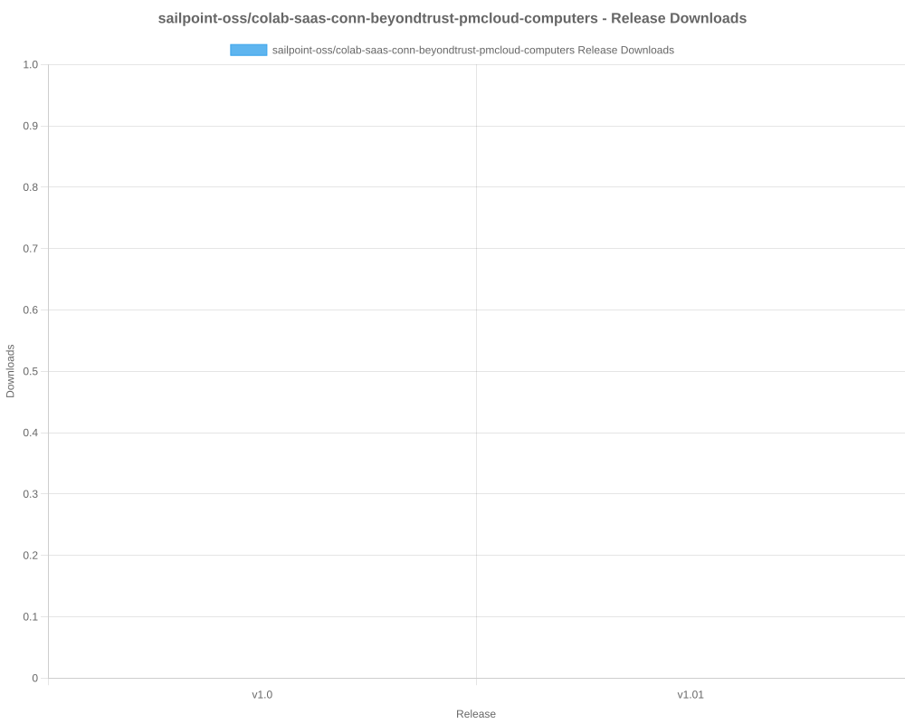
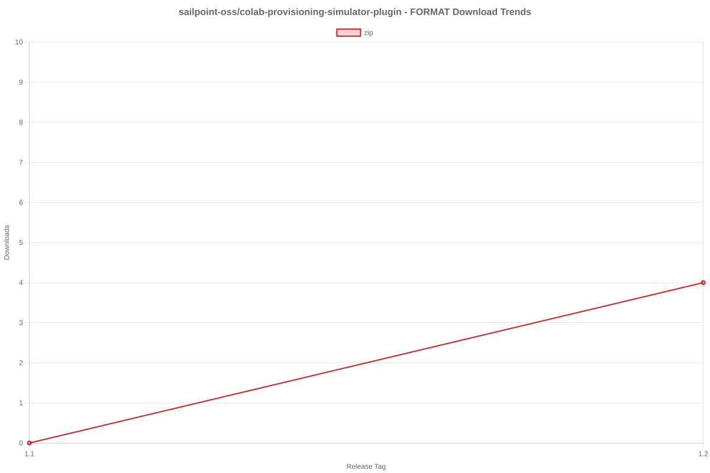
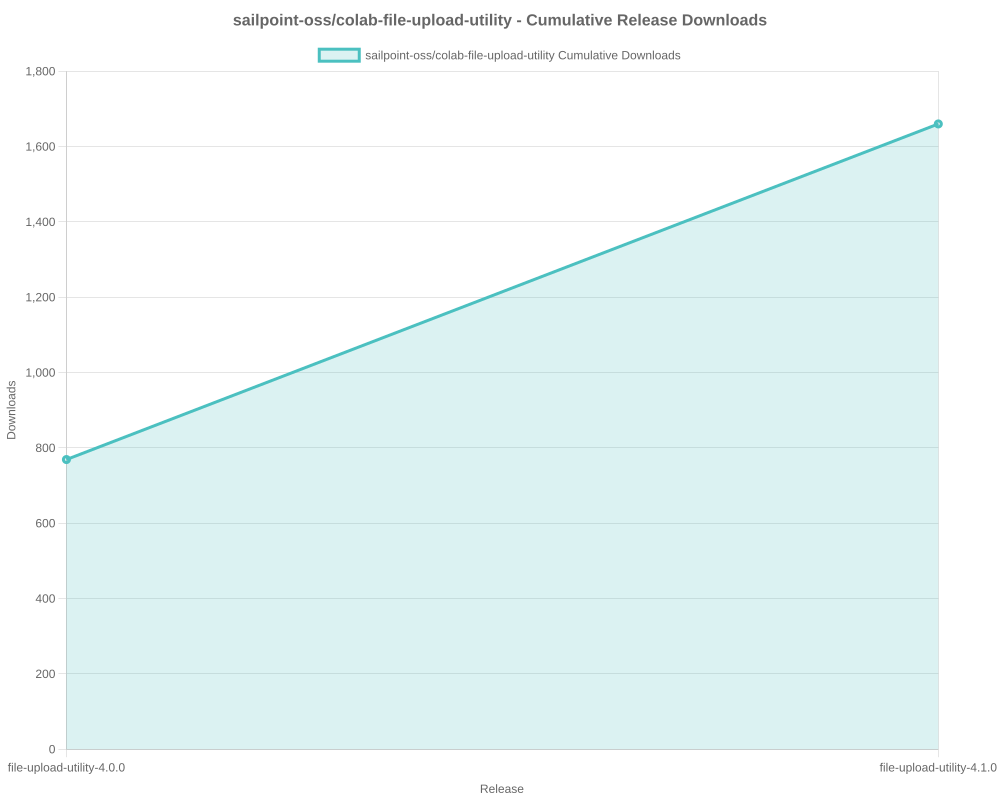

# SailPoint SDK Usage Statistics

<!-- METRICS_START -->
# Usage Statistics
    
Last updated: 1/5/2026, 12:38:02 AM

Below are stats from artifacts tracked across  and GitHub.
    
### GitHub: 

| Repository | Stars | Forks | Watchers | Open Issues | Closed Issues | Total Issues | Release Downloads | Releases | Latest Release | Language |
| --- | --- | --- | --- | --- | --- | --- | --- | --- | --- | --- |
| sailpoint-oss/colab-saas-conn-attribute-generator | 1 | 1 | 0 | 0 | 0 | 0 | 2 | 2 | v0.2.5 | TypeScript |
| sailpoint-oss/colab-saas-conn-access-management | 0 | 1 | 0 | 0 | 0 | 0 | 1 | 1 | v0.1.1 | TypeScript |
| sailpoint-oss/colab-saas-conn-proxy-entitlements | 1 | 0 | 0 | 0 | 0 | 0 | 0 | 1 | v0.1.1 | TypeScript |
| sailpoint-oss/colab-saas-conn-beyondtrust-representatives | 1 | 1 | 0 | 0 | 0 | 0 | 1 | 1 | v0.1.0 | TypeScript |
| sailpoint-oss/colab-saas-conn-beyondtrust-privilege-management-cloud | 0 | 1 | 0 | 0 | 0 | 0 | 1 | 1 | v0.1.0 | TypeScript |
| sailpoint-oss/colab-saas-conn-identitynow-orphan-accounts | 2 | 6 | 0 | 0 | 0 | 0 | 1 | 1 | v0.3.4 | TypeScript |
| sailpoint-oss/colab-saas-conn-genetec-clearid | 2 | 1 | 0 | 1 | 0 | 1 | 6 | 2 | v1.2.1 | TypeScript |
| sailpoint-oss/colab-saas-conn-rambase-cloud-erp | 0 | 1 | 0 | 0 | 0 | 0 | 0 | 1 | v1.0 | TypeScript |
| sailpoint-oss/colab-saas-conn-outlook-out-of-office | 1 | 1 | 1 | 0 | 0 | 0 | 1 | 1 | v1.1.0 | TypeScript |
| sailpoint-oss/colab-saas-conn-search-loopback | 0 | 1 | 0 | 0 | 0 | 0 | 1 | 1 | v0.1.0 | TypeScript |
| sailpoint-oss/colab-saas-conn-delimited-file | 1 | 2 | 0 | 0 | 0 | 0 | 1 | 1 | v0.1.5 | TypeScript |
| sailpoint-oss/colab-saas-conn-pan-customer-service-portal | 0 | 1 | 0 | 0 | 0 | 0 | 0 | 1 | v1.0.0 | TypeScript |
| sailpoint-oss/colab-saas-conn-peloton-platform | 0 | 1 | 0 | 0 | 0 | 0 | 0 | 1 | v0.1.0 | TypeScript |
| sailpoint-oss/colab-saas-conn-cyber-ark-rbac | 0 | 3 | 0 | 0 | 0 | 0 | 1 | 1 | v0.1.0 | TypeScript |
| sailpoint-oss/colab-saas-conn-thomsonreuters-document-intelligence | 1 | 1 | 0 | 0 | 0 | 0 | 1 | 1 | v0.1.0 | TypeScript |
| sailpoint-oss/colab-saas-conn-identitynow-management | 6 | 8 | 1 | 0 | 0 | 0 | 1 | 1 | v2.1.7 | TypeScript |
| sailpoint-oss/colab-saas-conn-prisma-sase | 0 | 2 | 0 | 0 | 0 | 0 | 1 | 1 | v1.0.0 | TypeScript |
| sailpoint-oss/colab-saas-conn-beyondtrust-pmcloud-computers | 1 | 2 | 0 | 0 | 0 | 0 | 0 | 3 | v0.1.0 | TypeScript |
| sailpoint-oss/colab-saas-conn-peloton-landview | 0 | 0 | 0 | 0 | 0 | 0 | 1 | 1 | v0.2.0 | TypeScript |
| sailpoint-oss/colab-saas-customizer-entra-id-plus | 0 | 2 | 1 | 0 | 0 | 0 | 0 | 0 | N/A | TypeScript |
| sailpoint-oss/colab-siem-plugin | 3 | 3 | 0 | 0 | 0 | 0 | 5 | 1 | v2.1.5 | CSS |
| sailpoint-oss/colab-saas-conn-sailpoint-identity-fusion | 6 | 6 | 5 | 4 | 1 | 5 | 82 | 10 | v1.3.2 | TypeScript |
| sailpoint-oss/colab-isc-extended-workflow-helper | 0 | 2 | 0 | 0 | 0 | 0 | 0 | 0 | N/A | Java |
| sailpoint-oss/colab-iiq-roles-with-deleted-entitlements | 0 | 1 | 0 | 0 | 0 | 0 | 0 | 0 | N/A | N/A |
| sailpoint-oss/colab-stunt-script | 4 | 0 | 2 | 0 | 0 | 0 | 0 | 0 | N/A | Shell |
| sailpoint-oss/colab-sailpoint-zapier-integration | 1 | 1 | 0 | 0 | 0 | 0 | 0 | 0 | N/A | JavaScript |
| sailpoint-oss/colab-events-dashboard-plugin | 0 | 1 | 0 | 0 | 0 | 0 | 7 | 1 | v1.0 | Java |
| sailpoint-oss/colab-motd-plugin | 4 | 0 | 0 | 0 | 0 | 0 | 0 | 0 | N/A | JavaScript |
| sailpoint-oss/colab-iiq-resilient-actions | 0 | 1 | 0 | 0 | 0 | 0 | 0 | 0 | N/A | N/A |
| sailpoint-oss/colab-isc-PsAttributeSyncValidator | 0 | 1 | 0 | 0 | 0 | 0 | 0 | 0 | N/A | N/A |
| sailpoint-oss/colab-non-employee-risk-management-splunk-addon | 1 | 1 | 0 | 1 | 0 | 1 | 0 | 1 | v1.0.0 | Python |
| sailpoint-oss/colab-iiqda-plugin-intellij | 0 | 3 | 0 | 0 | 0 | 0 | 0 | 0 | N/A | Java |
| sailpoint-oss/colab-workflows | 14 | 16 | 4 | 0 | 0 | 0 | 0 | 0 | N/A | N/A |
| sailpoint-oss/colab-show-workgroup-member-plugin | 0 | 2 | 0 | 0 | 0 | 0 | 0 | 0 | N/A | Java |
| sailpoint-oss/colab-iiq-custom-loading-spinner | 0 | 1 | 0 | 0 | 0 | 0 | 4 | 1 | v1.0 | JavaScript |
| sailpoint-oss/colab-isc-auto-loader | 0 | 3 | 0 | 0 | 0 | 0 | 0 | 0 | N/A | N/A |
| sailpoint-oss/colab-provisioning-simulator-plugin | 2 | 1 | 0 | 8 | 3 | 11 | 11 | 3 | 1.2 | Java |
| sailpoint-oss/colab-isc-powershell-task-manager | 1 | 1 | 0 | 0 | 0 | 0 | 0 | 0 | N/A | PowerShell |
| sailpoint-oss/colab-file-upload-utility-automation-scripts | 1 | 3 | 1 | 0 | 0 | 0 | 0 | 0 | N/A | PowerShell |
| sailpoint-oss/colab-sailpoint-configuration-manager | 2 | 3 | 1 | 0 | 0 | 0 | 0 | 0 | N/A | PowerShell |
| sailpoint-oss/colab-org-chart-plugin | 0 | 1 | 0 | 0 | 0 | 0 | 38 | 1 | 1.2.0 | TypeScript |
| sailpoint-oss/colab-transforms | 2 | 9 | 0 | 0 | 0 | 0 | 0 | 0 | N/A | N/A |
| sailpoint-oss/colab-file-upload-utility | 5 | 8 | 1 | 3 | 2 | 5 | 1,797 | 2 | file-upload-utility-4.1.0 | Java |
| sailpoint-oss/colab-isc-credential-cycling | 0 | 1 | 0 | 0 | 0 | 0 | 0 | 0 | N/A | C# |
| sailpoint-oss/colab-log-level-modifier-plugin | 1 | 2 | 0 | 0 | 0 | 0 | 0 | 0 | N/A | HTML |
| sailpoint-oss/colab-valdate-population-plugin | 0 | 0 | 0 | 0 | 0 | 0 | 0 | 0 | N/A | N/A |
| sailpoint-oss/colab-identity-photos-plugin | 0 | 0 | 0 | 0 | 0 | 0 | 0 | 0 | N/A | N/A |
| sailpoint-oss/colab-community-rest-api-plugin | 2 | 4 | 0 | 0 | 0 | 0 | 0 | 0 | N/A | Java |
| sailpoint-oss/colab-connector-configurations | 0 | 1 | 0 | 0 | 0 | 0 | 0 | 0 | N/A | N/A |
| sailpoint-oss/colab-iiq-hbm-extension-template | 2 | 2 | 0 | 0 | 0 | 0 | 0 | 0 | N/A | Java |
| sailpoint-oss/colab-iiqda | 5 | 9 | 2 | 4 | 1 | 5 | 0 | 0 | N/A | Java |
| sailpoint-oss/colab-announcement-plugin | 2 | 0 | 0 | 0 | 0 | 0 | 227 | 5 | v3.1 | CSS |
| sailpoint-oss/colab-identity-details-tweaks-plugin | 3 | 2 | 0 | 0 | 0 | 0 | 7 | 2 | v2.0 | JavaScript |
| sailpoint-oss/colab-repo-template | 0 | 4 | 2 | 0 | 0 | 0 | 0 | 0 | N/A | N/A |
| sailpoint-oss/colab-identitynow-azure-sentinel | 0 | 2 | 0 | 0 | 0 | 0 | 0 | 0 | N/A | Python |
| sailpoint-oss/colab-sailpoint-rule-restriction-vs-code-plugin | 0 | 2 | 0 | 0 | 0 | 0 | 0 | 0 | N/A | TypeScript |
| sailpoint-oss/colab-reports | 1 | 1 | 0 | 0 | 0 | 0 | 0 | 0 | N/A | Java |
| sailpoint-oss/colab-rules | 3 | 7 | 0 | 0 | 0 | 0 | 0 | 0 | N/A | N/A |
| sailpoint-oss/colab-proofpoint-plugin | 1 | 1 | 0 | 0 | 0 | 0 | 0 | 0 | N/A | Java |
| sailpoint-oss/colab-saas-conn-beyondtrust-epm | 0 | 1 | 0 | 0 | 0 | 0 | 0 | 0 | N/A | N/A |
| sailpoint-oss/colab-saas-conn-beyondtrust-pra | 0 | 1 | 0 | 0 | 0 | 0 | 0 | 0 | N/A | N/A |
| sailpoint-oss/colab-saas-conn-proofpoint | 0 | 2 | 0 | 0 | 0 | 0 | 0 | 0 | N/A | N/A |
| **Total** | **83** | **146** | **21** | **21** | **7** | **28** | **2,198** | **50** | | |

#### Repository Details:

**sailpoint-oss/colab-saas-conn-attribute-generator**:
- Last Activity: 3 days ago
- Repository Age: 193 days
- Release Count: 2
- Total Release Downloads: 2
- Latest Release: v0.2.5
- Latest Release Downloads: 2
- Views: 9
- Unique Visitors: 2
- Clones: 9
- Top Assets (by downloads):
  - attribute_zip: 2
- Format Breakdown:
  - zip: 2

**sailpoint-oss/colab-saas-conn-access-management**:
- Last Activity: 3 days ago
- Repository Age: 193 days
- Release Count: 1
- Total Release Downloads: 1
- Latest Release: v0.1.1
- Latest Release Downloads: 1
- Views: 2
- Unique Visitors: 1
- Clones: 6
- Top Assets (by downloads):
  - access_zip: 1
- Format Breakdown:
  - zip: 1

**sailpoint-oss/colab-saas-conn-proxy-entitlements**:
- Last Activity: 3 days ago
- Repository Age: 193 days
- Release Count: 1
- Total Release Downloads: 0
- Latest Release: v0.1.1
- Latest Release Downloads: 0
- Views: 0
- Unique Visitors: 0
- Clones: 4
- Top Assets (by downloads):
  - proxy_zip: 0
- Format Breakdown:
  - zip: 0

**sailpoint-oss/colab-saas-conn-beyondtrust-representatives**:
- Last Activity: 3 days ago
- Repository Age: 705 days
- Release Count: 1
- Total Release Downloads: 1
- Latest Release: v0.1.0
- Latest Release Downloads: 1
- Views: 0
- Unique Visitors: 0
- Clones: 15
- Top Assets (by downloads):
  - beyondtrust_zip: 1
- Format Breakdown:
  - zip: 1

**sailpoint-oss/colab-saas-conn-beyondtrust-privilege-management-cloud**:
- Last Activity: 3 days ago
- Repository Age: 705 days
- Release Count: 1
- Total Release Downloads: 1
- Latest Release: v0.1.0
- Latest Release Downloads: 1
- Views: 0
- Unique Visitors: 0
- Clones: 6
- Top Assets (by downloads):
  - beyondtrust_zip: 1
- Format Breakdown:
  - zip: 1

**sailpoint-oss/colab-saas-conn-identitynow-orphan-accounts**:
- Last Activity: 3 days ago
- Repository Age: 830 days
- Release Count: 1
- Total Release Downloads: 1
- Latest Release: v0.3.4
- Latest Release Downloads: 1
- Views: 3
- Unique Visitors: 3
- Clones: 12
- Top Assets (by downloads):
  - orphan_zip: 1
- Format Breakdown:
  - zip: 1

**sailpoint-oss/colab-saas-conn-genetec-clearid**:
- Last Activity: 3 days ago
- Repository Age: 830 days
- Release Count: 2
- Total Release Downloads: 6
- Latest Release: v1.2.1
- Latest Release Downloads: 6
- Views: 2
- Unique Visitors: 2
- Clones: 11
- Top Assets (by downloads):
  - clearid_zip: 6
- Format Breakdown:
  - zip: 6

**sailpoint-oss/colab-saas-conn-rambase-cloud-erp**:
- Last Activity: 3 days ago
- Repository Age: 831 days
- Release Count: 1
- Total Release Downloads: 0
- Latest Release: v1.0
- Latest Release Downloads: 0
- Views: 11
- Unique Visitors: 1
- Clones: 10
- Top Assets (by downloads):
  - rambase_zip: 0
- Format Breakdown:
  - zip: 0

**sailpoint-oss/colab-saas-conn-outlook-out-of-office**:
- Last Activity: 18 days ago
- Repository Age: 781 days
- Release Count: 1
- Total Release Downloads: 1
- Latest Release: v1.1.0
- Latest Release Downloads: 1
- Views: 0
- Unique Visitors: 0
- Clones: 6
- Top Assets (by downloads):
  - outlook_zip: 1
- Format Breakdown:
  - zip: 1

**sailpoint-oss/colab-saas-conn-search-loopback**:
- Last Activity: 18 days ago
- Repository Age: 346 days
- Release Count: 1
- Total Release Downloads: 1
- Latest Release: v0.1.0
- Latest Release Downloads: 1
- Views: 4
- Unique Visitors: 1
- Clones: 6
- Top Assets (by downloads):
  - saas_zip: 1
- Format Breakdown:
  - zip: 1

**sailpoint-oss/colab-saas-conn-delimited-file**:
- Last Activity: 18 days ago
- Repository Age: 527 days
- Release Count: 1
- Total Release Downloads: 1
- Latest Release: v0.1.5
- Latest Release Downloads: 1
- Views: 0
- Unique Visitors: 0
- Clones: 11
- Top Assets (by downloads):
  - isc_zip: 1
- Format Breakdown:
  - zip: 1

**sailpoint-oss/colab-saas-conn-pan-customer-service-portal**:
- Last Activity: 18 days ago
- Repository Age: 527 days
- Release Count: 1
- Total Release Downloads: 0
- Latest Release: v1.0.0
- Latest Release Downloads: 0
- Views: 4
- Unique Visitors: 2
- Clones: 13
- Top Assets (by downloads):
  - saas_zip: 0
- Format Breakdown:
  - zip: 0

**sailpoint-oss/colab-saas-conn-peloton-platform**:
- Last Activity: 18 days ago
- Repository Age: 250 days
- Release Count: 1
- Total Release Downloads: 0
- Latest Release: v0.1.0
- Latest Release Downloads: 0
- Views: 0
- Unique Visitors: 0
- Clones: 4
- Top Assets (by downloads):
  - colab_zip: 0
- Format Breakdown:
  - zip: 0

**sailpoint-oss/colab-saas-conn-cyber-ark-rbac**:
- Last Activity: 18 days ago
- Repository Age: 314 days
- Release Count: 1
- Total Release Downloads: 1
- Latest Release: v0.1.0
- Latest Release Downloads: 1
- Views: 3
- Unique Visitors: 3
- Clones: 10
- Top Assets (by downloads):
  - colab_zip: 1
- Format Breakdown:
  - zip: 1

**sailpoint-oss/colab-saas-conn-thomsonreuters-document-intelligence**:
- Last Activity: 18 days ago
- Repository Age: 405 days
- Release Count: 1
- Total Release Downloads: 1
- Latest Release: v0.1.0
- Latest Release Downloads: 1
- Views: 0
- Unique Visitors: 0
- Clones: 7
- Top Assets (by downloads):
  - colab_zip: 1
- Format Breakdown:
  - zip: 1

**sailpoint-oss/colab-saas-conn-identitynow-management**:
- Last Activity: 18 days ago
- Repository Age: 831 days
- Release Count: 1
- Total Release Downloads: 1
- Latest Release: v2.1.7
- Latest Release Downloads: 1
- Views: 47
- Unique Visitors: 10
- Clones: 7
- Top Assets (by downloads):
  - identitynowmanagement_zip: 1
- Format Breakdown:
  - zip: 1

**sailpoint-oss/colab-saas-conn-prisma-sase**:
- Last Activity: 18 days ago
- Repository Age: 527 days
- Release Count: 1
- Total Release Downloads: 1
- Latest Release: v1.0.0
- Latest Release Downloads: 1
- Views: 2
- Unique Visitors: 2
- Clones: 10
- Top Assets (by downloads):
  - prisma_zip: 1
- Format Breakdown:
  - zip: 1

**sailpoint-oss/colab-saas-conn-beyondtrust-pmcloud-computers**:
- Last Activity: 18 days ago
- Repository Age: 705 days
- Release Count: 3
- Total Release Downloads: 0
- Latest Release: v0.1.0
- Latest Release Downloads: 0
- Views: 0
- Unique Visitors: 0
- Clones: 6
- Top Assets (by downloads):
  - beyondtrust_zip: 0
- Format Breakdown:
  - zip: 0

**sailpoint-oss/colab-saas-conn-peloton-landview**:
- Last Activity: 18 days ago
- Repository Age: 653 days
- Release Count: 1
- Total Release Downloads: 1
- Latest Release: v0.2.0
- Latest Release Downloads: 1
- Views: 0
- Unique Visitors: 0
- Clones: 7
- Top Assets (by downloads):
  - colab_zip: 1
- Format Breakdown:
  - zip: 1

**sailpoint-oss/colab-saas-customizer-entra-id-plus**:
- Last Activity: 18 days ago
- Repository Age: 193 days
- Release Count: 0
- Total Release Downloads: 0
- Latest Release: N/A
- Latest Release Downloads: 0
- Views: 14
- Unique Visitors: 6
- Clones: 5

**sailpoint-oss/colab-siem-plugin**:
- Last Activity: 20 days ago
- Repository Age: 830 days
- Release Count: 1
- Total Release Downloads: 5
- Latest Release: v2.1.5
- Latest Release Downloads: 5
- Views: 80
- Unique Visitors: 26
- Clones: 10
- Top Assets (by downloads):
  - siem_zip: 5
- Format Breakdown:
  - zip: 5

**sailpoint-oss/colab-saas-conn-sailpoint-identity-fusion**:
- Last Activity: 25 days ago
- Repository Age: 642 days
- Release Count: 10
- Total Release Downloads: 82
- Latest Release: v1.3.2
- Latest Release Downloads: 9
- Views: 66
- Unique Visitors: 26
- Clones: 12
- Top Assets (by downloads):
  - identity_zip: 82
- Format Breakdown:
  - zip: 82

**sailpoint-oss/colab-isc-extended-workflow-helper**:
- Last Activity: 101 days ago
- Repository Age: 108 days
- Release Count: 0
- Total Release Downloads: 0
- Latest Release: N/A
- Latest Release Downloads: 0
- Views: 18
- Unique Visitors: 4
- Clones: 4

**sailpoint-oss/colab-iiq-roles-with-deleted-entitlements**:
- Last Activity: 121 days ago
- Repository Age: 121 days
- Release Count: 0
- Total Release Downloads: 0
- Latest Release: N/A
- Latest Release Downloads: 0
- Views: 3
- Unique Visitors: 2
- Clones: 3

**sailpoint-oss/colab-stunt-script**:
- Last Activity: 138 days ago
- Repository Age: 830 days
- Release Count: 0
- Total Release Downloads: 0
- Latest Release: N/A
- Latest Release Downloads: 0
- Views: 11
- Unique Visitors: 10
- Clones: 24

**sailpoint-oss/colab-sailpoint-zapier-integration**:
- Last Activity: 166 days ago
- Repository Age: 831 days
- Release Count: 0
- Total Release Downloads: 0
- Latest Release: N/A
- Latest Release Downloads: 0
- Views: 0
- Unique Visitors: 0
- Clones: 5

**sailpoint-oss/colab-events-dashboard-plugin**:
- Last Activity: 170 days ago
- Repository Age: 193 days
- Release Count: 1
- Total Release Downloads: 7
- Latest Release: v1.0
- Latest Release Downloads: 7
- Views: 1
- Unique Visitors: 1
- Clones: 8
- Top Assets (by downloads):
  - eventsdashboardplugin_zip: 7
- Format Breakdown:
  - zip: 7

**sailpoint-oss/colab-motd-plugin**:
- Last Activity: 176 days ago
- Repository Age: 619 days
- Release Count: 0
- Total Release Downloads: 0
- Latest Release: N/A
- Latest Release Downloads: 0
- Views: 13
- Unique Visitors: 2
- Clones: 4

**sailpoint-oss/colab-iiq-resilient-actions**:
- Last Activity: 206 days ago
- Repository Age: 206 days
- Release Count: 0
- Total Release Downloads: 0
- Latest Release: N/A
- Latest Release Downloads: 0
- Views: 4
- Unique Visitors: 1
- Clones: 1

**sailpoint-oss/colab-isc-PsAttributeSyncValidator**:
- Last Activity: 216 days ago
- Repository Age: 216 days
- Release Count: 0
- Total Release Downloads: 0
- Latest Release: N/A
- Latest Release Downloads: 0
- Views: 0
- Unique Visitors: 0
- Clones: 4

**sailpoint-oss/colab-non-employee-risk-management-splunk-addon**:
- Last Activity: 272 days ago
- Repository Age: 408 days
- Release Count: 1
- Total Release Downloads: 0
- Latest Release: v1.0.0
- Latest Release Downloads: 0
- Views: 3
- Unique Visitors: 3
- Clones: 6

**sailpoint-oss/colab-iiqda-plugin-intellij**:
- Last Activity: 276 days ago
- Repository Age: 564 days
- Release Count: 0
- Total Release Downloads: 0
- Latest Release: N/A
- Latest Release Downloads: 0
- Views: 56
- Unique Visitors: 9
- Clones: 5

**sailpoint-oss/colab-workflows**:
- Last Activity: 319 days ago
- Repository Age: 832 days
- Release Count: 0
- Total Release Downloads: 0
- Latest Release: N/A
- Latest Release Downloads: 0
- Views: 172
- Unique Visitors: 30
- Clones: 9

**sailpoint-oss/colab-show-workgroup-member-plugin**:
- Last Activity: 327 days ago
- Repository Age: 342 days
- Release Count: 0
- Total Release Downloads: 0
- Latest Release: N/A
- Latest Release Downloads: 0
- Views: 4
- Unique Visitors: 2
- Clones: 6

**sailpoint-oss/colab-iiq-custom-loading-spinner**:
- Last Activity: 356 days ago
- Repository Age: 362 days
- Release Count: 1
- Total Release Downloads: 4
- Latest Release: v1.0
- Latest Release Downloads: 4
- Views: 8
- Unique Visitors: 1
- Clones: 3
- Top Assets (by downloads):
  - custom_zip: 4
- Format Breakdown:
  - zip: 4

**sailpoint-oss/colab-isc-auto-loader**:
- Last Activity: 390 days ago
- Repository Age: 390 days
- Release Count: 0
- Total Release Downloads: 0
- Latest Release: N/A
- Latest Release Downloads: 0
- Views: 0
- Unique Visitors: 0
- Clones: 4

**sailpoint-oss/colab-provisioning-simulator-plugin**:
- Last Activity: 397 days ago
- Repository Age: 606 days
- Release Count: 3
- Total Release Downloads: 11
- Latest Release: 1.2
- Latest Release Downloads: 9
- Views: 13
- Unique Visitors: 4
- Clones: 6
- Top Assets (by downloads):
  - colab: 6
  - colab_zip: 4
  - provisioningsimulator: 1
- Format Breakdown:
  - zip: 4

**sailpoint-oss/colab-isc-powershell-task-manager**:
- Last Activity: 429 days ago
- Repository Age: 451 days
- Release Count: 0
- Total Release Downloads: 0
- Latest Release: N/A
- Latest Release Downloads: 0
- Views: 1
- Unique Visitors: 1
- Clones: 5

**sailpoint-oss/colab-file-upload-utility-automation-scripts**:
- Last Activity: 460 days ago
- Repository Age: 472 days
- Release Count: 0
- Total Release Downloads: 0
- Latest Release: N/A
- Latest Release Downloads: 0
- Views: 8
- Unique Visitors: 4
- Clones: 2

**sailpoint-oss/colab-sailpoint-configuration-manager**:
- Last Activity: 463 days ago
- Repository Age: 676 days
- Release Count: 0
- Total Release Downloads: 0
- Latest Release: N/A
- Latest Release Downloads: 0
- Views: 6
- Unique Visitors: 6
- Clones: 5

**sailpoint-oss/colab-org-chart-plugin**:
- Last Activity: 465 days ago
- Repository Age: 564 days
- Release Count: 1
- Total Release Downloads: 38
- Latest Release: 1.2.0
- Latest Release Downloads: 38
- Views: 43
- Unique Visitors: 1
- Clones: 10
- Top Assets (by downloads):
  - orgchartplugin_zip: 38
- Format Breakdown:
  - zip: 38

**sailpoint-oss/colab-transforms**:
- Last Activity: 466 days ago
- Repository Age: 832 days
- Release Count: 0
- Total Release Downloads: 0
- Latest Release: N/A
- Latest Release Downloads: 0
- Views: 19
- Unique Visitors: 8
- Clones: 6

**sailpoint-oss/colab-file-upload-utility**:
- Last Activity: 480 days ago
- Repository Age: 831 days
- Release Count: 2
- Total Release Downloads: 1,797
- Latest Release: file-upload-utility-4.1.0
- Latest Release Downloads: 1,024
- Views: 116
- Unique Visitors: 37
- Clones: 7
- Top Assets (by downloads):
  - sailpoint: 1,797

**sailpoint-oss/colab-isc-credential-cycling**:
- Last Activity: 494 days ago
- Repository Age: 520 days
- Release Count: 0
- Total Release Downloads: 0
- Latest Release: N/A
- Latest Release Downloads: 0
- Views: 1
- Unique Visitors: 1
- Clones: 6

**sailpoint-oss/colab-log-level-modifier-plugin**:
- Last Activity: 503 days ago
- Repository Age: 507 days
- Release Count: 0
- Total Release Downloads: 0
- Latest Release: N/A
- Latest Release Downloads: 0
- Views: 4
- Unique Visitors: 2
- Clones: 4

**sailpoint-oss/colab-valdate-population-plugin**:
- Last Activity: 517 days ago
- Repository Age: 517 days
- Release Count: 0
- Total Release Downloads: 0
- Latest Release: N/A
- Latest Release Downloads: 0
- Views: 0
- Unique Visitors: 0
- Clones: 2

**sailpoint-oss/colab-identity-photos-plugin**:
- Last Activity: 517 days ago
- Repository Age: 517 days
- Release Count: 0
- Total Release Downloads: 0
- Latest Release: N/A
- Latest Release Downloads: 0
- Views: 0
- Unique Visitors: 0
- Clones: 2

**sailpoint-oss/colab-community-rest-api-plugin**:
- Last Activity: 558 days ago
- Repository Age: 564 days
- Release Count: 0
- Total Release Downloads: 0
- Latest Release: N/A
- Latest Release Downloads: 0
- Views: 9
- Unique Visitors: 2
- Clones: 3

**sailpoint-oss/colab-connector-configurations**:
- Last Activity: 564 days ago
- Repository Age: 564 days
- Release Count: 0
- Total Release Downloads: 0
- Latest Release: N/A
- Latest Release Downloads: 0
- Views: 0
- Unique Visitors: 0
- Clones: 3

**sailpoint-oss/colab-iiq-hbm-extension-template**:
- Last Activity: 592 days ago
- Repository Age: 620 days
- Release Count: 0
- Total Release Downloads: 0
- Latest Release: N/A
- Latest Release Downloads: 0
- Views: 11
- Unique Visitors: 2
- Clones: 3

**sailpoint-oss/colab-iiqda**:
- Last Activity: 597 days ago
- Repository Age: 832 days
- Release Count: 0
- Total Release Downloads: 0
- Latest Release: N/A
- Latest Release Downloads: 0
- Views: 24
- Unique Visitors: 18
- Clones: 8

**sailpoint-oss/colab-announcement-plugin**:
- Last Activity: 597 days ago
- Repository Age: 725 days
- Release Count: 5
- Total Release Downloads: 227
- Latest Release: v3.1
- Latest Release Downloads: 104
- Views: 2
- Unique Visitors: 2
- Clones: 3
- Top Assets (by downloads):
  - announcement_zip: 227
- Format Breakdown:
  - zip: 227

**sailpoint-oss/colab-identity-details-tweaks-plugin**:
- Last Activity: 642 days ago
- Repository Age: 689 days
- Release Count: 2
- Total Release Downloads: 7
- Latest Release: v2.0
- Latest Release Downloads: 0
- Views: 25
- Unique Visitors: 1
- Clones: 4
- Top Assets (by downloads):
  - identitydetailstweaks_zip: 7
- Format Breakdown:
  - zip: 7

**sailpoint-oss/colab-repo-template**:
- Last Activity: 671 days ago
- Repository Age: 1,258 days
- Release Count: 0
- Total Release Downloads: 0
- Latest Release: N/A
- Latest Release Downloads: 0
- Views: 22
- Unique Visitors: 7
- Clones: 3

**sailpoint-oss/colab-identitynow-azure-sentinel**:
- Last Activity: 683 days ago
- Repository Age: 824 days
- Release Count: 0
- Total Release Downloads: 0
- Latest Release: N/A
- Latest Release Downloads: 0
- Views: 0
- Unique Visitors: 0
- Clones: 2

**sailpoint-oss/colab-sailpoint-rule-restriction-vs-code-plugin**:
- Last Activity: 689 days ago
- Repository Age: 703 days
- Release Count: 0
- Total Release Downloads: 0
- Latest Release: N/A
- Latest Release Downloads: 0
- Views: 2
- Unique Visitors: 2
- Clones: 2

**sailpoint-oss/colab-reports**:
- Last Activity: 789 days ago
- Repository Age: 790 days
- Release Count: 0
- Total Release Downloads: 0
- Latest Release: N/A
- Latest Release Downloads: 0
- Views: 31
- Unique Visitors: 4
- Clones: 5

**sailpoint-oss/colab-rules**:
- Last Activity: 790 days ago
- Repository Age: 832 days
- Release Count: 0
- Total Release Downloads: 0
- Latest Release: N/A
- Latest Release Downloads: 0
- Views: 23
- Unique Visitors: 12
- Clones: 8

**sailpoint-oss/colab-proofpoint-plugin**:
- Last Activity: 817 days ago
- Repository Age: 830 days
- Release Count: 0
- Total Release Downloads: 0
- Latest Release: N/A
- Latest Release Downloads: 0
- Views: 0
- Unique Visitors: 0
- Clones: 5

**sailpoint-oss/colab-saas-conn-beyondtrust-epm**:
- Last Activity: 824 days ago
- Repository Age: 831 days
- Release Count: 0
- Total Release Downloads: 0
- Latest Release: N/A
- Latest Release Downloads: 0
- Views: 0
- Unique Visitors: 0
- Clones: 3

**sailpoint-oss/colab-saas-conn-beyondtrust-pra**:
- Last Activity: 824 days ago
- Repository Age: 831 days
- Release Count: 0
- Total Release Downloads: 0
- Latest Release: N/A
- Latest Release Downloads: 0
- Views: 0
- Unique Visitors: 0
- Clones: 3

**sailpoint-oss/colab-saas-conn-proofpoint**:
- Last Activity: 824 days ago
- Repository Age: 830 days
- Release Count: 0
- Total Release Downloads: 0
- Latest Release: N/A
- Latest Release Downloads: 0
- Views: 0
- Unique Visitors: 0
- Clones: 3

<!-- METRICS_END -->
