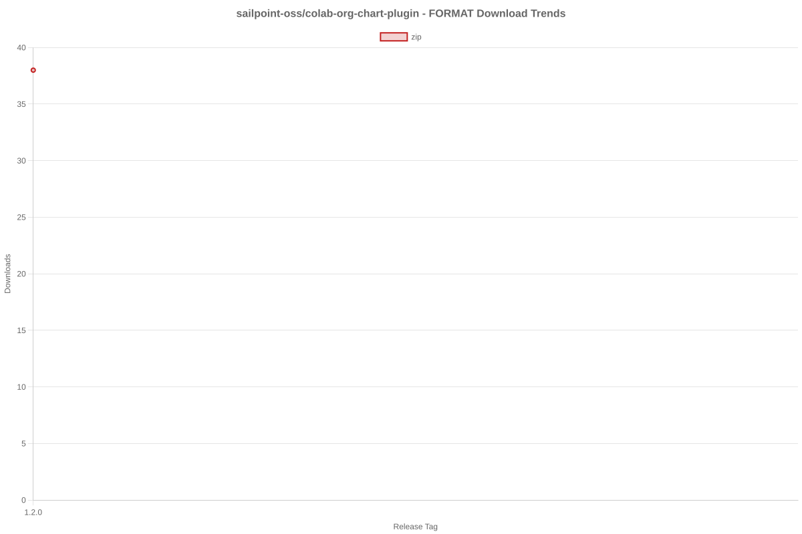

# SailPoint SDK Usage Statistics

<!-- METRICS_START -->
# Usage Statistics
    
Last updated: 9/29/2025, 12:32:36 AM

Below are stats from artifacts tracked across  and GitHub.
    
### GitHub: 

| Repository | Stars | Forks | Watchers | Open Issues | Closed Issues | Total Issues | Release Downloads | Releases | Latest Release | Language |
| --- | --- | --- | --- | --- | --- | --- | --- | --- | --- | --- |
| sailpoint-oss/colab-isc-extended-workflow-helper | 0 | 1 | 0 | 0 | 0 | 0 | 0 | 0 | N/A | Java |
| sailpoint-oss/colab-saas-conn-sailpoint-identity-fusion | 5 | 6 | 4 | 3 | 1 | 4 | 42 | 7 | v1.2.2 | TypeScript |
| sailpoint-oss/colab-saas-conn-prisma-sase | 0 | 1 | 0 | 0 | 0 | 0 | 0 | 0 | N/A | TypeScript |
| sailpoint-oss/colab-saas-conn-pan-customer-service-portal | 0 | 1 | 0 | 0 | 0 | 0 | 0 | 0 | N/A | TypeScript |
| sailpoint-oss/colab-iiq-roles-with-deleted-entitlements | 0 | 0 | 0 | 0 | 0 | 0 | 0 | 0 | N/A | N/A |
| sailpoint-oss/colab-stunt-script | 4 | 0 | 3 | 0 | 0 | 0 | 0 | 0 | N/A | Shell |
| sailpoint-oss/colab-saas-conn-outlook-out-of-office | 1 | 1 | 1 | 0 | 0 | 0 | 0 | 0 | N/A | TypeScript |
| sailpoint-oss/colab-saas-conn-search-loopback | 0 | 1 | 0 | 0 | 0 | 0 | 0 | 0 | N/A | TypeScript |
| sailpoint-oss/colab-sailpoint-zapier-integration | 1 | 0 | 1 | 0 | 0 | 0 | 0 | 0 | N/A | JavaScript |
| sailpoint-oss/colab-events-dashboard-plugin | 0 | 1 | 0 | 0 | 0 | 0 | 5 | 1 | v1.0 | Java |
| sailpoint-oss/colab-motd-plugin | 3 | 0 | 0 | 0 | 0 | 0 | 0 | 0 | N/A | JavaScript |
| sailpoint-oss/colab-saas-conn-genetec-clearid | 2 | 1 | 1 | 1 | 0 | 1 | 0 | 0 | N/A | TypeScript |
| sailpoint-oss/colab-iiq-resilient-actions | 0 | 1 | 0 | 0 | 0 | 0 | 0 | 0 | N/A | N/A |
| sailpoint-oss/colab-isc-PsAttributeSyncValidator | 0 | 0 | 0 | 0 | 0 | 0 | 0 | 0 | N/A | N/A |
| sailpoint-oss/colab-saas-conn-identitynow-orphan-accounts | 2 | 5 | 1 | 0 | 0 | 0 | 0 | 0 | N/A | TypeScript |
| sailpoint-oss/colab-saas-conn-peloton-platform | 0 | 1 | 0 | 0 | 0 | 0 | 0 | 0 | N/A | TypeScript |
| sailpoint-oss/colab-non-employee-risk-management-splunk-addon | 1 | 1 | 0 | 0 | 0 | 0 | 0 | 1 | v1.0.0 | Python |
| sailpoint-oss/colab-iiqda-plugin-intellij | 0 | 3 | 0 | 0 | 0 | 0 | 0 | 0 | N/A | Java |
| sailpoint-oss/colab-saas-conn-identitynow-management | 6 | 8 | 2 | 0 | 0 | 0 | 0 | 0 | N/A | TypeScript |
| sailpoint-oss/colab-saas-conn-cyber-ark-rbac | 0 | 2 | 0 | 0 | 0 | 0 | 0 | 0 | N/A | TypeScript |
| sailpoint-oss/colab-saas-conn-peloton-landview | 0 | 0 | 1 | 0 | 0 | 0 | 0 | 0 | N/A | TypeScript |
| sailpoint-oss/colab-workflows | 13 | 14 | 5 | 0 | 0 | 0 | 0 | 0 | N/A | N/A |
| sailpoint-oss/colab-show-workgroup-member-plugin | 0 | 2 | 0 | 0 | 0 | 0 | 0 | 0 | N/A | Java |
| sailpoint-oss/colab-iiq-custom-loading-spinner | 0 | 1 | 0 | 0 | 0 | 0 | 3 | 1 | v1.0 | JavaScript |
| sailpoint-oss/colab-isc-auto-loader | 0 | 1 | 0 | 0 | 0 | 0 | 0 | 0 | N/A | N/A |
| sailpoint-oss/colab-saas-conn-beyondtrust-privilege-management-cloud | 0 | 1 | 1 | 0 | 0 | 0 | 0 | 0 | N/A | TypeScript |
| sailpoint-oss/colab-provisioning-simulator-plugin | 1 | 1 | 0 | 8 | 3 | 11 | 11 | 3 | 1.2 | Java |
| sailpoint-oss/colab-saas-conn-thomsonreuters-document-intelligence | 1 | 1 | 0 | 0 | 0 | 0 | 0 | 0 | N/A | TypeScript |
| sailpoint-oss/colab-isc-powershell-task-manager | 1 | 1 | 0 | 0 | 0 | 0 | 0 | 0 | N/A | PowerShell |
| sailpoint-oss/colab-saas-conn-delimited-file | 1 | 2 | 0 | 0 | 0 | 0 | 0 | 0 | N/A | TypeScript |
| sailpoint-oss/colab-file-upload-utility-automation-scripts | 1 | 2 | 1 | 0 | 0 | 0 | 0 | 0 | N/A | PowerShell |
| sailpoint-oss/colab-sailpoint-configuration-manager | 2 | 2 | 2 | 0 | 0 | 0 | 0 | 0 | N/A | PowerShell |
| sailpoint-oss/colab-org-chart-plugin | 0 | 1 | 0 | 0 | 0 | 0 | 38 | 1 | 1.2.0 | TypeScript |
| sailpoint-oss/colab-transforms | 2 | 8 | 1 | 0 | 0 | 0 | 0 | 0 | N/A | N/A |
| sailpoint-oss/colab-file-upload-utility | 5 | 8 | 2 | 3 | 2 | 5 | 1,609 | 2 | file-upload-utility-4.1.0 | Java |
| sailpoint-oss/colab-isc-credential-cycling | 0 | 1 | 0 | 0 | 0 | 0 | 0 | 0 | N/A | C# |
| sailpoint-oss/colab-log-level-modifier-plugin | 1 | 2 | 0 | 0 | 0 | 0 | 0 | 0 | N/A | HTML |
| sailpoint-oss/colab-valdate-population-plugin | 0 | 0 | 0 | 0 | 0 | 0 | 0 | 0 | N/A | N/A |
| sailpoint-oss/colab-identity-photos-plugin | 0 | 0 | 0 | 0 | 0 | 0 | 0 | 0 | N/A | N/A |
| sailpoint-oss/colab-community-rest-api-plugin | 2 | 4 | 0 | 0 | 0 | 0 | 0 | 0 | N/A | Java |
| sailpoint-oss/colab-saas-conn-beyondtrust-pmcloud-computers | 1 | 1 | 1 | 0 | 0 | 0 | 0 | 2 | v1.01 | TypeScript |
| sailpoint-oss/colab-connector-configurations | 0 | 0 | 0 | 0 | 0 | 0 | 0 | 0 | N/A | N/A |
| sailpoint-oss/colab-iiq-hbm-extension-template | 2 | 2 | 0 | 0 | 0 | 0 | 0 | 0 | N/A | Java |
| sailpoint-oss/colab-iiqda | 5 | 8 | 3 | 4 | 1 | 5 | 0 | 0 | N/A | Java |
| sailpoint-oss/colab-announcement-plugin | 2 | 0 | 1 | 0 | 0 | 0 | 203 | 5 | v3.1 | CSS |
| sailpoint-oss/colab-identity-details-tweaks-plugin | 3 | 2 | 1 | 0 | 0 | 0 | 7 | 2 | v2.0 | JavaScript |
| sailpoint-oss/colab-repo-template | 0 | 3 | 3 | 0 | 0 | 0 | 0 | 0 | N/A | N/A |
| sailpoint-oss/colab-identitynow-azure-sentinel | 0 | 1 | 1 | 0 | 0 | 0 | 0 | 0 | N/A | Python |
| sailpoint-oss/colab-sailpoint-rule-restriction-vs-code-plugin | 0 | 1 | 1 | 0 | 0 | 0 | 0 | 0 | N/A | TypeScript |
| sailpoint-oss/colab-saas-conn-beyondtrust-representatives | 1 | 1 | 1 | 0 | 0 | 0 | 0 | 0 | N/A | TypeScript |
| sailpoint-oss/colab-reports | 1 | 1 | 1 | 0 | 0 | 0 | 0 | 0 | N/A | Java |
| sailpoint-oss/colab-rules | 3 | 7 | 1 | 0 | 0 | 0 | 0 | 0 | N/A | N/A |
| sailpoint-oss/colab-proofpoint-plugin | 1 | 1 | 1 | 0 | 0 | 0 | 0 | 0 | N/A | Java |
| sailpoint-oss/colab-siem-plugin | 2 | 1 | 1 | 0 | 0 | 0 | 0 | 0 | N/A | CSS |
| sailpoint-oss/colab-saas-conn-rambase-cloud-erp | 0 | 1 | 1 | 0 | 0 | 0 | 0 | 0 | N/A | TypeScript |
| sailpoint-oss/colab-saas-conn-beyondtrust-epm | 0 | 0 | 1 | 0 | 0 | 0 | 0 | 0 | N/A | N/A |
| sailpoint-oss/colab-saas-conn-beyondtrust-pra | 0 | 0 | 1 | 0 | 0 | 0 | 0 | 0 | N/A | N/A |
| sailpoint-oss/colab-saas-conn-proofpoint | 0 | 1 | 1 | 0 | 0 | 0 | 0 | 0 | N/A | N/A |
| **Total** | **76** | **117** | **46** | **19** | **7** | **26** | **1,918** | **25** | | |

#### Repository Details:

**sailpoint-oss/colab-isc-extended-workflow-helper**:
- Last Activity: 3 days ago
- Repository Age: 10 days
- Release Count: 0
- Total Release Downloads: 0
- Latest Release: N/A
- Latest Release Downloads: 0
- Views: 76
- Unique Visitors: 20
- Clones: 20

**sailpoint-oss/colab-saas-conn-sailpoint-identity-fusion**:
- Last Activity: 10 days ago
- Repository Age: 544 days
- Release Count: 7
- Total Release Downloads: 42
- Latest Release: v1.2.2
- Latest Release Downloads: 3
- Views: 248
- Unique Visitors: 52
- Clones: 30
- Top Assets (by downloads):
  - identity_zip: 42
- Format Breakdown:
  - zip: 42

**sailpoint-oss/colab-saas-conn-prisma-sase**:
- Last Activity: 17 days ago
- Repository Age: 429 days
- Release Count: 0
- Total Release Downloads: 0
- Latest Release: N/A
- Latest Release Downloads: 0
- Views: 16
- Unique Visitors: 2
- Clones: 10

**sailpoint-oss/colab-saas-conn-pan-customer-service-portal**:
- Last Activity: 18 days ago
- Repository Age: 429 days
- Release Count: 0
- Total Release Downloads: 0
- Latest Release: N/A
- Latest Release Downloads: 0
- Views: 15
- Unique Visitors: 5
- Clones: 6

**sailpoint-oss/colab-iiq-roles-with-deleted-entitlements**:
- Last Activity: 23 days ago
- Repository Age: 23 days
- Release Count: 0
- Total Release Downloads: 0
- Latest Release: N/A
- Latest Release Downloads: 0
- Views: 24
- Unique Visitors: 3
- Clones: 1

**sailpoint-oss/colab-stunt-script**:
- Last Activity: 40 days ago
- Repository Age: 732 days
- Release Count: 0
- Total Release Downloads: 0
- Latest Release: N/A
- Latest Release Downloads: 0
- Views: 56
- Unique Visitors: 20
- Clones: 18

**sailpoint-oss/colab-saas-conn-outlook-out-of-office**:
- Last Activity: 41 days ago
- Repository Age: 683 days
- Release Count: 0
- Total Release Downloads: 0
- Latest Release: N/A
- Latest Release Downloads: 0
- Views: 60
- Unique Visitors: 7
- Clones: 3

**sailpoint-oss/colab-saas-conn-search-loopback**:
- Last Activity: 48 days ago
- Repository Age: 248 days
- Release Count: 0
- Total Release Downloads: 0
- Latest Release: N/A
- Latest Release Downloads: 0
- Views: 16
- Unique Visitors: 5
- Clones: 3

**sailpoint-oss/colab-sailpoint-zapier-integration**:
- Last Activity: 68 days ago
- Repository Age: 733 days
- Release Count: 0
- Total Release Downloads: 0
- Latest Release: N/A
- Latest Release Downloads: 0
- Views: 4
- Unique Visitors: 3
- Clones: 3

**sailpoint-oss/colab-events-dashboard-plugin**:
- Last Activity: 72 days ago
- Repository Age: 95 days
- Release Count: 1
- Total Release Downloads: 5
- Latest Release: v1.0
- Latest Release Downloads: 5
- Views: 31
- Unique Visitors: 4
- Clones: 1
- Top Assets (by downloads):
  - eventsdashboardplugin_zip: 5
- Format Breakdown:
  - zip: 5

**sailpoint-oss/colab-motd-plugin**:
- Last Activity: 78 days ago
- Repository Age: 521 days
- Release Count: 0
- Total Release Downloads: 0
- Latest Release: N/A
- Latest Release Downloads: 0
- Views: 15
- Unique Visitors: 2
- Clones: 4

**sailpoint-oss/colab-saas-conn-genetec-clearid**:
- Last Activity: 103 days ago
- Repository Age: 732 days
- Release Count: 0
- Total Release Downloads: 0
- Latest Release: N/A
- Latest Release Downloads: 0
- Views: 50
- Unique Visitors: 10
- Clones: 5

**sailpoint-oss/colab-iiq-resilient-actions**:
- Last Activity: 108 days ago
- Repository Age: 108 days
- Release Count: 0
- Total Release Downloads: 0
- Latest Release: N/A
- Latest Release Downloads: 0
- Views: 2
- Unique Visitors: 1
- Clones: 1

**sailpoint-oss/colab-isc-PsAttributeSyncValidator**:
- Last Activity: 118 days ago
- Repository Age: 118 days
- Release Count: 0
- Total Release Downloads: 0
- Latest Release: N/A
- Latest Release Downloads: 0
- Views: 0
- Unique Visitors: 0
- Clones: 2

**sailpoint-oss/colab-saas-conn-identitynow-orphan-accounts**:
- Last Activity: 121 days ago
- Repository Age: 732 days
- Release Count: 0
- Total Release Downloads: 0
- Latest Release: N/A
- Latest Release Downloads: 0
- Views: 21
- Unique Visitors: 3
- Clones: 3

**sailpoint-oss/colab-saas-conn-peloton-platform**:
- Last Activity: 152 days ago
- Repository Age: 152 days
- Release Count: 0
- Total Release Downloads: 0
- Latest Release: N/A
- Latest Release Downloads: 0
- Views: 37
- Unique Visitors: 2
- Clones: 0

**sailpoint-oss/colab-non-employee-risk-management-splunk-addon**:
- Last Activity: 174 days ago
- Repository Age: 310 days
- Release Count: 1
- Total Release Downloads: 0
- Latest Release: v1.0.0
- Latest Release Downloads: 0
- Views: 5
- Unique Visitors: 4
- Clones: 8

**sailpoint-oss/colab-iiqda-plugin-intellij**:
- Last Activity: 178 days ago
- Repository Age: 466 days
- Release Count: 0
- Total Release Downloads: 0
- Latest Release: N/A
- Latest Release Downloads: 0
- Views: 70
- Unique Visitors: 10
- Clones: 15

**sailpoint-oss/colab-saas-conn-identitynow-management**:
- Last Activity: 205 days ago
- Repository Age: 733 days
- Release Count: 0
- Total Release Downloads: 0
- Latest Release: N/A
- Latest Release Downloads: 0
- Views: 22
- Unique Visitors: 14
- Clones: 4

**sailpoint-oss/colab-saas-conn-cyber-ark-rbac**:
- Last Activity: 213 days ago
- Repository Age: 216 days
- Release Count: 0
- Total Release Downloads: 0
- Latest Release: N/A
- Latest Release Downloads: 0
- Views: 9
- Unique Visitors: 6
- Clones: 2

**sailpoint-oss/colab-saas-conn-peloton-landview**:
- Last Activity: 216 days ago
- Repository Age: 555 days
- Release Count: 0
- Total Release Downloads: 0
- Latest Release: N/A
- Latest Release Downloads: 0
- Views: 0
- Unique Visitors: 0
- Clones: 4

**sailpoint-oss/colab-workflows**:
- Last Activity: 221 days ago
- Repository Age: 734 days
- Release Count: 0
- Total Release Downloads: 0
- Latest Release: N/A
- Latest Release Downloads: 0
- Views: 355
- Unique Visitors: 80
- Clones: 5

**sailpoint-oss/colab-show-workgroup-member-plugin**:
- Last Activity: 229 days ago
- Repository Age: 244 days
- Release Count: 0
- Total Release Downloads: 0
- Latest Release: N/A
- Latest Release Downloads: 0
- Views: 19
- Unique Visitors: 4
- Clones: 2

**sailpoint-oss/colab-iiq-custom-loading-spinner**:
- Last Activity: 258 days ago
- Repository Age: 264 days
- Release Count: 1
- Total Release Downloads: 3
- Latest Release: v1.0
- Latest Release Downloads: 3
- Views: 23
- Unique Visitors: 2
- Clones: 2
- Top Assets (by downloads):
  - custom_zip: 3
- Format Breakdown:
  - zip: 3

**sailpoint-oss/colab-isc-auto-loader**:
- Last Activity: 292 days ago
- Repository Age: 292 days
- Release Count: 0
- Total Release Downloads: 0
- Latest Release: N/A
- Latest Release Downloads: 0
- Views: 3
- Unique Visitors: 2
- Clones: 4

**sailpoint-oss/colab-saas-conn-beyondtrust-privilege-management-cloud**:
- Last Activity: 297 days ago
- Repository Age: 607 days
- Release Count: 0
- Total Release Downloads: 0
- Latest Release: N/A
- Latest Release Downloads: 0
- Views: 1
- Unique Visitors: 1
- Clones: 3

**sailpoint-oss/colab-provisioning-simulator-plugin**:
- Last Activity: 299 days ago
- Repository Age: 508 days
- Release Count: 3
- Total Release Downloads: 11
- Latest Release: 1.2
- Latest Release Downloads: 9
- Views: 1
- Unique Visitors: 1
- Clones: 4
- Top Assets (by downloads):
  - colab: 6
  - colab_zip: 4
  - provisioningsimulator: 1
- Format Breakdown:
  - zip: 4

**sailpoint-oss/colab-saas-conn-thomsonreuters-document-intelligence**:
- Last Activity: 300 days ago
- Repository Age: 307 days
- Release Count: 0
- Total Release Downloads: 0
- Latest Release: N/A
- Latest Release Downloads: 0
- Views: 0
- Unique Visitors: 0
- Clones: 2

**sailpoint-oss/colab-isc-powershell-task-manager**:
- Last Activity: 331 days ago
- Repository Age: 353 days
- Release Count: 0
- Total Release Downloads: 0
- Latest Release: N/A
- Latest Release Downloads: 0
- Views: 12
- Unique Visitors: 2
- Clones: 5

**sailpoint-oss/colab-saas-conn-delimited-file**:
- Last Activity: 344 days ago
- Repository Age: 429 days
- Release Count: 0
- Total Release Downloads: 0
- Latest Release: N/A
- Latest Release Downloads: 0
- Views: 9
- Unique Visitors: 1
- Clones: 1

**sailpoint-oss/colab-file-upload-utility-automation-scripts**:
- Last Activity: 362 days ago
- Repository Age: 374 days
- Release Count: 0
- Total Release Downloads: 0
- Latest Release: N/A
- Latest Release Downloads: 0
- Views: 118
- Unique Visitors: 7
- Clones: 2

**sailpoint-oss/colab-sailpoint-configuration-manager**:
- Last Activity: 365 days ago
- Repository Age: 578 days
- Release Count: 0
- Total Release Downloads: 0
- Latest Release: N/A
- Latest Release Downloads: 0
- Views: 11
- Unique Visitors: 8
- Clones: 4

**sailpoint-oss/colab-org-chart-plugin**:
- Last Activity: 367 days ago
- Repository Age: 466 days
- Release Count: 1
- Total Release Downloads: 38
- Latest Release: 1.2.0
- Latest Release Downloads: 38
- Views: 24
- Unique Visitors: 4
- Clones: 1
- Top Assets (by downloads):
  - orgchartplugin_zip: 38
- Format Breakdown:
  - zip: 38

**sailpoint-oss/colab-transforms**:
- Last Activity: 368 days ago
- Repository Age: 734 days
- Release Count: 0
- Total Release Downloads: 0
- Latest Release: N/A
- Latest Release Downloads: 0
- Views: 36
- Unique Visitors: 17
- Clones: 7

**sailpoint-oss/colab-file-upload-utility**:
- Last Activity: 382 days ago
- Repository Age: 733 days
- Release Count: 2
- Total Release Downloads: 1,609
- Latest Release: file-upload-utility-4.1.0
- Latest Release Downloads: 844
- Views: 178
- Unique Visitors: 62
- Clones: 4
- Top Assets (by downloads):
  - sailpoint: 1,609

**sailpoint-oss/colab-isc-credential-cycling**:
- Last Activity: 396 days ago
- Repository Age: 422 days
- Release Count: 0
- Total Release Downloads: 0
- Latest Release: N/A
- Latest Release Downloads: 0
- Views: 5
- Unique Visitors: 1
- Clones: 2

**sailpoint-oss/colab-log-level-modifier-plugin**:
- Last Activity: 405 days ago
- Repository Age: 409 days
- Release Count: 0
- Total Release Downloads: 0
- Latest Release: N/A
- Latest Release Downloads: 0
- Views: 17
- Unique Visitors: 3
- Clones: 1

**sailpoint-oss/colab-valdate-population-plugin**:
- Last Activity: 419 days ago
- Repository Age: 419 days
- Release Count: 0
- Total Release Downloads: 0
- Latest Release: N/A
- Latest Release Downloads: 0
- Views: 1
- Unique Visitors: 1
- Clones: 1

**sailpoint-oss/colab-identity-photos-plugin**:
- Last Activity: 419 days ago
- Repository Age: 419 days
- Release Count: 0
- Total Release Downloads: 0
- Latest Release: N/A
- Latest Release Downloads: 0
- Views: 2
- Unique Visitors: 1
- Clones: 2

**sailpoint-oss/colab-community-rest-api-plugin**:
- Last Activity: 460 days ago
- Repository Age: 466 days
- Release Count: 0
- Total Release Downloads: 0
- Latest Release: N/A
- Latest Release Downloads: 0
- Views: 32
- Unique Visitors: 5
- Clones: 8

**sailpoint-oss/colab-saas-conn-beyondtrust-pmcloud-computers**:
- Last Activity: 465 days ago
- Repository Age: 607 days
- Release Count: 2
- Total Release Downloads: 0
- Latest Release: v1.01
- Latest Release Downloads: 0
- Views: 1
- Unique Visitors: 1
- Clones: 3

**sailpoint-oss/colab-connector-configurations**:
- Last Activity: 466 days ago
- Repository Age: 466 days
- Release Count: 0
- Total Release Downloads: 0
- Latest Release: N/A
- Latest Release Downloads: 0
- Views: 0
- Unique Visitors: 0
- Clones: 1

**sailpoint-oss/colab-iiq-hbm-extension-template**:
- Last Activity: 494 days ago
- Repository Age: 522 days
- Release Count: 0
- Total Release Downloads: 0
- Latest Release: N/A
- Latest Release Downloads: 0
- Views: 5
- Unique Visitors: 3
- Clones: 2

**sailpoint-oss/colab-iiqda**:
- Last Activity: 499 days ago
- Repository Age: 734 days
- Release Count: 0
- Total Release Downloads: 0
- Latest Release: N/A
- Latest Release Downloads: 0
- Views: 56
- Unique Visitors: 23
- Clones: 9

**sailpoint-oss/colab-announcement-plugin**:
- Last Activity: 499 days ago
- Repository Age: 627 days
- Release Count: 5
- Total Release Downloads: 203
- Latest Release: v3.1
- Latest Release Downloads: 99
- Views: 43
- Unique Visitors: 9
- Clones: 7
- Top Assets (by downloads):
  - announcement_zip: 203
- Format Breakdown:
  - zip: 203

**sailpoint-oss/colab-identity-details-tweaks-plugin**:
- Last Activity: 544 days ago
- Repository Age: 591 days
- Release Count: 2
- Total Release Downloads: 7
- Latest Release: v2.0
- Latest Release Downloads: 0
- Views: 24
- Unique Visitors: 15
- Clones: 3
- Top Assets (by downloads):
  - identitydetailstweaks_zip: 7
- Format Breakdown:
  - zip: 7

**sailpoint-oss/colab-repo-template**:
- Last Activity: 573 days ago
- Repository Age: 1,160 days
- Release Count: 0
- Total Release Downloads: 0
- Latest Release: N/A
- Latest Release Downloads: 0
- Views: 13
- Unique Visitors: 9
- Clones: 7

**sailpoint-oss/colab-identitynow-azure-sentinel**:
- Last Activity: 585 days ago
- Repository Age: 726 days
- Release Count: 0
- Total Release Downloads: 0
- Latest Release: N/A
- Latest Release Downloads: 0
- Views: 3
- Unique Visitors: 1
- Clones: 3

**sailpoint-oss/colab-sailpoint-rule-restriction-vs-code-plugin**:
- Last Activity: 591 days ago
- Repository Age: 605 days
- Release Count: 0
- Total Release Downloads: 0
- Latest Release: N/A
- Latest Release Downloads: 0
- Views: 0
- Unique Visitors: 0
- Clones: 3

**sailpoint-oss/colab-saas-conn-beyondtrust-representatives**:
- Last Activity: 605 days ago
- Repository Age: 607 days
- Release Count: 0
- Total Release Downloads: 0
- Latest Release: N/A
- Latest Release Downloads: 0
- Views: 1
- Unique Visitors: 1
- Clones: 1

**sailpoint-oss/colab-reports**:
- Last Activity: 691 days ago
- Repository Age: 692 days
- Release Count: 0
- Total Release Downloads: 0
- Latest Release: N/A
- Latest Release Downloads: 0
- Views: 1
- Unique Visitors: 1
- Clones: 3

**sailpoint-oss/colab-rules**:
- Last Activity: 692 days ago
- Repository Age: 734 days
- Release Count: 0
- Total Release Downloads: 0
- Latest Release: N/A
- Latest Release Downloads: 0
- Views: 13
- Unique Visitors: 9
- Clones: 5

**sailpoint-oss/colab-proofpoint-plugin**:
- Last Activity: 719 days ago
- Repository Age: 732 days
- Release Count: 0
- Total Release Downloads: 0
- Latest Release: N/A
- Latest Release Downloads: 0
- Views: 0
- Unique Visitors: 0
- Clones: 4

**sailpoint-oss/colab-siem-plugin**:
- Last Activity: 719 days ago
- Repository Age: 732 days
- Release Count: 0
- Total Release Downloads: 0
- Latest Release: N/A
- Latest Release Downloads: 0
- Views: 61
- Unique Visitors: 14
- Clones: 6

**sailpoint-oss/colab-saas-conn-rambase-cloud-erp**:
- Last Activity: 724 days ago
- Repository Age: 733 days
- Release Count: 0
- Total Release Downloads: 0
- Latest Release: N/A
- Latest Release Downloads: 0
- Views: 0
- Unique Visitors: 0
- Clones: 2

**sailpoint-oss/colab-saas-conn-beyondtrust-epm**:
- Last Activity: 726 days ago
- Repository Age: 733 days
- Release Count: 0
- Total Release Downloads: 0
- Latest Release: N/A
- Latest Release Downloads: 0
- Views: 0
- Unique Visitors: 0
- Clones: 2

**sailpoint-oss/colab-saas-conn-beyondtrust-pra**:
- Last Activity: 726 days ago
- Repository Age: 733 days
- Release Count: 0
- Total Release Downloads: 0
- Latest Release: N/A
- Latest Release Downloads: 0
- Views: 0
- Unique Visitors: 0
- Clones: 2

**sailpoint-oss/colab-saas-conn-proofpoint**:
- Last Activity: 726 days ago
- Repository Age: 732 days
- Release Count: 0
- Total Release Downloads: 0
- Latest Release: N/A
- Latest Release Downloads: 0
- Views: 0
- Unique Visitors: 0
- Clones: 2

<!-- METRICS_END -->
