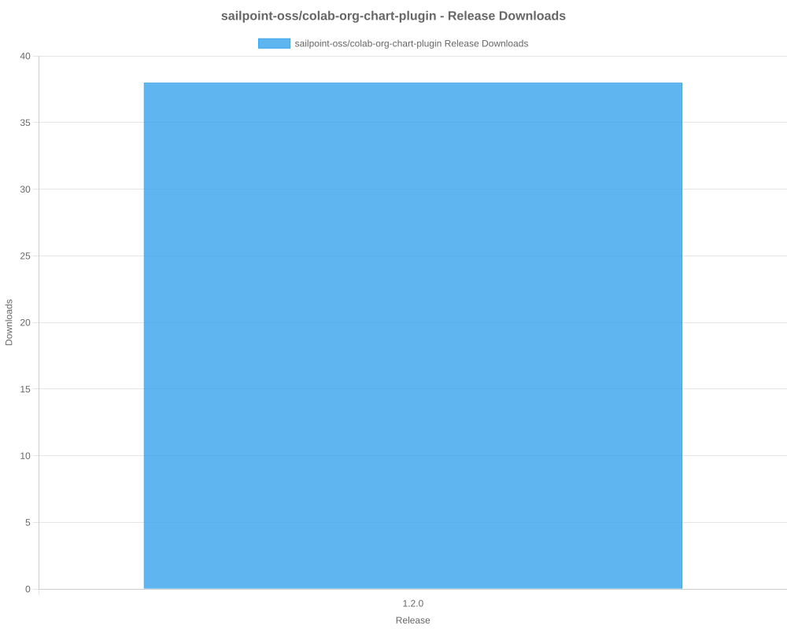
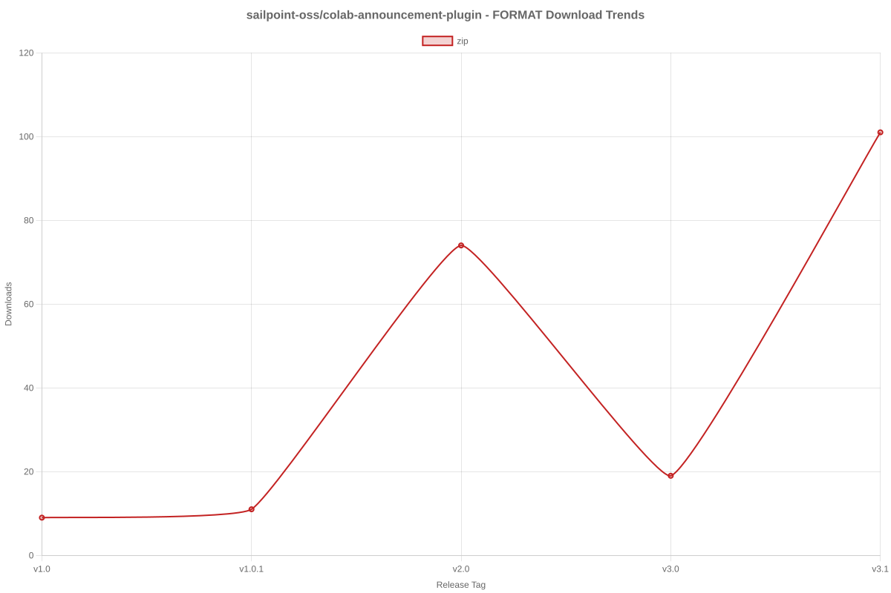

# SailPoint SDK Usage Statistics

<!-- METRICS_START -->
# Usage Statistics
    
Last updated: 2/16/2026, 12:43:25 AM

Below are stats from artifacts tracked across  and GitHub.
    
### GitHub: 

| Repository | Stars | Forks | Watchers | Open Issues | Closed Issues | Total Issues | Release Downloads | Releases | Latest Release | Language |
| --- | --- | --- | --- | --- | --- | --- | --- | --- | --- | --- |
| sailpoint-oss/colab-saas-customizer-entra-id-plus | 0 | 2 | 1 | 0 | 0 | 0 | 6 | 1 | v0.1.2 | TypeScript |
| sailpoint-oss/colab-saas-conn-attribute-generator | 1 | 1 | 0 | 3 | 0 | 3 | 2 | 2 | v0.2.5 | TypeScript |
| sailpoint-oss/colab-saas-conn-access-management | 1 | 1 | 0 | 0 | 0 | 0 | 3 | 2 | v0.2.0 | TypeScript |
| sailpoint-oss/colab-saas-conn-beyondtrust-privilege-management-cloud | 0 | 1 | 0 | 0 | 0 | 0 | 2 | 1 | v0.1.0 | TypeScript |
| sailpoint-oss/colab-saas-conn-beyondtrust-representatives | 1 | 1 | 0 | 0 | 0 | 0 | 2 | 1 | v0.1.0 | TypeScript |
| sailpoint-oss/colab-saas-conn-genetec-clearid | 2 | 1 | 0 | 1 | 0 | 1 | 7 | 2 | v1.2.1 | TypeScript |
| sailpoint-oss/colab-saas-conn-rambase-cloud-erp | 0 | 1 | 0 | 0 | 0 | 0 | 0 | 1 | v1.0 | TypeScript |
| sailpoint-oss/colab-saas-conn-identitynow-orphan-accounts | 2 | 6 | 0 | 0 | 0 | 0 | 1 | 1 | v0.3.4 | TypeScript |
| sailpoint-oss/colab-saas-conn-sailpoint-identity-fusion | 6 | 6 | 5 | 4 | 1 | 5 | 107 | 10 | v1.3.2 | TypeScript |
| sailpoint-oss/colab-saas-conn-proxy-entitlements | 1 | 0 | 0 | 0 | 0 | 0 | 0 | 1 | v0.1.1 | TypeScript |
| sailpoint-oss/colab-rules | 3 | 7 | 0 | 0 | 0 | 0 | 0 | 0 | N/A | N/A |
| sailpoint-oss/colab-saas-conn-outlook-out-of-office | 1 | 1 | 1 | 0 | 0 | 0 | 2 | 1 | v1.1.0 | TypeScript |
| sailpoint-oss/colab-saas-conn-search-loopback | 0 | 1 | 0 | 0 | 0 | 0 | 2 | 1 | v0.1.0 | TypeScript |
| sailpoint-oss/colab-saas-conn-delimited-file | 1 | 2 | 0 | 0 | 0 | 0 | 3 | 1 | v0.1.5 | TypeScript |
| sailpoint-oss/colab-saas-conn-pan-customer-service-portal | 0 | 1 | 0 | 0 | 0 | 0 | 0 | 1 | v1.0.0 | TypeScript |
| sailpoint-oss/colab-saas-conn-peloton-platform | 0 | 1 | 0 | 0 | 0 | 0 | 0 | 1 | v0.1.0 | TypeScript |
| sailpoint-oss/colab-saas-conn-cyber-ark-rbac | 0 | 3 | 0 | 0 | 0 | 0 | 2 | 1 | v0.1.0 | TypeScript |
| sailpoint-oss/colab-saas-conn-thomsonreuters-document-intelligence | 1 | 1 | 0 | 0 | 0 | 0 | 1 | 1 | v0.1.0 | TypeScript |
| sailpoint-oss/colab-saas-conn-identitynow-management | 5 | 9 | 1 | 0 | 0 | 0 | 2 | 1 | v2.1.7 | TypeScript |
| sailpoint-oss/colab-saas-conn-prisma-sase | 0 | 2 | 0 | 0 | 0 | 0 | 1 | 1 | v1.0.0 | TypeScript |
| sailpoint-oss/colab-saas-conn-beyondtrust-pmcloud-computers | 1 | 2 | 0 | 0 | 0 | 0 | 0 | 3 | v0.1.0 | TypeScript |
| sailpoint-oss/colab-saas-conn-peloton-landview | 0 | 0 | 0 | 0 | 0 | 0 | 1 | 1 | v0.2.0 | TypeScript |
| sailpoint-oss/colab-siem-plugin | 3 | 3 | 0 | 0 | 0 | 0 | 22 | 1 | v2.1.5 | CSS |
| sailpoint-oss/colab-isc-extended-workflow-helper | 1 | 2 | 0 | 0 | 0 | 0 | 0 | 0 | N/A | Java |
| sailpoint-oss/colab-iiq-roles-with-deleted-entitlements | 0 | 1 | 0 | 0 | 0 | 0 | 0 | 0 | N/A | N/A |
| sailpoint-oss/colab-stunt-script | 4 | 0 | 2 | 0 | 0 | 0 | 0 | 0 | N/A | Shell |
| sailpoint-oss/colab-sailpoint-zapier-integration | 1 | 1 | 0 | 0 | 0 | 0 | 0 | 0 | N/A | JavaScript |
| sailpoint-oss/colab-events-dashboard-plugin | 0 | 1 | 0 | 0 | 0 | 0 | 9 | 1 | v1.0 | Java |
| sailpoint-oss/colab-motd-plugin | 4 | 0 | 0 | 0 | 0 | 0 | 0 | 0 | N/A | JavaScript |
| sailpoint-oss/colab-iiq-resilient-actions | 0 | 1 | 0 | 0 | 0 | 0 | 0 | 0 | N/A | N/A |
| sailpoint-oss/colab-isc-PsAttributeSyncValidator | 0 | 1 | 0 | 0 | 0 | 0 | 0 | 0 | N/A | N/A |
| sailpoint-oss/colab-non-employee-risk-management-splunk-addon | 1 | 1 | 0 | 1 | 0 | 1 | 0 | 1 | v1.0.0 | Python |
| sailpoint-oss/colab-iiqda-plugin-intellij | 0 | 3 | 0 | 0 | 0 | 0 | 0 | 0 | N/A | Java |
| sailpoint-oss/colab-workflows | 15 | 16 | 4 | 0 | 0 | 0 | 0 | 0 | N/A | N/A |
| sailpoint-oss/colab-show-workgroup-member-plugin | 0 | 1 | 0 | 0 | 0 | 0 | 0 | 0 | N/A | Java |
| sailpoint-oss/colab-iiq-custom-loading-spinner | 0 | 1 | 0 | 0 | 0 | 0 | 4 | 1 | v1.0 | JavaScript |
| sailpoint-oss/colab-isc-auto-loader | 0 | 3 | 0 | 0 | 0 | 0 | 0 | 0 | N/A | N/A |
| sailpoint-oss/colab-provisioning-simulator-plugin | 2 | 1 | 0 | 8 | 3 | 11 | 13 | 3 | 1.2 | Java |
| sailpoint-oss/colab-isc-powershell-task-manager | 1 | 1 | 0 | 0 | 0 | 0 | 0 | 0 | N/A | PowerShell |
| sailpoint-oss/colab-file-upload-utility-automation-scripts | 1 | 3 | 1 | 0 | 0 | 0 | 0 | 0 | N/A | PowerShell |
| sailpoint-oss/colab-sailpoint-configuration-manager | 2 | 3 | 1 | 0 | 0 | 0 | 0 | 0 | N/A | PowerShell |
| sailpoint-oss/colab-org-chart-plugin | 0 | 1 | 0 | 0 | 0 | 0 | 39 | 1 | 1.2.0 | TypeScript |
| sailpoint-oss/colab-transforms | 2 | 9 | 0 | 0 | 0 | 0 | 0 | 0 | N/A | N/A |
| sailpoint-oss/colab-file-upload-utility | 5 | 8 | 1 | 3 | 2 | 5 | 1,896 | 2 | file-upload-utility-4.1.0 | Java |
| sailpoint-oss/colab-isc-credential-cycling | 0 | 1 | 0 | 0 | 0 | 0 | 0 | 0 | N/A | C# |
| sailpoint-oss/colab-log-level-modifier-plugin | 1 | 2 | 0 | 0 | 0 | 0 | 0 | 0 | N/A | HTML |
| sailpoint-oss/colab-valdate-population-plugin | 0 | 0 | 0 | 0 | 0 | 0 | 0 | 0 | N/A | N/A |
| sailpoint-oss/colab-identity-photos-plugin | 0 | 0 | 0 | 0 | 0 | 0 | 0 | 0 | N/A | N/A |
| sailpoint-oss/colab-community-rest-api-plugin | 2 | 4 | 0 | 0 | 0 | 0 | 0 | 0 | N/A | Java |
| sailpoint-oss/colab-connector-configurations | 0 | 1 | 0 | 0 | 0 | 0 | 0 | 0 | N/A | N/A |
| sailpoint-oss/colab-iiq-hbm-extension-template | 2 | 2 | 0 | 0 | 0 | 0 | 0 | 0 | N/A | Java |
| sailpoint-oss/colab-iiqda | 5 | 9 | 2 | 4 | 1 | 5 | 0 | 0 | N/A | Java |
| sailpoint-oss/colab-announcement-plugin | 2 | 0 | 0 | 0 | 0 | 0 | 238 | 5 | v3.1 | CSS |
| sailpoint-oss/colab-identity-details-tweaks-plugin | 3 | 2 | 0 | 0 | 0 | 0 | 7 | 2 | v2.0 | JavaScript |
| sailpoint-oss/colab-repo-template | 0 | 4 | 2 | 0 | 0 | 0 | 0 | 0 | N/A | N/A |
| sailpoint-oss/colab-identitynow-azure-sentinel | 0 | 2 | 0 | 0 | 0 | 0 | 0 | 0 | N/A | Python |
| sailpoint-oss/colab-sailpoint-rule-restriction-vs-code-plugin | 0 | 2 | 0 | 0 | 0 | 0 | 0 | 0 | N/A | TypeScript |
| sailpoint-oss/colab-reports | 1 | 1 | 0 | 0 | 0 | 0 | 0 | 0 | N/A | Java |
| sailpoint-oss/colab-proofpoint-plugin | 1 | 1 | 0 | 0 | 0 | 0 | 0 | 0 | N/A | Java |
| sailpoint-oss/colab-saas-conn-beyondtrust-epm | 0 | 1 | 0 | 0 | 0 | 0 | 0 | 0 | N/A | N/A |
| sailpoint-oss/colab-saas-conn-beyondtrust-pra | 0 | 1 | 0 | 0 | 0 | 0 | 0 | 0 | N/A | N/A |
| sailpoint-oss/colab-saas-conn-proofpoint | 0 | 2 | 0 | 0 | 0 | 0 | 0 | 0 | N/A | N/A |
| **Total** | **85** | **146** | **21** | **24** | **7** | **31** | **2,372** | **52** | | |

#### Repository Details:

**sailpoint-oss/colab-saas-customizer-entra-id-plus**:
- Last Activity: 1 days ago
- Repository Age: 235 days
- Release Count: 1
- Total Release Downloads: 6
- Latest Release: v0.1.2
- Latest Release Downloads: 6
- Views: 33
- Unique Visitors: 8
- Clones: 11
- Top Assets (by downloads):
  - entra_zip: 6
- Format Breakdown:
  - zip: 6

**sailpoint-oss/colab-saas-conn-attribute-generator**:
- Last Activity: 1 days ago
- Repository Age: 235 days
- Release Count: 2
- Total Release Downloads: 2
- Latest Release: v0.2.5
- Latest Release Downloads: 2
- Views: 20
- Unique Visitors: 8
- Clones: 28
- Top Assets (by downloads):
  - attribute_zip: 2
- Format Breakdown:
  - zip: 2

**sailpoint-oss/colab-saas-conn-access-management**:
- Last Activity: 1 days ago
- Repository Age: 235 days
- Release Count: 2
- Total Release Downloads: 3
- Latest Release: v0.2.0
- Latest Release Downloads: 2
- Views: 266
- Unique Visitors: 19
- Clones: 104
- Top Assets (by downloads):
  - access_zip: 3
- Format Breakdown:
  - zip: 3

**sailpoint-oss/colab-saas-conn-beyondtrust-privilege-management-cloud**:
- Last Activity: 1 days ago
- Repository Age: 747 days
- Release Count: 1
- Total Release Downloads: 2
- Latest Release: v0.1.0
- Latest Release Downloads: 2
- Views: 13
- Unique Visitors: 7
- Clones: 33
- Top Assets (by downloads):
  - beyondtrust_zip: 2
- Format Breakdown:
  - zip: 2

**sailpoint-oss/colab-saas-conn-beyondtrust-representatives**:
- Last Activity: 1 days ago
- Repository Age: 747 days
- Release Count: 1
- Total Release Downloads: 2
- Latest Release: v0.1.0
- Latest Release Downloads: 2
- Views: 4
- Unique Visitors: 2
- Clones: 12
- Top Assets (by downloads):
  - beyondtrust_zip: 2
- Format Breakdown:
  - zip: 2

**sailpoint-oss/colab-saas-conn-genetec-clearid**:
- Last Activity: 1 days ago
- Repository Age: 872 days
- Release Count: 2
- Total Release Downloads: 7
- Latest Release: v1.2.1
- Latest Release Downloads: 7
- Views: 37
- Unique Visitors: 8
- Clones: 21
- Top Assets (by downloads):
  - clearid_zip: 7
- Format Breakdown:
  - zip: 7

**sailpoint-oss/colab-saas-conn-rambase-cloud-erp**:
- Last Activity: 1 days ago
- Repository Age: 873 days
- Release Count: 1
- Total Release Downloads: 0
- Latest Release: v1.0
- Latest Release Downloads: 0
- Views: 6
- Unique Visitors: 1
- Clones: 32
- Top Assets (by downloads):
  - rambase_zip: 0
- Format Breakdown:
  - zip: 0

**sailpoint-oss/colab-saas-conn-identitynow-orphan-accounts**:
- Last Activity: 1 days ago
- Repository Age: 872 days
- Release Count: 1
- Total Release Downloads: 1
- Latest Release: v0.3.4
- Latest Release Downloads: 1
- Views: 15
- Unique Visitors: 6
- Clones: 23
- Top Assets (by downloads):
  - orphan_zip: 1
- Format Breakdown:
  - zip: 1

**sailpoint-oss/colab-saas-conn-sailpoint-identity-fusion**:
- Last Activity: 2 days ago
- Repository Age: 684 days
- Release Count: 10
- Total Release Downloads: 107
- Latest Release: v1.3.2
- Latest Release Downloads: 32
- Views: 744
- Unique Visitors: 60
- Clones: 283
- Top Assets (by downloads):
  - identity_zip: 107
- Format Breakdown:
  - zip: 107

**sailpoint-oss/colab-saas-conn-proxy-entitlements**:
- Last Activity: 4 days ago
- Repository Age: 235 days
- Release Count: 1
- Total Release Downloads: 0
- Latest Release: v0.1.1
- Latest Release Downloads: 0
- Views: 76
- Unique Visitors: 2
- Clones: 19
- Top Assets (by downloads):
  - proxy_zip: 0
- Format Breakdown:
  - zip: 0

**sailpoint-oss/colab-rules**:
- Last Activity: 34 days ago
- Repository Age: 874 days
- Release Count: 0
- Total Release Downloads: 0
- Latest Release: N/A
- Latest Release Downloads: 0
- Views: 124
- Unique Visitors: 38
- Clones: 9

**sailpoint-oss/colab-saas-conn-outlook-out-of-office**:
- Last Activity: 60 days ago
- Repository Age: 823 days
- Release Count: 1
- Total Release Downloads: 2
- Latest Release: v1.1.0
- Latest Release Downloads: 2
- Views: 1
- Unique Visitors: 1
- Clones: 5
- Top Assets (by downloads):
  - outlook_zip: 2
- Format Breakdown:
  - zip: 2

**sailpoint-oss/colab-saas-conn-search-loopback**:
- Last Activity: 60 days ago
- Repository Age: 388 days
- Release Count: 1
- Total Release Downloads: 2
- Latest Release: v0.1.0
- Latest Release Downloads: 2
- Views: 7
- Unique Visitors: 3
- Clones: 4
- Top Assets (by downloads):
  - saas_zip: 2
- Format Breakdown:
  - zip: 2

**sailpoint-oss/colab-saas-conn-delimited-file**:
- Last Activity: 60 days ago
- Repository Age: 569 days
- Release Count: 1
- Total Release Downloads: 3
- Latest Release: v0.1.5
- Latest Release Downloads: 3
- Views: 7
- Unique Visitors: 1
- Clones: 10
- Top Assets (by downloads):
  - isc_zip: 3
- Format Breakdown:
  - zip: 3

**sailpoint-oss/colab-saas-conn-pan-customer-service-portal**:
- Last Activity: 60 days ago
- Repository Age: 569 days
- Release Count: 1
- Total Release Downloads: 0
- Latest Release: v1.0.0
- Latest Release Downloads: 0
- Views: 3
- Unique Visitors: 3
- Clones: 7
- Top Assets (by downloads):
  - saas_zip: 0
- Format Breakdown:
  - zip: 0

**sailpoint-oss/colab-saas-conn-peloton-platform**:
- Last Activity: 60 days ago
- Repository Age: 292 days
- Release Count: 1
- Total Release Downloads: 0
- Latest Release: v0.1.0
- Latest Release Downloads: 0
- Views: 6
- Unique Visitors: 1
- Clones: 5
- Top Assets (by downloads):
  - colab_zip: 0
- Format Breakdown:
  - zip: 0

**sailpoint-oss/colab-saas-conn-cyber-ark-rbac**:
- Last Activity: 60 days ago
- Repository Age: 356 days
- Release Count: 1
- Total Release Downloads: 2
- Latest Release: v0.1.0
- Latest Release Downloads: 2
- Views: 11
- Unique Visitors: 5
- Clones: 5
- Top Assets (by downloads):
  - colab_zip: 2
- Format Breakdown:
  - zip: 2

**sailpoint-oss/colab-saas-conn-thomsonreuters-document-intelligence**:
- Last Activity: 60 days ago
- Repository Age: 447 days
- Release Count: 1
- Total Release Downloads: 1
- Latest Release: v0.1.0
- Latest Release Downloads: 1
- Views: 3
- Unique Visitors: 1
- Clones: 5
- Top Assets (by downloads):
  - colab_zip: 1
- Format Breakdown:
  - zip: 1

**sailpoint-oss/colab-saas-conn-identitynow-management**:
- Last Activity: 60 days ago
- Repository Age: 873 days
- Release Count: 1
- Total Release Downloads: 2
- Latest Release: v2.1.7
- Latest Release Downloads: 2
- Views: 71
- Unique Visitors: 9
- Clones: 6
- Top Assets (by downloads):
  - identitynowmanagement_zip: 2
- Format Breakdown:
  - zip: 2

**sailpoint-oss/colab-saas-conn-prisma-sase**:
- Last Activity: 60 days ago
- Repository Age: 569 days
- Release Count: 1
- Total Release Downloads: 1
- Latest Release: v1.0.0
- Latest Release Downloads: 1
- Views: 1
- Unique Visitors: 1
- Clones: 10
- Top Assets (by downloads):
  - prisma_zip: 1
- Format Breakdown:
  - zip: 1

**sailpoint-oss/colab-saas-conn-beyondtrust-pmcloud-computers**:
- Last Activity: 60 days ago
- Repository Age: 747 days
- Release Count: 3
- Total Release Downloads: 0
- Latest Release: v0.1.0
- Latest Release Downloads: 0
- Views: 5
- Unique Visitors: 3
- Clones: 6
- Top Assets (by downloads):
  - beyondtrust_zip: 0
- Format Breakdown:
  - zip: 0

**sailpoint-oss/colab-saas-conn-peloton-landview**:
- Last Activity: 60 days ago
- Repository Age: 695 days
- Release Count: 1
- Total Release Downloads: 1
- Latest Release: v0.2.0
- Latest Release Downloads: 1
- Views: 9
- Unique Visitors: 1
- Clones: 4
- Top Assets (by downloads):
  - colab_zip: 1
- Format Breakdown:
  - zip: 1

**sailpoint-oss/colab-siem-plugin**:
- Last Activity: 62 days ago
- Repository Age: 872 days
- Release Count: 1
- Total Release Downloads: 22
- Latest Release: v2.1.5
- Latest Release Downloads: 22
- Views: 194
- Unique Visitors: 44
- Clones: 7
- Top Assets (by downloads):
  - siem_zip: 22
- Format Breakdown:
  - zip: 22

**sailpoint-oss/colab-isc-extended-workflow-helper**:
- Last Activity: 143 days ago
- Repository Age: 150 days
- Release Count: 0
- Total Release Downloads: 0
- Latest Release: N/A
- Latest Release Downloads: 0
- Views: 2
- Unique Visitors: 2
- Clones: 5

**sailpoint-oss/colab-iiq-roles-with-deleted-entitlements**:
- Last Activity: 163 days ago
- Repository Age: 163 days
- Release Count: 0
- Total Release Downloads: 0
- Latest Release: N/A
- Latest Release Downloads: 0
- Views: 2
- Unique Visitors: 1
- Clones: 4

**sailpoint-oss/colab-stunt-script**:
- Last Activity: 180 days ago
- Repository Age: 872 days
- Release Count: 0
- Total Release Downloads: 0
- Latest Release: N/A
- Latest Release Downloads: 0
- Views: 19
- Unique Visitors: 13
- Clones: 38

**sailpoint-oss/colab-sailpoint-zapier-integration**:
- Last Activity: 208 days ago
- Repository Age: 873 days
- Release Count: 0
- Total Release Downloads: 0
- Latest Release: N/A
- Latest Release Downloads: 0
- Views: 2
- Unique Visitors: 2
- Clones: 4

**sailpoint-oss/colab-events-dashboard-plugin**:
- Last Activity: 212 days ago
- Repository Age: 235 days
- Release Count: 1
- Total Release Downloads: 9
- Latest Release: v1.0
- Latest Release Downloads: 9
- Views: 44
- Unique Visitors: 5
- Clones: 3
- Top Assets (by downloads):
  - eventsdashboardplugin_zip: 9
- Format Breakdown:
  - zip: 9

**sailpoint-oss/colab-motd-plugin**:
- Last Activity: 218 days ago
- Repository Age: 661 days
- Release Count: 0
- Total Release Downloads: 0
- Latest Release: N/A
- Latest Release Downloads: 0
- Views: 9
- Unique Visitors: 3
- Clones: 4

**sailpoint-oss/colab-iiq-resilient-actions**:
- Last Activity: 248 days ago
- Repository Age: 248 days
- Release Count: 0
- Total Release Downloads: 0
- Latest Release: N/A
- Latest Release Downloads: 0
- Views: 4
- Unique Visitors: 4
- Clones: 5

**sailpoint-oss/colab-isc-PsAttributeSyncValidator**:
- Last Activity: 258 days ago
- Repository Age: 258 days
- Release Count: 0
- Total Release Downloads: 0
- Latest Release: N/A
- Latest Release Downloads: 0
- Views: 0
- Unique Visitors: 0
- Clones: 4

**sailpoint-oss/colab-non-employee-risk-management-splunk-addon**:
- Last Activity: 314 days ago
- Repository Age: 450 days
- Release Count: 1
- Total Release Downloads: 0
- Latest Release: v1.0.0
- Latest Release Downloads: 0
- Views: 5
- Unique Visitors: 5
- Clones: 3

**sailpoint-oss/colab-iiqda-plugin-intellij**:
- Last Activity: 318 days ago
- Repository Age: 606 days
- Release Count: 0
- Total Release Downloads: 0
- Latest Release: N/A
- Latest Release Downloads: 0
- Views: 45
- Unique Visitors: 14
- Clones: 6

**sailpoint-oss/colab-workflows**:
- Last Activity: 361 days ago
- Repository Age: 874 days
- Release Count: 0
- Total Release Downloads: 0
- Latest Release: N/A
- Latest Release Downloads: 0
- Views: 390
- Unique Visitors: 86
- Clones: 10

**sailpoint-oss/colab-show-workgroup-member-plugin**:
- Last Activity: 369 days ago
- Repository Age: 384 days
- Release Count: 0
- Total Release Downloads: 0
- Latest Release: N/A
- Latest Release Downloads: 0
- Views: 20
- Unique Visitors: 6
- Clones: 6

**sailpoint-oss/colab-iiq-custom-loading-spinner**:
- Last Activity: 398 days ago
- Repository Age: 404 days
- Release Count: 1
- Total Release Downloads: 4
- Latest Release: v1.0
- Latest Release Downloads: 4
- Views: 1
- Unique Visitors: 1
- Clones: 5
- Top Assets (by downloads):
  - custom_zip: 4
- Format Breakdown:
  - zip: 4

**sailpoint-oss/colab-isc-auto-loader**:
- Last Activity: 432 days ago
- Repository Age: 432 days
- Release Count: 0
- Total Release Downloads: 0
- Latest Release: N/A
- Latest Release Downloads: 0
- Views: 0
- Unique Visitors: 0
- Clones: 4

**sailpoint-oss/colab-provisioning-simulator-plugin**:
- Last Activity: 439 days ago
- Repository Age: 648 days
- Release Count: 3
- Total Release Downloads: 13
- Latest Release: 1.2
- Latest Release Downloads: 11
- Views: 41
- Unique Visitors: 7
- Clones: 10
- Top Assets (by downloads):
  - colab: 7
  - colab_zip: 5
  - provisioningsimulator: 1
- Format Breakdown:
  - zip: 5

**sailpoint-oss/colab-isc-powershell-task-manager**:
- Last Activity: 471 days ago
- Repository Age: 493 days
- Release Count: 0
- Total Release Downloads: 0
- Latest Release: N/A
- Latest Release Downloads: 0
- Views: 3
- Unique Visitors: 2
- Clones: 6

**sailpoint-oss/colab-file-upload-utility-automation-scripts**:
- Last Activity: 502 days ago
- Repository Age: 514 days
- Release Count: 0
- Total Release Downloads: 0
- Latest Release: N/A
- Latest Release Downloads: 0
- Views: 23
- Unique Visitors: 6
- Clones: 6

**sailpoint-oss/colab-sailpoint-configuration-manager**:
- Last Activity: 505 days ago
- Repository Age: 718 days
- Release Count: 0
- Total Release Downloads: 0
- Latest Release: N/A
- Latest Release Downloads: 0
- Views: 11
- Unique Visitors: 5
- Clones: 3

**sailpoint-oss/colab-org-chart-plugin**:
- Last Activity: 507 days ago
- Repository Age: 606 days
- Release Count: 1
- Total Release Downloads: 39
- Latest Release: 1.2.0
- Latest Release Downloads: 39
- Views: 46
- Unique Visitors: 4
- Clones: 6
- Top Assets (by downloads):
  - orgchartplugin_zip: 39
- Format Breakdown:
  - zip: 39

**sailpoint-oss/colab-transforms**:
- Last Activity: 508 days ago
- Repository Age: 874 days
- Release Count: 0
- Total Release Downloads: 0
- Latest Release: N/A
- Latest Release Downloads: 0
- Views: 46
- Unique Visitors: 18
- Clones: 4

**sailpoint-oss/colab-file-upload-utility**:
- Last Activity: 522 days ago
- Repository Age: 873 days
- Release Count: 2
- Total Release Downloads: 1,896
- Latest Release: file-upload-utility-4.1.0
- Latest Release Downloads: 1,117
- Views: 260
- Unique Visitors: 76
- Clones: 7
- Top Assets (by downloads):
  - sailpoint: 1,896

**sailpoint-oss/colab-isc-credential-cycling**:
- Last Activity: 536 days ago
- Repository Age: 562 days
- Release Count: 0
- Total Release Downloads: 0
- Latest Release: N/A
- Latest Release Downloads: 0
- Views: 2
- Unique Visitors: 1
- Clones: 5

**sailpoint-oss/colab-log-level-modifier-plugin**:
- Last Activity: 545 days ago
- Repository Age: 549 days
- Release Count: 0
- Total Release Downloads: 0
- Latest Release: N/A
- Latest Release Downloads: 0
- Views: 0
- Unique Visitors: 0
- Clones: 5

**sailpoint-oss/colab-valdate-population-plugin**:
- Last Activity: 559 days ago
- Repository Age: 559 days
- Release Count: 0
- Total Release Downloads: 0
- Latest Release: N/A
- Latest Release Downloads: 0
- Views: 0
- Unique Visitors: 0
- Clones: 5

**sailpoint-oss/colab-identity-photos-plugin**:
- Last Activity: 559 days ago
- Repository Age: 559 days
- Release Count: 0
- Total Release Downloads: 0
- Latest Release: N/A
- Latest Release Downloads: 0
- Views: 0
- Unique Visitors: 0
- Clones: 5

**sailpoint-oss/colab-community-rest-api-plugin**:
- Last Activity: 600 days ago
- Repository Age: 606 days
- Release Count: 0
- Total Release Downloads: 0
- Latest Release: N/A
- Latest Release Downloads: 0
- Views: 192
- Unique Visitors: 12
- Clones: 3

**sailpoint-oss/colab-connector-configurations**:
- Last Activity: 606 days ago
- Repository Age: 606 days
- Release Count: 0
- Total Release Downloads: 0
- Latest Release: N/A
- Latest Release Downloads: 0
- Views: 0
- Unique Visitors: 0
- Clones: 4

**sailpoint-oss/colab-iiq-hbm-extension-template**:
- Last Activity: 634 days ago
- Repository Age: 662 days
- Release Count: 0
- Total Release Downloads: 0
- Latest Release: N/A
- Latest Release Downloads: 0
- Views: 49
- Unique Visitors: 6
- Clones: 6

**sailpoint-oss/colab-iiqda**:
- Last Activity: 639 days ago
- Repository Age: 874 days
- Release Count: 0
- Total Release Downloads: 0
- Latest Release: N/A
- Latest Release Downloads: 0
- Views: 72
- Unique Visitors: 20
- Clones: 6

**sailpoint-oss/colab-announcement-plugin**:
- Last Activity: 639 days ago
- Repository Age: 767 days
- Release Count: 5
- Total Release Downloads: 238
- Latest Release: v3.1
- Latest Release Downloads: 113
- Views: 37
- Unique Visitors: 12
- Clones: 7
- Top Assets (by downloads):
  - announcement_zip: 238
- Format Breakdown:
  - zip: 238

**sailpoint-oss/colab-identity-details-tweaks-plugin**:
- Last Activity: 684 days ago
- Repository Age: 731 days
- Release Count: 2
- Total Release Downloads: 7
- Latest Release: v2.0
- Latest Release Downloads: 0
- Views: 13
- Unique Visitors: 6
- Clones: 5
- Top Assets (by downloads):
  - identitydetailstweaks_zip: 7
- Format Breakdown:
  - zip: 7

**sailpoint-oss/colab-repo-template**:
- Last Activity: 713 days ago
- Repository Age: 1,300 days
- Release Count: 0
- Total Release Downloads: 0
- Latest Release: N/A
- Latest Release Downloads: 0
- Views: 35
- Unique Visitors: 13
- Clones: 6

**sailpoint-oss/colab-identitynow-azure-sentinel**:
- Last Activity: 725 days ago
- Repository Age: 866 days
- Release Count: 0
- Total Release Downloads: 0
- Latest Release: N/A
- Latest Release Downloads: 0
- Views: 3
- Unique Visitors: 2
- Clones: 3

**sailpoint-oss/colab-sailpoint-rule-restriction-vs-code-plugin**:
- Last Activity: 731 days ago
- Repository Age: 745 days
- Release Count: 0
- Total Release Downloads: 0
- Latest Release: N/A
- Latest Release Downloads: 0
- Views: 1
- Unique Visitors: 1
- Clones: 4

**sailpoint-oss/colab-reports**:
- Last Activity: 831 days ago
- Repository Age: 832 days
- Release Count: 0
- Total Release Downloads: 0
- Latest Release: N/A
- Latest Release Downloads: 0
- Views: 23
- Unique Visitors: 4
- Clones: 3

**sailpoint-oss/colab-proofpoint-plugin**:
- Last Activity: 859 days ago
- Repository Age: 872 days
- Release Count: 0
- Total Release Downloads: 0
- Latest Release: N/A
- Latest Release Downloads: 0
- Views: 1
- Unique Visitors: 1
- Clones: 4

**sailpoint-oss/colab-saas-conn-beyondtrust-epm**:
- Last Activity: 866 days ago
- Repository Age: 873 days
- Release Count: 0
- Total Release Downloads: 0
- Latest Release: N/A
- Latest Release Downloads: 0
- Views: 0
- Unique Visitors: 0
- Clones: 3

**sailpoint-oss/colab-saas-conn-beyondtrust-pra**:
- Last Activity: 866 days ago
- Repository Age: 873 days
- Release Count: 0
- Total Release Downloads: 0
- Latest Release: N/A
- Latest Release Downloads: 0
- Views: 1
- Unique Visitors: 1
- Clones: 3

**sailpoint-oss/colab-saas-conn-proofpoint**:
- Last Activity: 866 days ago
- Repository Age: 872 days
- Release Count: 0
- Total Release Downloads: 0
- Latest Release: N/A
- Latest Release Downloads: 0
- Views: 3
- Unique Visitors: 1
- Clones: 3

<!-- METRICS_END -->
