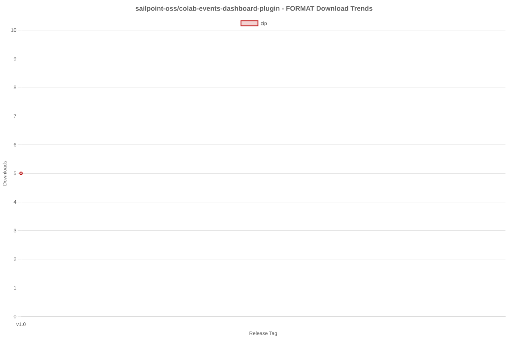
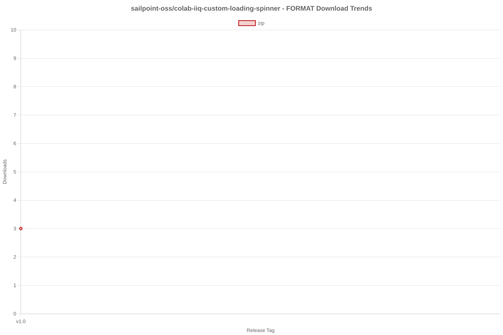

# SailPoint SDK Usage Statistics

<!-- METRICS_START -->
# Usage Statistics
    
Last updated: 12/8/2025, 12:33:51 AM

Below are stats from artifacts tracked across  and GitHub.
    
### GitHub: 

| Repository | Stars | Forks | Watchers | Open Issues | Closed Issues | Total Issues | Release Downloads | Releases | Latest Release | Language |
| --- | --- | --- | --- | --- | --- | --- | --- | --- | --- | --- |
| sailpoint-oss/colab-saas-conn-sailpoint-identity-fusion | 6 | 6 | 4 | 4 | 1 | 5 | 70 | 9 | v1.3.1 | TypeScript |
| sailpoint-oss/colab-saas-conn-attribute-generator | 0 | 1 | 0 | 0 | 0 | 0 | 0 | 0 | N/A | TypeScript |
| sailpoint-oss/colab-saas-conn-proxy-entitlements | 0 | 0 | 0 | 0 | 0 | 0 | 0 | 0 | N/A | TypeScript |
| sailpoint-oss/colab-siem-plugin | 3 | 2 | 0 | 0 | 0 | 0 | 0 | 0 | N/A | CSS |
| sailpoint-oss/colab-isc-extended-workflow-helper | 0 | 2 | 0 | 0 | 0 | 0 | 0 | 0 | N/A | Java |
| sailpoint-oss/colab-saas-conn-prisma-sase | 0 | 2 | 0 | 0 | 0 | 0 | 0 | 0 | N/A | TypeScript |
| sailpoint-oss/colab-saas-conn-pan-customer-service-portal | 0 | 1 | 0 | 0 | 0 | 0 | 0 | 0 | N/A | TypeScript |
| sailpoint-oss/colab-iiq-roles-with-deleted-entitlements | 0 | 1 | 0 | 0 | 0 | 0 | 0 | 0 | N/A | N/A |
| sailpoint-oss/colab-stunt-script | 4 | 0 | 2 | 0 | 0 | 0 | 0 | 0 | N/A | Shell |
| sailpoint-oss/colab-saas-conn-outlook-out-of-office | 1 | 1 | 1 | 0 | 0 | 0 | 0 | 0 | N/A | TypeScript |
| sailpoint-oss/colab-saas-conn-access-management | 0 | 0 | 0 | 0 | 0 | 0 | 0 | 0 | N/A | TypeScript |
| sailpoint-oss/colab-saas-customizer-entra-id-plus | 0 | 1 | 1 | 0 | 0 | 0 | 0 | 0 | N/A | TypeScript |
| sailpoint-oss/colab-saas-conn-search-loopback | 0 | 1 | 0 | 0 | 0 | 0 | 0 | 0 | N/A | TypeScript |
| sailpoint-oss/colab-sailpoint-zapier-integration | 1 | 1 | 0 | 0 | 0 | 0 | 0 | 0 | N/A | JavaScript |
| sailpoint-oss/colab-events-dashboard-plugin | 0 | 1 | 0 | 0 | 0 | 0 | 7 | 1 | v1.0 | Java |
| sailpoint-oss/colab-motd-plugin | 4 | 0 | 0 | 0 | 0 | 0 | 0 | 0 | N/A | JavaScript |
| sailpoint-oss/colab-saas-conn-genetec-clearid | 2 | 1 | 0 | 1 | 0 | 1 | 0 | 0 | N/A | TypeScript |
| sailpoint-oss/colab-iiq-resilient-actions | 0 | 1 | 0 | 0 | 0 | 0 | 0 | 0 | N/A | N/A |
| sailpoint-oss/colab-isc-PsAttributeSyncValidator | 0 | 1 | 0 | 0 | 0 | 0 | 0 | 0 | N/A | N/A |
| sailpoint-oss/colab-saas-conn-identitynow-orphan-accounts | 2 | 6 | 0 | 0 | 0 | 0 | 0 | 0 | N/A | TypeScript |
| sailpoint-oss/colab-saas-conn-peloton-platform | 0 | 1 | 0 | 0 | 0 | 0 | 0 | 0 | N/A | TypeScript |
| sailpoint-oss/colab-non-employee-risk-management-splunk-addon | 1 | 1 | 0 | 1 | 0 | 1 | 0 | 1 | v1.0.0 | Python |
| sailpoint-oss/colab-iiqda-plugin-intellij | 0 | 3 | 0 | 0 | 0 | 0 | 0 | 0 | N/A | Java |
| sailpoint-oss/colab-saas-conn-identitynow-management | 6 | 8 | 1 | 0 | 0 | 0 | 0 | 0 | N/A | TypeScript |
| sailpoint-oss/colab-saas-conn-cyber-ark-rbac | 0 | 3 | 0 | 0 | 0 | 0 | 0 | 0 | N/A | TypeScript |
| sailpoint-oss/colab-saas-conn-peloton-landview | 0 | 0 | 0 | 0 | 0 | 0 | 0 | 0 | N/A | TypeScript |
| sailpoint-oss/colab-workflows | 13 | 16 | 4 | 0 | 0 | 0 | 0 | 0 | N/A | N/A |
| sailpoint-oss/colab-show-workgroup-member-plugin | 0 | 2 | 0 | 0 | 0 | 0 | 0 | 0 | N/A | Java |
| sailpoint-oss/colab-iiq-custom-loading-spinner | 0 | 1 | 0 | 0 | 0 | 0 | 4 | 1 | v1.0 | JavaScript |
| sailpoint-oss/colab-isc-auto-loader | 0 | 3 | 0 | 0 | 0 | 0 | 0 | 0 | N/A | N/A |
| sailpoint-oss/colab-saas-conn-beyondtrust-privilege-management-cloud | 0 | 1 | 0 | 0 | 0 | 0 | 0 | 0 | N/A | TypeScript |
| sailpoint-oss/colab-provisioning-simulator-plugin | 2 | 1 | 0 | 8 | 3 | 11 | 11 | 3 | 1.2 | Java |
| sailpoint-oss/colab-saas-conn-thomsonreuters-document-intelligence | 1 | 1 | 0 | 0 | 0 | 0 | 0 | 0 | N/A | TypeScript |
| sailpoint-oss/colab-isc-powershell-task-manager | 1 | 1 | 0 | 0 | 0 | 0 | 0 | 0 | N/A | PowerShell |
| sailpoint-oss/colab-saas-conn-delimited-file | 1 | 2 | 0 | 0 | 0 | 0 | 0 | 0 | N/A | TypeScript |
| sailpoint-oss/colab-file-upload-utility-automation-scripts | 1 | 3 | 1 | 0 | 0 | 0 | 0 | 0 | N/A | PowerShell |
| sailpoint-oss/colab-sailpoint-configuration-manager | 2 | 3 | 1 | 0 | 0 | 0 | 0 | 0 | N/A | PowerShell |
| sailpoint-oss/colab-org-chart-plugin | 0 | 1 | 0 | 0 | 0 | 0 | 38 | 1 | 1.2.0 | TypeScript |
| sailpoint-oss/colab-transforms | 2 | 9 | 0 | 0 | 0 | 0 | 0 | 0 | N/A | N/A |
| sailpoint-oss/colab-file-upload-utility | 5 | 8 | 1 | 3 | 2 | 5 | 1,744 | 2 | file-upload-utility-4.1.0 | Java |
| sailpoint-oss/colab-isc-credential-cycling | 0 | 1 | 0 | 0 | 0 | 0 | 0 | 0 | N/A | C# |
| sailpoint-oss/colab-log-level-modifier-plugin | 1 | 2 | 0 | 0 | 0 | 0 | 0 | 0 | N/A | HTML |
| sailpoint-oss/colab-valdate-population-plugin | 0 | 0 | 0 | 0 | 0 | 0 | 0 | 0 | N/A | N/A |
| sailpoint-oss/colab-identity-photos-plugin | 0 | 0 | 0 | 0 | 0 | 0 | 0 | 0 | N/A | N/A |
| sailpoint-oss/colab-community-rest-api-plugin | 2 | 4 | 0 | 0 | 0 | 0 | 0 | 0 | N/A | Java |
| sailpoint-oss/colab-saas-conn-beyondtrust-pmcloud-computers | 1 | 2 | 0 | 0 | 0 | 0 | 0 | 2 | v1.01 | TypeScript |
| sailpoint-oss/colab-connector-configurations | 0 | 1 | 0 | 0 | 0 | 0 | 0 | 0 | N/A | N/A |
| sailpoint-oss/colab-iiq-hbm-extension-template | 2 | 2 | 0 | 0 | 0 | 0 | 0 | 0 | N/A | Java |
| sailpoint-oss/colab-iiqda | 5 | 9 | 2 | 4 | 1 | 5 | 0 | 0 | N/A | Java |
| sailpoint-oss/colab-announcement-plugin | 2 | 0 | 0 | 0 | 0 | 0 | 223 | 5 | v3.1 | CSS |
| sailpoint-oss/colab-identity-details-tweaks-plugin | 3 | 2 | 0 | 0 | 0 | 0 | 7 | 2 | v2.0 | JavaScript |
| sailpoint-oss/colab-repo-template | 0 | 4 | 2 | 0 | 0 | 0 | 0 | 0 | N/A | N/A |
| sailpoint-oss/colab-identitynow-azure-sentinel | 0 | 2 | 0 | 0 | 0 | 0 | 0 | 0 | N/A | Python |
| sailpoint-oss/colab-sailpoint-rule-restriction-vs-code-plugin | 0 | 2 | 0 | 0 | 0 | 0 | 0 | 0 | N/A | TypeScript |
| sailpoint-oss/colab-saas-conn-beyondtrust-representatives | 1 | 1 | 0 | 0 | 0 | 0 | 0 | 0 | N/A | TypeScript |
| sailpoint-oss/colab-reports | 1 | 1 | 0 | 0 | 0 | 0 | 0 | 0 | N/A | Java |
| sailpoint-oss/colab-rules | 3 | 7 | 0 | 0 | 0 | 0 | 0 | 0 | N/A | N/A |
| sailpoint-oss/colab-proofpoint-plugin | 1 | 1 | 0 | 0 | 0 | 0 | 0 | 0 | N/A | Java |
| sailpoint-oss/colab-saas-conn-rambase-cloud-erp | 0 | 1 | 0 | 0 | 0 | 0 | 0 | 0 | N/A | TypeScript |
| sailpoint-oss/colab-saas-conn-beyondtrust-epm | 0 | 1 | 0 | 0 | 0 | 0 | 0 | 0 | N/A | N/A |
| sailpoint-oss/colab-saas-conn-beyondtrust-pra | 0 | 1 | 0 | 0 | 0 | 0 | 0 | 0 | N/A | N/A |
| sailpoint-oss/colab-saas-conn-proofpoint | 0 | 2 | 0 | 0 | 0 | 0 | 0 | 0 | N/A | N/A |
| **Total** | **80** | **143** | **20** | **21** | **7** | **28** | **2,104** | **27** | | |

#### Repository Details:

**sailpoint-oss/colab-saas-conn-sailpoint-identity-fusion**:
- Last Activity: 0 days ago
- Repository Age: 614 days
- Release Count: 9
- Total Release Downloads: 70
- Latest Release: v1.3.1
- Latest Release Downloads: 3
- Views: 387
- Unique Visitors: 53
- Clones: 108
- Top Assets (by downloads):
  - identity_zip: 70
- Format Breakdown:
  - zip: 70

**sailpoint-oss/colab-saas-conn-attribute-generator**:
- Last Activity: 5 days ago
- Repository Age: 165 days
- Release Count: 0
- Total Release Downloads: 0
- Latest Release: N/A
- Latest Release Downloads: 0
- Views: 84
- Unique Visitors: 13
- Clones: 24

**sailpoint-oss/colab-saas-conn-proxy-entitlements**:
- Last Activity: 5 days ago
- Repository Age: 165 days
- Release Count: 0
- Total Release Downloads: 0
- Latest Release: N/A
- Latest Release Downloads: 0
- Views: 7
- Unique Visitors: 7
- Clones: 18

**sailpoint-oss/colab-siem-plugin**:
- Last Activity: 30 days ago
- Repository Age: 802 days
- Release Count: 0
- Total Release Downloads: 0
- Latest Release: N/A
- Latest Release Downloads: 0
- Views: 46
- Unique Visitors: 13
- Clones: 6

**sailpoint-oss/colab-isc-extended-workflow-helper**:
- Last Activity: 73 days ago
- Repository Age: 80 days
- Release Count: 0
- Total Release Downloads: 0
- Latest Release: N/A
- Latest Release Downloads: 0
- Views: 22
- Unique Visitors: 5
- Clones: 7

**sailpoint-oss/colab-saas-conn-prisma-sase**:
- Last Activity: 87 days ago
- Repository Age: 499 days
- Release Count: 0
- Total Release Downloads: 0
- Latest Release: N/A
- Latest Release Downloads: 0
- Views: 0
- Unique Visitors: 0
- Clones: 11

**sailpoint-oss/colab-saas-conn-pan-customer-service-portal**:
- Last Activity: 88 days ago
- Repository Age: 499 days
- Release Count: 0
- Total Release Downloads: 0
- Latest Release: N/A
- Latest Release Downloads: 0
- Views: 3
- Unique Visitors: 3
- Clones: 13

**sailpoint-oss/colab-iiq-roles-with-deleted-entitlements**:
- Last Activity: 93 days ago
- Repository Age: 93 days
- Release Count: 0
- Total Release Downloads: 0
- Latest Release: N/A
- Latest Release Downloads: 0
- Views: 4
- Unique Visitors: 1
- Clones: 7

**sailpoint-oss/colab-stunt-script**:
- Last Activity: 110 days ago
- Repository Age: 802 days
- Release Count: 0
- Total Release Downloads: 0
- Latest Release: N/A
- Latest Release Downloads: 0
- Views: 20
- Unique Visitors: 13
- Clones: 9

**sailpoint-oss/colab-saas-conn-outlook-out-of-office**:
- Last Activity: 111 days ago
- Repository Age: 753 days
- Release Count: 0
- Total Release Downloads: 0
- Latest Release: N/A
- Latest Release Downloads: 0
- Views: 0
- Unique Visitors: 0
- Clones: 5

**sailpoint-oss/colab-saas-conn-access-management**:
- Last Activity: 117 days ago
- Repository Age: 165 days
- Release Count: 0
- Total Release Downloads: 0
- Latest Release: N/A
- Latest Release Downloads: 0
- Views: 11
- Unique Visitors: 2
- Clones: 7

**sailpoint-oss/colab-saas-customizer-entra-id-plus**:
- Last Activity: 117 days ago
- Repository Age: 165 days
- Release Count: 0
- Total Release Downloads: 0
- Latest Release: N/A
- Latest Release Downloads: 0
- Views: 8
- Unique Visitors: 6
- Clones: 9

**sailpoint-oss/colab-saas-conn-search-loopback**:
- Last Activity: 118 days ago
- Repository Age: 318 days
- Release Count: 0
- Total Release Downloads: 0
- Latest Release: N/A
- Latest Release Downloads: 0
- Views: 4
- Unique Visitors: 4
- Clones: 9

**sailpoint-oss/colab-sailpoint-zapier-integration**:
- Last Activity: 138 days ago
- Repository Age: 803 days
- Release Count: 0
- Total Release Downloads: 0
- Latest Release: N/A
- Latest Release Downloads: 0
- Views: 0
- Unique Visitors: 0
- Clones: 6

**sailpoint-oss/colab-events-dashboard-plugin**:
- Last Activity: 142 days ago
- Repository Age: 165 days
- Release Count: 1
- Total Release Downloads: 7
- Latest Release: v1.0
- Latest Release Downloads: 7
- Views: 6
- Unique Visitors: 4
- Clones: 6
- Top Assets (by downloads):
  - eventsdashboardplugin_zip: 7
- Format Breakdown:
  - zip: 7

**sailpoint-oss/colab-motd-plugin**:
- Last Activity: 148 days ago
- Repository Age: 591 days
- Release Count: 0
- Total Release Downloads: 0
- Latest Release: N/A
- Latest Release Downloads: 0
- Views: 0
- Unique Visitors: 0
- Clones: 5

**sailpoint-oss/colab-saas-conn-genetec-clearid**:
- Last Activity: 173 days ago
- Repository Age: 802 days
- Release Count: 0
- Total Release Downloads: 0
- Latest Release: N/A
- Latest Release Downloads: 0
- Views: 4
- Unique Visitors: 3
- Clones: 8

**sailpoint-oss/colab-iiq-resilient-actions**:
- Last Activity: 178 days ago
- Repository Age: 178 days
- Release Count: 0
- Total Release Downloads: 0
- Latest Release: N/A
- Latest Release Downloads: 0
- Views: 0
- Unique Visitors: 0
- Clones: 6

**sailpoint-oss/colab-isc-PsAttributeSyncValidator**:
- Last Activity: 188 days ago
- Repository Age: 188 days
- Release Count: 0
- Total Release Downloads: 0
- Latest Release: N/A
- Latest Release Downloads: 0
- Views: 1
- Unique Visitors: 1
- Clones: 7

**sailpoint-oss/colab-saas-conn-identitynow-orphan-accounts**:
- Last Activity: 191 days ago
- Repository Age: 802 days
- Release Count: 0
- Total Release Downloads: 0
- Latest Release: N/A
- Latest Release Downloads: 0
- Views: 2
- Unique Visitors: 2
- Clones: 8

**sailpoint-oss/colab-saas-conn-peloton-platform**:
- Last Activity: 222 days ago
- Repository Age: 222 days
- Release Count: 0
- Total Release Downloads: 0
- Latest Release: N/A
- Latest Release Downloads: 0
- Views: 0
- Unique Visitors: 0
- Clones: 7

**sailpoint-oss/colab-non-employee-risk-management-splunk-addon**:
- Last Activity: 244 days ago
- Repository Age: 380 days
- Release Count: 1
- Total Release Downloads: 0
- Latest Release: v1.0.0
- Latest Release Downloads: 0
- Views: 21
- Unique Visitors: 5
- Clones: 6

**sailpoint-oss/colab-iiqda-plugin-intellij**:
- Last Activity: 248 days ago
- Repository Age: 536 days
- Release Count: 0
- Total Release Downloads: 0
- Latest Release: N/A
- Latest Release Downloads: 0
- Views: 48
- Unique Visitors: 14
- Clones: 12

**sailpoint-oss/colab-saas-conn-identitynow-management**:
- Last Activity: 275 days ago
- Repository Age: 803 days
- Release Count: 0
- Total Release Downloads: 0
- Latest Release: N/A
- Latest Release Downloads: 0
- Views: 9
- Unique Visitors: 6
- Clones: 5

**sailpoint-oss/colab-saas-conn-cyber-ark-rbac**:
- Last Activity: 283 days ago
- Repository Age: 286 days
- Release Count: 0
- Total Release Downloads: 0
- Latest Release: N/A
- Latest Release Downloads: 0
- Views: 29
- Unique Visitors: 7
- Clones: 6

**sailpoint-oss/colab-saas-conn-peloton-landview**:
- Last Activity: 286 days ago
- Repository Age: 625 days
- Release Count: 0
- Total Release Downloads: 0
- Latest Release: N/A
- Latest Release Downloads: 0
- Views: 0
- Unique Visitors: 0
- Clones: 8

**sailpoint-oss/colab-workflows**:
- Last Activity: 291 days ago
- Repository Age: 804 days
- Release Count: 0
- Total Release Downloads: 0
- Latest Release: N/A
- Latest Release Downloads: 0
- Views: 244
- Unique Visitors: 64
- Clones: 10

**sailpoint-oss/colab-show-workgroup-member-plugin**:
- Last Activity: 299 days ago
- Repository Age: 314 days
- Release Count: 0
- Total Release Downloads: 0
- Latest Release: N/A
- Latest Release Downloads: 0
- Views: 32
- Unique Visitors: 1
- Clones: 7

**sailpoint-oss/colab-iiq-custom-loading-spinner**:
- Last Activity: 328 days ago
- Repository Age: 334 days
- Release Count: 1
- Total Release Downloads: 4
- Latest Release: v1.0
- Latest Release Downloads: 4
- Views: 0
- Unique Visitors: 0
- Clones: 6
- Top Assets (by downloads):
  - custom_zip: 4
- Format Breakdown:
  - zip: 4

**sailpoint-oss/colab-isc-auto-loader**:
- Last Activity: 362 days ago
- Repository Age: 362 days
- Release Count: 0
- Total Release Downloads: 0
- Latest Release: N/A
- Latest Release Downloads: 0
- Views: 3
- Unique Visitors: 2
- Clones: 7

**sailpoint-oss/colab-saas-conn-beyondtrust-privilege-management-cloud**:
- Last Activity: 367 days ago
- Repository Age: 677 days
- Release Count: 0
- Total Release Downloads: 0
- Latest Release: N/A
- Latest Release Downloads: 0
- Views: 2
- Unique Visitors: 2
- Clones: 6

**sailpoint-oss/colab-provisioning-simulator-plugin**:
- Last Activity: 369 days ago
- Repository Age: 578 days
- Release Count: 3
- Total Release Downloads: 11
- Latest Release: 1.2
- Latest Release Downloads: 9
- Views: 12
- Unique Visitors: 4
- Clones: 5
- Top Assets (by downloads):
  - colab: 6
  - colab_zip: 4
  - provisioningsimulator: 1
- Format Breakdown:
  - zip: 4

**sailpoint-oss/colab-saas-conn-thomsonreuters-document-intelligence**:
- Last Activity: 370 days ago
- Repository Age: 377 days
- Release Count: 0
- Total Release Downloads: 0
- Latest Release: N/A
- Latest Release Downloads: 0
- Views: 5
- Unique Visitors: 2
- Clones: 5

**sailpoint-oss/colab-isc-powershell-task-manager**:
- Last Activity: 401 days ago
- Repository Age: 423 days
- Release Count: 0
- Total Release Downloads: 0
- Latest Release: N/A
- Latest Release Downloads: 0
- Views: 6
- Unique Visitors: 1
- Clones: 10

**sailpoint-oss/colab-saas-conn-delimited-file**:
- Last Activity: 414 days ago
- Repository Age: 499 days
- Release Count: 0
- Total Release Downloads: 0
- Latest Release: N/A
- Latest Release Downloads: 0
- Views: 5
- Unique Visitors: 2
- Clones: 7

**sailpoint-oss/colab-file-upload-utility-automation-scripts**:
- Last Activity: 432 days ago
- Repository Age: 444 days
- Release Count: 0
- Total Release Downloads: 0
- Latest Release: N/A
- Latest Release Downloads: 0
- Views: 78
- Unique Visitors: 14
- Clones: 9

**sailpoint-oss/colab-sailpoint-configuration-manager**:
- Last Activity: 435 days ago
- Repository Age: 648 days
- Release Count: 0
- Total Release Downloads: 0
- Latest Release: N/A
- Latest Release Downloads: 0
- Views: 5
- Unique Visitors: 3
- Clones: 8

**sailpoint-oss/colab-org-chart-plugin**:
- Last Activity: 437 days ago
- Repository Age: 536 days
- Release Count: 1
- Total Release Downloads: 38
- Latest Release: 1.2.0
- Latest Release Downloads: 38
- Views: 2
- Unique Visitors: 2
- Clones: 7
- Top Assets (by downloads):
  - orgchartplugin_zip: 38
- Format Breakdown:
  - zip: 38

**sailpoint-oss/colab-transforms**:
- Last Activity: 438 days ago
- Repository Age: 804 days
- Release Count: 0
- Total Release Downloads: 0
- Latest Release: N/A
- Latest Release Downloads: 0
- Views: 60
- Unique Visitors: 19
- Clones: 7

**sailpoint-oss/colab-file-upload-utility**:
- Last Activity: 452 days ago
- Repository Age: 803 days
- Release Count: 2
- Total Release Downloads: 1,744
- Latest Release: file-upload-utility-4.1.0
- Latest Release Downloads: 973
- Views: 135
- Unique Visitors: 56
- Clones: 7
- Top Assets (by downloads):
  - sailpoint: 1,744

**sailpoint-oss/colab-isc-credential-cycling**:
- Last Activity: 466 days ago
- Repository Age: 492 days
- Release Count: 0
- Total Release Downloads: 0
- Latest Release: N/A
- Latest Release Downloads: 0
- Views: 0
- Unique Visitors: 0
- Clones: 7

**sailpoint-oss/colab-log-level-modifier-plugin**:
- Last Activity: 475 days ago
- Repository Age: 479 days
- Release Count: 0
- Total Release Downloads: 0
- Latest Release: N/A
- Latest Release Downloads: 0
- Views: 9
- Unique Visitors: 2
- Clones: 9

**sailpoint-oss/colab-valdate-population-plugin**:
- Last Activity: 489 days ago
- Repository Age: 489 days
- Release Count: 0
- Total Release Downloads: 0
- Latest Release: N/A
- Latest Release Downloads: 0
- Views: 0
- Unique Visitors: 0
- Clones: 6

**sailpoint-oss/colab-identity-photos-plugin**:
- Last Activity: 489 days ago
- Repository Age: 489 days
- Release Count: 0
- Total Release Downloads: 0
- Latest Release: N/A
- Latest Release Downloads: 0
- Views: 0
- Unique Visitors: 0
- Clones: 7

**sailpoint-oss/colab-community-rest-api-plugin**:
- Last Activity: 530 days ago
- Repository Age: 536 days
- Release Count: 0
- Total Release Downloads: 0
- Latest Release: N/A
- Latest Release Downloads: 0
- Views: 28
- Unique Visitors: 8
- Clones: 8

**sailpoint-oss/colab-saas-conn-beyondtrust-pmcloud-computers**:
- Last Activity: 535 days ago
- Repository Age: 677 days
- Release Count: 2
- Total Release Downloads: 0
- Latest Release: v1.01
- Latest Release Downloads: 0
- Views: 0
- Unique Visitors: 0
- Clones: 8

**sailpoint-oss/colab-connector-configurations**:
- Last Activity: 536 days ago
- Repository Age: 536 days
- Release Count: 0
- Total Release Downloads: 0
- Latest Release: N/A
- Latest Release Downloads: 0
- Views: 2
- Unique Visitors: 1
- Clones: 7

**sailpoint-oss/colab-iiq-hbm-extension-template**:
- Last Activity: 564 days ago
- Repository Age: 592 days
- Release Count: 0
- Total Release Downloads: 0
- Latest Release: N/A
- Latest Release Downloads: 0
- Views: 1
- Unique Visitors: 1
- Clones: 6

**sailpoint-oss/colab-iiqda**:
- Last Activity: 569 days ago
- Repository Age: 804 days
- Release Count: 0
- Total Release Downloads: 0
- Latest Release: N/A
- Latest Release Downloads: 0
- Views: 29
- Unique Visitors: 18
- Clones: 10

**sailpoint-oss/colab-announcement-plugin**:
- Last Activity: 569 days ago
- Repository Age: 697 days
- Release Count: 5
- Total Release Downloads: 223
- Latest Release: v3.1
- Latest Release Downloads: 103
- Views: 19
- Unique Visitors: 3
- Clones: 6
- Top Assets (by downloads):
  - announcement_zip: 223
- Format Breakdown:
  - zip: 223

**sailpoint-oss/colab-identity-details-tweaks-plugin**:
- Last Activity: 614 days ago
- Repository Age: 661 days
- Release Count: 2
- Total Release Downloads: 7
- Latest Release: v2.0
- Latest Release Downloads: 0
- Views: 53
- Unique Visitors: 2
- Clones: 8
- Top Assets (by downloads):
  - identitydetailstweaks_zip: 7
- Format Breakdown:
  - zip: 7

**sailpoint-oss/colab-repo-template**:
- Last Activity: 643 days ago
- Repository Age: 1,230 days
- Release Count: 0
- Total Release Downloads: 0
- Latest Release: N/A
- Latest Release Downloads: 0
- Views: 6
- Unique Visitors: 5
- Clones: 9

**sailpoint-oss/colab-identitynow-azure-sentinel**:
- Last Activity: 655 days ago
- Repository Age: 796 days
- Release Count: 0
- Total Release Downloads: 0
- Latest Release: N/A
- Latest Release Downloads: 0
- Views: 13
- Unique Visitors: 1
- Clones: 8

**sailpoint-oss/colab-sailpoint-rule-restriction-vs-code-plugin**:
- Last Activity: 661 days ago
- Repository Age: 675 days
- Release Count: 0
- Total Release Downloads: 0
- Latest Release: N/A
- Latest Release Downloads: 0
- Views: 0
- Unique Visitors: 0
- Clones: 7

**sailpoint-oss/colab-saas-conn-beyondtrust-representatives**:
- Last Activity: 675 days ago
- Repository Age: 677 days
- Release Count: 0
- Total Release Downloads: 0
- Latest Release: N/A
- Latest Release Downloads: 0
- Views: 8
- Unique Visitors: 3
- Clones: 6

**sailpoint-oss/colab-reports**:
- Last Activity: 761 days ago
- Repository Age: 762 days
- Release Count: 0
- Total Release Downloads: 0
- Latest Release: N/A
- Latest Release Downloads: 0
- Views: 21
- Unique Visitors: 1
- Clones: 5

**sailpoint-oss/colab-rules**:
- Last Activity: 762 days ago
- Repository Age: 804 days
- Release Count: 0
- Total Release Downloads: 0
- Latest Release: N/A
- Latest Release Downloads: 0
- Views: 41
- Unique Visitors: 18
- Clones: 6

**sailpoint-oss/colab-proofpoint-plugin**:
- Last Activity: 789 days ago
- Repository Age: 802 days
- Release Count: 0
- Total Release Downloads: 0
- Latest Release: N/A
- Latest Release Downloads: 0
- Views: 0
- Unique Visitors: 0
- Clones: 5

**sailpoint-oss/colab-saas-conn-rambase-cloud-erp**:
- Last Activity: 794 days ago
- Repository Age: 803 days
- Release Count: 0
- Total Release Downloads: 0
- Latest Release: N/A
- Latest Release Downloads: 0
- Views: 0
- Unique Visitors: 0
- Clones: 6

**sailpoint-oss/colab-saas-conn-beyondtrust-epm**:
- Last Activity: 796 days ago
- Repository Age: 803 days
- Release Count: 0
- Total Release Downloads: 0
- Latest Release: N/A
- Latest Release Downloads: 0
- Views: 0
- Unique Visitors: 0
- Clones: 6

**sailpoint-oss/colab-saas-conn-beyondtrust-pra**:
- Last Activity: 796 days ago
- Repository Age: 803 days
- Release Count: 0
- Total Release Downloads: 0
- Latest Release: N/A
- Latest Release Downloads: 0
- Views: 0
- Unique Visitors: 0
- Clones: 6

**sailpoint-oss/colab-saas-conn-proofpoint**:
- Last Activity: 796 days ago
- Repository Age: 802 days
- Release Count: 0
- Total Release Downloads: 0
- Latest Release: N/A
- Latest Release Downloads: 0
- Views: 0
- Unique Visitors: 0
- Clones: 6

<!-- METRICS_END -->
